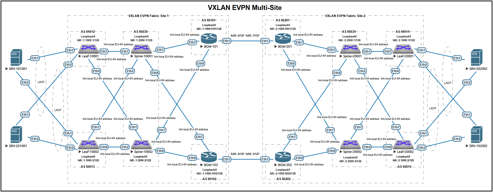
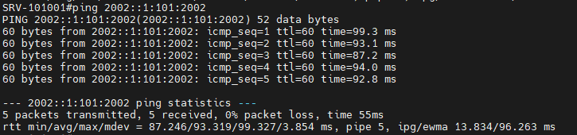
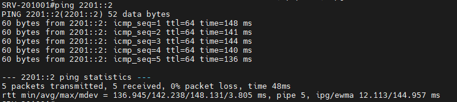

# Проектная работа. Построение сетей ЦОД с поддержкой L2 и L3 связности объединенные по схеме Multi-site (IPv6 only).

### Цели:
* Реализация сетевой фабрики с использованием Overlay технологии VxLAN
* В Underlay на выбор используется OSPF/ISIS/BGP

### Описание/Пошаговая инструкция выполнения домашнего задания:
Построения сетевой фабрики на основе протокола VxLAN:
#### 1) Необходимо настроить подключение конечного хоста сразу к двум коммутаторам с использованием технологии VPC;
#### 2) Настроить маршрутизацию между сетями;
#### 3) Зафиксируете в документации - план работы, адресное пространство, схему сети, настройки сетевого оборудования.

# Выполнение:

## План выполнения проектной работы:

1) Зафиксировать параметры сети;
2) Привести схему сети;
3) Опубликовать список реализованных функций;
4) Провести проверку роботы сети;
7) Опубликовать листинг команд для проверки корректной работы сети;
8) Привести конфигурации устройств.

## Параметры сети.

### Параметры Underlay-сети:

#### Внутри Site.

| Назначение   | IP шаблон |
| ------------ |:---------------:|
| Leaf loopbacks | fd0::P:1000:L/128 |
| Spine loopbacks | fd0::P:2000:S/128 |
| P-2-P links | link-local (EUI-64) |
| Router ID  | P.x.1.y | none | none |

* P - номер Site;
* L - номер Leaf-коммутатора;
* S - номер Spine-коммутатора;
* link-local (EUI-64) - адреса назначенные коммутаторами автоматически.
* Адрес для Router ID назначается: P - номер Site, x = 1 - для Leaf-коммутаторов и x = 2 - для Spine-коммутаторов, y - назначается по порядку следования одноранговых коммутаторов.

#### Между Site.

| Назначение   | IP шаблон |
| ------------ |:---------------:|
| BGW loopbacks | fd0::P:1000:fP0B/128 |
| P-2-P links | fc00::gg/127 |
| Router ID  | P0B.1.1.1 |

* P - номер Site;
* B - номер BGW-коммутатора;
* gg - порядковый номер межсайтового интерфейса (начиная с нуля).

#### Номера автономных систем.

Внутри сайта между парами Leaf - Spine и BGW - Spine применен динамический пиринг на link-local адресах p-2-p-интерфесов.
Диапазон AS для Leaf-коммутаторов - 64512-65512, из которого выделены под BGW-коммутаторы - 65101, 65102, 65201 и 65202;
AS для Spine-коммутаторов первого сайта - 65535, второго сайта - 65534;

#### Прочее.

STP на Leaf-коммутаторах включен, каждому из которых назначена роль - Root. STP на Spine-коммутаторах и BGW-коммутаторах выключен. 

Параметры, которые следовало бы изменить в целях оптимизации работы сети, но в виду особенностей работы в виртуальной среде оставлены без изменений:
* MTU (9k);
* BFD (bfd interval 100 min-rx 100 multiplier 3);
* BGP (timers 3 9, idle-restart-timer 60).

### Параметры Overlay-сети:

#### Первый клиент.
| Назначение | Сервисная модель | VLAN ID/VRF name | VNI | RD | RT |
| ------------ |:---------------:|:---------------:|:---------------:|:---------------:|:---------------:|
| MAC-VRF 1 | vlan-aware-bundle | 100-199 | 1000100-1000199 | (Router ID):1 | 1:1 |
| IP-VRF 1 | - | CUST-1 | 11111111 | (Router ID):1 | 1000:11111111 |

#### Второго клиент.
| Назначение | Сервисная модель | VLAN ID/ VRF name | VNI | RD | RT |
| ------------ |:---------------:|:---------------:|:---------------:|:---------------:|
| MAC-VRF 1 | vlan-aware-bundle | 200-299 | 1000200-1000299 | (Router ID):2 | 2:2 |

### Параметры ESI для серверов:

#### Первый клиент.
| Назначение   | Интерфейс | ESI ID | RT | LACP SID | Site |
| ------------ |:---------------:|:---------------:|:---------------:|:---------------:|:---------------:|
| SRV-101001 | Port-channel 101001 | 0001:0000:0000:0010:1001 | 10:00:00:10:10:01 | 1000.ff10.1001 | 1 |
| SRV-102002 | Port-channel 102002 | 0002:0000:0000:0010:2002 | 20:00:00:10:20:02 | 2000.ff10.2002 | 2 |

#### Второй клиент.
| Назначение   | Интерфейс | ESI ID | RT | LACP SID | Site |
| ------------ |:---------------:|:---------------:|:---------------:|:---------------:|:---------------:|
| SRV-201001 | Port-channel 201001 | 0001:0000:0000:0020:1001 | 10:00:00:20:10:01 | 1000.ff20.1001 | 1 |
| SRV-202002 | Port-channel 202002 | 0002:0000:0000:0020:2002 | 20:00:00:20:20:02 | 2000.ff20.2002 | 2 |

### Параметры клиентских устройств:

#### Первый клиент - L3 связность.
| Назначение | IP-шлюза | MAC | VLAN ID | VRF name | Site |
| ------------ |:---------------:|:---------------:|:---------------:|
| DAG 1 | 2001::1:100:1/112 | 10:00:00:00:00:00 | 100 | CUST-1 | 1 |
| DAG 2 | 2002::1:101:1/112 | 20:00:00:00:00:00 | 101 | CUST-1 | 2 |

| Назначение | IP | Default gateway | Site |
| ------------ |:---------------:|:---------------:|:---------------:|
| SRV-101001 | 2001::1:100:1001/112 | 2001::1:100:1 | 1 |
| SRV-102002 | 2002::1:101:2002/112 | 2002::1:101:1 | 2 |

#### Второй клиент - L2 связность.
| Назначение | IP |
| ------------ |:---------------:|
| SRV-201001 | 2201::1/64 | 1 |
| SRV-202002 | 2201::2/64 | 2 |

## Cхема сети:



## Список реализованных функций:

* Версия IP - только v6;
* Протокол маршрутизации для Underlay-сети - BGP;
* Протокол распространенния BUM-трафика - EVPN;
* Протокол Overlay-сети - VxLAN;
* Первому клиенту предоставляется L3-связность между серверами в разных сайтах;
* Второму клиенту предоставляется L2-связность между серверами в разных сайтах;
* Схема подключения клиентских серверов - Multi-homing (ESI);
* Трафик внутри и меджу сайтами балансируется по ECMP путям.

## Проверка работы сети:

#### Связь между серверами первого клиента


#### Связь между серверами второго клиента


## Листинг команд с примерами вывода:
#### Листинг:
```
show bgp evpn
show mac address-table
show ipv6 route vrf CUST-1
```

#### Выводы команд с коммутатора Leaf-10001:

```
Leaf-10001#show bgp evpn
BGP routing table information for VRF default
Router identifier 1.1.1.1, local AS number 64512
Route status codes: * - valid, > - active, S - Stale, E - ECMP head, e - ECMP
                    c - Contributing to ECMP, % - Pending BGP convergence
Origin codes: i - IGP, e - EGP, ? - incomplete
AS Path Attributes: Or-ID - Originator ID, C-LST - Cluster List, LL Nexthop - Link Local Nexthop

          Network                Next Hop              Metric  LocPref Weight  Path
 * >      RD: 1.1.1.1:1 auto-discovery 1000100 0001:0000:0000:0010:1001
                                 -                     -       -       0       i
 * >Ec    RD: 1.1.1.2:1 auto-discovery 1000100 0001:0000:0000:0010:1001
                                 fd0::1:1000:2         -       100     0       65535 64513 i
 *  ec    RD: 1.1.1.2:1 auto-discovery 1000100 0001:0000:0000:0010:1001
                                 fd0::1:1000:2         -       100     0       65535 64513 i
 * >      RD: 1.1.1.1:1 auto-discovery 0001:0000:0000:0010:1001
                                 -                     -       -       0       i
 * >Ec    RD: 1.1.1.2:1 auto-discovery 0001:0000:0000:0010:1001
                                 fd0::1:1000:2         -       100     0       65535 64513 i
 *  ec    RD: 1.1.1.2:1 auto-discovery 0001:0000:0000:0010:1001
                                 fd0::1:1000:2         -       100     0       65535 64513 i
 * >      RD: 1.1.1.1:2 auto-discovery 1000200 0001:0000:0000:0020:1001
                                 -                     -       -       0       i
 * >Ec    RD: 1.1.1.2:2 auto-discovery 1000200 0001:0000:0000:0020:1001
                                 fd0::1:1000:2         -       100     0       65535 64513 i
 *  ec    RD: 1.1.1.2:2 auto-discovery 1000200 0001:0000:0000:0020:1001
                                 fd0::1:1000:2         -       100     0       65535 64513 i
 * >      RD: 1.1.1.1:1 auto-discovery 0001:0000:0000:0020:1001
                                 -                     -       -       0       i
 * >Ec    RD: 1.1.1.2:1 auto-discovery 0001:0000:0000:0020:1001
                                 fd0::1:1000:2         -       100     0       65535 64513 i
 *  ec    RD: 1.1.1.2:1 auto-discovery 0001:0000:0000:0020:1001
                                 fd0::1:1000:2         -       100     0       65535 64513 i
 * >      RD: 1.1.1.1:1 mac-ip 1000100 5000.00e3.eee7 2001::1:100:1001
                                 -                     -       -       0       i
 * >Ec    RD: 1.1.1.2:1 mac-ip 1000100 5000.00e3.eee7 2001::1:100:1001
                                 fd0::1:1000:2         -       100     0       65535 64513 i
 *  ec    RD: 1.1.1.2:1 mac-ip 1000100 5000.00e3.eee7 2001::1:100:1001
                                 fd0::1:1000:2         -       100     0       65535 64513 i
 * >Ec    RD: 101.1.1.1:2 mac-ip 1000200 5000.0057.1bfa
                                 fd0::1:1000:f101      -       100     0       65535 65101 65201 65534 64514 i
 *  ec    RD: 101.1.1.1:2 mac-ip 1000200 5000.0057.1bfa
                                 fd0::1:1000:f101      -       100     0       65535 65101 65201 65534 64514 i
 * >Ec    RD: 102.1.1.1:2 mac-ip 1000200 5000.0057.1bfa
                                 fd0::1:1000:f102      -       100     0       65535 65102 65202 65534 64514 i
 *  ec    RD: 102.1.1.1:2 mac-ip 1000200 5000.0057.1bfa
                                 fd0::1:1000:f102      -       100     0       65535 65102 65202 65534 64514 i
 * >      RD: 1.1.1.1:2 mac-ip 1000200 5000.0088.f9bc
                                 -                     -       -       0       i
 * >      RD: 1.1.1.1:1 imet 1000100 fd0::1:1000:1
                                 -                     -       -       0       i
 * >Ec    RD: 1.1.1.2:1 imet 1000100 fd0::1:1000:2
                                 fd0::1:1000:2         -       100     0       65535 64513 i
 *  ec    RD: 1.1.1.2:1 imet 1000100 fd0::1:1000:2
                                 fd0::1:1000:2         -       100     0       65535 64513 i
 * >      RD: 1.1.1.1:2 imet 1000200 fd0::1:1000:1
                                 -                     -       -       0       i
 * >Ec    RD: 1.1.1.2:2 imet 1000200 fd0::1:1000:2
                                 fd0::1:1000:2         -       100     0       65535 64513 i
 *  ec    RD: 1.1.1.2:2 imet 1000200 fd0::1:1000:2
                                 fd0::1:1000:2         -       100     0       65535 64513 i
 * >Ec    RD: 101.1.1.1:2 imet 1000200 fd0::1:1000:f101
                                 fd0::1:1000:f101      -       100     0       65535 65101 i
 *  ec    RD: 101.1.1.1:2 imet 1000200 fd0::1:1000:f101
                                 fd0::1:1000:f101      -       100     0       65535 65101 i
 * >Ec    RD: 102.1.1.1:2 imet 1000200 fd0::1:1000:f102
                                 fd0::1:1000:f102      -       100     0       65535 65102 i
 *  ec    RD: 102.1.1.1:2 imet 1000200 fd0::1:1000:f102
                                 fd0::1:1000:f102      -       100     0       65535 65102 i
 * >      RD: 1.1.1.1:1 ethernet-segment 0001:0000:0000:0010:1001 fd0::1:1000:1
                                 -                     -       -       0       i
 * >Ec    RD: 1.1.1.2:1 ethernet-segment 0001:0000:0000:0010:1001 fd0::1:1000:2
                                 fd0::1:1000:2         -       100     0       65535 64513 i
 *  ec    RD: 1.1.1.2:1 ethernet-segment 0001:0000:0000:0010:1001 fd0::1:1000:2
                                 fd0::1:1000:2         -       100     0       65535 64513 i
 * >      RD: 1.1.1.1:1 ethernet-segment 0001:0000:0000:0020:1001 fd0::1:1000:1
                                 -                     -       -       0       i
 * >Ec    RD: 1.1.1.2:1 ethernet-segment 0001:0000:0000:0020:1001 fd0::1:1000:2
                                 fd0::1:1000:2         -       100     0       65535 64513 i
 *  ec    RD: 1.1.1.2:1 ethernet-segment 0001:0000:0000:0020:1001 fd0::1:1000:2
                                 fd0::1:1000:2         -       100     0       65535 64513 i
 * >      RD: 1.1.1.1:1 ip-prefix 2001::1:100:0/112
                                 -                     -       -       0       i
 * >Ec    RD: 1.1.1.2:1 ip-prefix 2001::1:100:0/112
                                 fd0::1:1000:2         -       100     0       65535 64513 i
 *  ec    RD: 1.1.1.2:1 ip-prefix 2001::1:100:0/112
                                 fd0::1:1000:2         -       100     0       65535 64513 i
 * >Ec    RD: 2.1.1.1:1 ip-prefix 2002::1:101:0/112
                                 fd0::1:1000:f101      -       100     0       65535 65101 65201 65534 64514 i
 *  ec    RD: 2.1.1.1:1 ip-prefix 2002::1:101:0/112
                                 fd0::1:1000:f101      -       100     0       65535 65101 65201 65534 64514 i
 *  ec    RD: 2.1.1.1:1 ip-prefix 2002::1:101:0/112
                                 fd0::1:1000:f102      -       100     0       65535 65102 65202 65534 64514 i
 *  ec    RD: 2.1.1.1:1 ip-prefix 2002::1:101:0/112
                                 fd0::1:1000:f102      -       100     0       65535 65102 65202 65534 64514 i
 * >Ec    RD: 2.1.1.2:1 ip-prefix 2002::1:101:0/112
                                 fd0::1:1000:f101      -       100     0       65535 65101 65201 65534 64515 i
 *  ec    RD: 2.1.1.2:1 ip-prefix 2002::1:101:0/112
                                 fd0::1:1000:f101      -       100     0       65535 65101 65201 65534 64515 i
 *  ec    RD: 2.1.1.2:1 ip-prefix 2002::1:101:0/112
                                 fd0::1:1000:f102      -       100     0       65535 65102 65202 65534 64515 i
 *  ec    RD: 2.1.1.2:1 ip-prefix 2002::1:101:0/112
                                 fd0::1:1000:f102      -       100     0       65535 65102 65202 65534 64515 i
```
```
Leaf-10001#show mac address-table
          Mac Address Table
------------------------------------------------------------------

Vlan    Mac Address       Type        Ports      Moves   Last Move
----    -----------       ----        -----      -----   ---------
 100    1000.0000.0000    STATIC      Cpu
 100    5000.00e3.eee7    DYNAMIC     Po101001   1       0:04:34 ago
 200    5000.0057.1bfa    DYNAMIC     Vx1        48      0:01:11 ago
 200    5000.0088.f9bc    DYNAMIC     Po201001   1       0:01:20 ago
4094    1000.0000.0000    STATIC      Cpu
4094    5000.0010.d0f5    DYNAMIC     Vx1        1       4:49:39 ago
4094    5000.0088.70da    DYNAMIC     Vx1        1       4:56:43 ago
4094    5000.00cb.38c2    DYNAMIC     Vx1        1       21:16:27 ago
Total Mac Addresses for this criterion: 8

          Multicast Mac Address Table
------------------------------------------------------------------

Vlan    Mac Address       Type        Ports
----    -----------       ----        -----
Total Mac Addresses for this criterion: 0
```
```
Leaf-10001#show ipv6 route vrf CUST-1

VRF: CUST-1
Displaying 2 of 6 IPv6 routing table entries
Codes: C - connected, S - static, K - kernel, O3 - OSPFv3,
       B - Other BGP Routes, A B - BGP Aggregate, R - RIP,
       I L1 - IS-IS level 1, I L2 - IS-IS level 2, DH - DHCP,
       NG - Nexthop Group Static Route, M - Martian,
       DP - Dynamic Policy Route, L - VRF Leaked,
       RC - Route Cache Route

 C        2001::1:100:0/112 [0/0]
           via Vlan100, directly connected
 B E      2002::1:101:0/112 [200/0]
           via VTEP fd0::1:1000:f101 VNI 11111111 router-mac 50:00:00:88:70:da local-interface Vxlan1
           via VTEP fd0::1:1000:f102 VNI 11111111 router-mac 50:00:00:10:d0:f5 local-interface Vxlan1
```

## Конфигурации устройств:
```
Leaf-10001#show running-config
! Command: show running-config
! device: Leaf-10001 (vEOS-lab, EOS-4.29.2F)
!
! boot system flash:/vEOS-lab.swi
!
no aaa root
!
transceiver qsfp default-mode 4x10G
!
service routing protocols model multi-agent
!
hostname Leaf-10001
!
spanning-tree mode mstp
spanning-tree mst 0 priority 8192
!
vlan 100
   name CUST-1_L3_Subnet_100
!
vlan 200
   name CUST-2_L2
!
vrf instance CUST-1
!
interface Port-Channel101001
   description SRV-101001
   switchport trunk allowed vlan 100
   switchport mode trunk
   !
   evpn ethernet-segment
      identifier 0001:0000:0000:0010:1001
      route-target import 10:00:00:10:10:01
   lacp system-id 1000.ff10.1001
!
interface Port-Channel201001
   description SRV-201001
   switchport trunk allowed vlan 200
   switchport mode trunk
   !
   evpn ethernet-segment
      identifier 0001:0000:0000:0020:1001
      route-target import 10:00:00:20:10:01
   lacp system-id 1000.ff20.1001
!
interface Ethernet1
   description SRV-101001_Eth1
   channel-group 101001 mode active
!
interface Ethernet2
   description SRV-201001_Eth1
   channel-group 201001 mode active
!
interface Ethernet3
   description -
   shutdown
!
interface Ethernet4
   description -
   shutdown
!
interface Ethernet5
   description -
   shutdown
!
interface Ethernet6
   description -
   shutdown
!
interface Ethernet7
   description Spine-10001_Eth1
   no switchport
   ipv6 enable
!
interface Ethernet8
   description Spine-10002_Eth1
   no switchport
   ipv6 enable
!
interface Loopback0
   description iFace
   ipv6 enable
   ipv6 address fd0::1:1000:1/128
!
interface Management1
!
interface Vlan100
   description CUST-1_Subnet-100
   vrf CUST-1
   ipv6 enable
   ipv6 nd ra disabled all
   ipv6 address virtual 2001::1:100:1/112
!
interface Vxlan1
   description VTEP-10001
   vxlan source-interface Loopback0
   vxlan udp-port 4789
   vxlan encapsulation ipv6
   vxlan vlan 100-299 vni 1000100-1000299
   vxlan vrf CUST-1 vni 11111111
!
ip virtual-router mac-address 10:00:00:00:00:00
!
no ip routing
no ip routing vrf CUST-1
!
ipv6 unicast-routing
ipv6 unicast-routing vrf CUST-1
!
route-map RM_RC_Loopback0 permit 10
   match interface Loopback0
!
router bgp 64512
   router-id 1.1.1.1
   no bgp default ipv4-unicast
   maximum-paths 8
   neighbor FAB_OV peer group
   neighbor FAB_OV remote-as 65535
   neighbor FAB_OV update-source Loopback0
   neighbor FAB_OV ebgp-multihop 3
   neighbor FAB_OV send-community extended
   neighbor FAB_UN peer group
   neighbor fd0::1:2000:1 peer group FAB_OV
   neighbor fd0::1:2000:1 description Spine-10001
   neighbor fd0::1:2000:2 peer group FAB_OV
   neighbor fd0::1:2000:2 description Spine-10002
   neighbor interface Et7-8 peer-group FAB_UN remote-as 65535
   !
   vlan-aware-bundle CUST-1
      rd 1.1.1.1:1
      route-target both 1:1
      redistribute learned
      vlan 100-199
   !
   vlan-aware-bundle CUST-2
      rd 1.1.1.1:2
      route-target both 2:2
      redistribute learned
      vlan 200-299
   !
   address-family evpn
      neighbor FAB_OV activate
      no neighbor FAB_UN activate
   !
   address-family ipv6
      no neighbor FAB_OV activate
      neighbor FAB_UN activate
      redistribute connected route-map RM_RC_Loopback0
   !
   vrf CUST-1
      rd 1.1.1.1:1
      route-target import evpn 1000:11111111
      route-target export evpn 1000:11111111
      router-id 1.1.1.1
      redistribute connected
!
end
```
```
Leaf-10002#sh running-config
! Command: show running-config
! device: Leaf-10002 (vEOS-lab, EOS-4.29.2F)
!
! boot system flash:/vEOS-lab.swi
!
no aaa root
!
transceiver qsfp default-mode 4x10G
!
service routing protocols model multi-agent
!
hostname Leaf-10002
!
spanning-tree mode mstp
spanning-tree mst 0 priority 8192
!
vlan 100
   name CUST-1_L3_Subnet_100
!
vlan 200
   name CUST-2_L2
!
vrf instance CUST-1
!
interface Port-Channel101001
   description SRV-101001
   switchport trunk allowed vlan 100
   switchport mode trunk
   !
   evpn ethernet-segment
      identifier 0001:0000:0000:0010:1001
      route-target import 10:00:00:10:10:01
   lacp system-id 1000.ff10.1001
!
interface Port-Channel201001
   description SRV-201001
   switchport trunk allowed vlan 200
   switchport mode trunk
   !
   evpn ethernet-segment
      identifier 0001:0000:0000:0020:1001
      route-target import 10:00:00:20:10:01
   lacp system-id 1000.ff20.1001
!
interface Ethernet1
   description SRV-101001_Eth2
   channel-group 101001 mode active
!
interface Ethernet2
   description SRV-201001_Eth2
   channel-group 201001 mode active
!
interface Ethernet3
   description -
   shutdown
!
interface Ethernet4
   description -
   shutdown
!
interface Ethernet5
   description -
   shutdown
!
interface Ethernet6
   description -
   shutdown
!
interface Ethernet7
   description Spine-10001_Eth2
   no switchport
   ipv6 enable
!
interface Ethernet8
   description Spine-10002_Eth2
   no switchport
   ipv6 enable
!
interface Loopback0
   description iFace
   ipv6 enable
   ipv6 address fd0::1:1000:2/128
!
interface Management1
!
interface Vlan100
   description CUST-1_Subnet-100
   vrf CUST-1
   ipv6 enable
   ipv6 nd ra disabled all
   ipv6 address virtual 2001::1:100:1/112
!
interface Vxlan1
   description VTEP-10002
   vxlan source-interface Loopback0
   vxlan udp-port 4789
   vxlan encapsulation ipv6
   vxlan vlan 100-299 vni 1000100-1000299
   vxlan vrf CUST-1 vni 11111111
!
ip virtual-router mac-address 10:00:00:00:00:00
!
no ip routing
no ip routing vrf CUST-1
!
ipv6 unicast-routing
ipv6 unicast-routing vrf CUST-1
!
route-map RM_RC_Loopback0 permit 10
   match interface Loopback0
!
router bgp 64513
   router-id 1.1.1.2
   no bgp default ipv4-unicast
   maximum-paths 8
   neighbor FAB_OV peer group
   neighbor FAB_OV remote-as 65535
   neighbor FAB_OV update-source Loopback0
   neighbor FAB_OV ebgp-multihop 3
   neighbor FAB_OV send-community extended
   neighbor FAB_UN peer group
   neighbor fd0::1:2000:1 peer group FAB_OV
   neighbor fd0::1:2000:1 description Spine-10001
   neighbor fd0::1:2000:2 peer group FAB_OV
   neighbor fd0::1:2000:2 description Spine-10002
   neighbor interface Et7-8 peer-group FAB_UN remote-as 65535
   !
   vlan-aware-bundle CUST-1
      rd 1.1.1.2:1
      route-target both 1:1
      redistribute learned
      vlan 100-199
   !
   vlan-aware-bundle CUST-2
      rd 1.1.1.2:2
      route-target both 2:2
      redistribute learned
      vlan 200-299
   !
   address-family evpn
      neighbor FAB_OV activate
      no neighbor FAB_UN activate
   !
   address-family ipv6
      no neighbor FAB_OV activate
      neighbor FAB_UN activate
      redistribute connected route-map RM_RC_Loopback0
   !
   vrf CUST-1
      rd 1.1.1.2:1
      route-target import evpn 1000:11111111
      route-target export evpn 1000:11111111
      router-id 1.1.1.2
      redistribute connected
!
end
```
```
BGW-101#sh running-config
! Command: show running-config
! device: BGW-101 (vEOS-lab, EOS-4.29.2F)
!
! boot system flash:/vEOS-lab.swi
!
no aaa root
!
transceiver qsfp default-mode 4x10G
!
service routing protocols model multi-agent
!
hostname BGW-101
!
spanning-tree mode none
!
vlan 200
   name CUST-2_L2
!
vrf instance CUST-1
!
interface Ethernet1
   description BGW-201_Eth1
   no switchport
   ipv6 enable
   ipv6 address fc00::/127
   ipv6 nd ra disabled
!
interface Ethernet2
   description -
   shutdown
!
interface Ethernet3
   description -
   shutdown
!
interface Ethernet4
   description -
   shutdown
!
interface Ethernet5
   description -
   shutdown
!
interface Ethernet6
   description -
   shutdown
!
interface Ethernet7
   description Spine-10001_Eth7
   no switchport
   bfd interval 100 min-rx 100 multiplier 3
   ipv6 enable
!
interface Ethernet8
   description Spine-10002_Eth7
   no switchport
   bfd interval 100 min-rx 100 multiplier 3
   ipv6 enable
!
interface Loopback0
   description iFace
   ipv6 enable
   ipv6 address fd0::1:1000:f101/128
!
interface Management1
!
interface Vxlan1
   vxlan source-interface Loopback0
   vxlan udp-port 4789
   vxlan encapsulation ipv6
   vxlan vlan 100-299 vni 1000100-1000299
   vxlan vrf CUST-1 vni 11111111
!
no ip routing
no ip routing vrf CUST-1
!
ipv6 unicast-routing
ipv6 unicast-routing vrf CUST-1
!
route-map RM_match_int_Lo0 permit 10
   match interface Loopback0
!
router bgp 65101
   router-id 101.1.1.1
   no bgp default ipv4-unicast
   maximum-paths 8
   neighbor DCI_OV peer group
   neighbor DCI_OV remote-as 65201
   neighbor DCI_OV next-hop-unchanged
   neighbor DCI_OV update-source Loopback0
   neighbor DCI_OV ebgp-multihop 3
   neighbor DCI_OV send-community extended
   neighbor DCI_UN peer group
   neighbor DCI_UN remote-as 65201
   neighbor DCI_UN route-map RM_match_int_Lo0 out
   neighbor FAB_OV peer group
   neighbor FAB_OV remote-as 65535
   neighbor FAB_OV update-source Loopback0
   neighbor FAB_OV ebgp-multihop 3
   neighbor FAB_OV send-community extended
   neighbor FAB_UN peer group
   neighbor fd0::1:2000:1 peer group FAB_OV
   neighbor fd0::1:2000:1 description Spine-10001
   neighbor fd0::1:2000:2 peer group FAB_OV
   neighbor fd0::1:2000:2 description Spine-10002
   neighbor fd0::2:1000:f201 peer group DCI_OV
   neighbor fd0::2:1000:f201 description BGW-201
   neighbor fc00::1 peer group DCI_UN
   neighbor fc00::1 description BGW-201
   neighbor interface Et7-8 peer-group FAB_UN remote-as 65535
   !
   vlan-aware-bundle CUST-2
      rd evpn domain all 101.1.1.1:2
      route-target both 2:2
      route-target import export evpn domain remote 200:200
      redistribute learned
      vlan 200-299
   !
   address-family evpn
      neighbor DCI_OV activate
      neighbor DCI_OV domain remote
      no neighbor DCI_UN activate
      neighbor FAB_OV activate
      no neighbor FAB_UN activate
      neighbor default next-hop-self received-evpn-routes route-type ip-prefix inter-domain
   !
   address-family ipv6
      no neighbor DCI_OV activate
      neighbor DCI_UN activate
      no neighbor FAB_OV activate
      neighbor FAB_UN activate
      redistribute connected route-map RM_match_int_Lo0
   !
   vrf CUST-1
      rd 101.1.1.1:1
      route-target import evpn 1000:11111111
      route-target export evpn 1000:11111111
      router-id 101.1.1.1
!
end
```
```
BGW-102#show running-config
! Command: show running-config
! device: BGW-102 (vEOS-lab, EOS-4.29.2F)
!
! boot system flash:/vEOS-lab.swi
!
no aaa root
!
transceiver qsfp default-mode 4x10G
!
service routing protocols model multi-agent
!
hostname BGW-102
!
spanning-tree mode none
!
vlan 200
   name CUST-2_L2
!
vrf instance CUST-1
!
interface Ethernet1
   description BGW-202_Eth1
   no switchport
   ipv6 enable
   ipv6 address fc00::2/127
   ipv6 nd ra disabled
!
interface Ethernet2
   description -
   shutdown
!
interface Ethernet3
   description -
   shutdown
!
interface Ethernet4
   description -
   shutdown
!
interface Ethernet5
   description -
   shutdown
!
interface Ethernet6
   description -
   shutdown
!
interface Ethernet7
   description Spine-10001_Eth8
   no switchport
   bfd interval 100 min-rx 100 multiplier 3
   ipv6 enable
!
interface Ethernet8
   description Spine-10002_Eth8
   no switchport
   bfd interval 100 min-rx 100 multiplier 3
   ipv6 enable
!
interface Loopback0
   description iFace
   ipv6 enable
   ipv6 address fd0::1:1000:f102/128
!
interface Management1
!
interface Vxlan1
   vxlan source-interface Loopback0
   vxlan udp-port 4789
   vxlan encapsulation ipv6
   vxlan vlan 100-299 vni 1000100-1000299
   vxlan vrf CUST-1 vni 11111111
!
no ip routing
no ip routing vrf CUST-1
!
ipv6 unicast-routing
ipv6 unicast-routing vrf CUST-1
!
route-map RM_match_int_Lo0 permit 10
   match interface Loopback0
!
router bgp 65102
   router-id 102.1.1.1
   no bgp default ipv4-unicast
   maximum-paths 8
   neighbor DCI_OV peer group
   neighbor DCI_OV remote-as 65202
   neighbor DCI_OV next-hop-unchanged
   neighbor DCI_OV update-source Loopback0
   neighbor DCI_OV ebgp-multihop 3
   neighbor DCI_OV send-community extended
   neighbor DCI_UN peer group
   neighbor DCI_UN remote-as 65202
   neighbor DCI_UN route-map RM_match_int_Lo0 out
   neighbor FAB_OV peer group
   neighbor FAB_OV remote-as 65535
   neighbor FAB_OV update-source Loopback0
   neighbor FAB_OV ebgp-multihop 3
   neighbor FAB_OV send-community extended
   neighbor FAB_UN peer group
   neighbor fd0::1:2000:1 peer group FAB_OV
   neighbor fd0::1:2000:1 description Spine-10001
   neighbor fd0::1:2000:2 peer group FAB_OV
   neighbor fd0::1:2000:2 description Spine-10002
   neighbor fd0::2:1000:f202 peer group DCI_OV
   neighbor fd0::2:1000:f202 description BGW-202
   neighbor fc00::3 peer group DCI_UN
   neighbor fc00::3 description BGW-202
   neighbor interface Et7-8 peer-group FAB_UN remote-as 65535
   !
   vlan-aware-bundle CUST-2
      rd evpn domain all 102.1.1.1:2
      route-target both 2:2
      route-target import export evpn domain remote 200:200
      redistribute learned
      vlan 200-299
   !
   address-family evpn
      neighbor DCI_OV activate
      neighbor DCI_OV domain remote
      no neighbor DCI_UN activate
      neighbor FAB_OV activate
      no neighbor FAB_UN activate
      neighbor default next-hop-self received-evpn-routes route-type ip-prefix inter-domain
   !
   address-family ipv6
      no neighbor DCI_OV activate
      neighbor DCI_UN activate
      no neighbor FAB_OV activate
      neighbor FAB_UN activate
      redistribute connected route-map RM_match_int_Lo0
   !
   vrf CUST-1
      rd 102.1.1.1:1
      route-target import evpn 1000:11111111
      route-target export evpn 1000:11111111
      router-id 102.1.1.1
!
end
```
```
Spine-10001#show running-config
! Command: show running-config
! device: Spine-10001 (vEOS-lab, EOS-4.29.2F)
!
! boot system flash:/vEOS-lab.swi
!
no aaa root
!
transceiver qsfp default-mode 4x10G
!
service routing protocols model multi-agent
!
hostname Spine-10001
!
spanning-tree mode none
!
interface Ethernet1
   description Leaf-10001_Eth7
   no switchport
   ipv6 enable
!
interface Ethernet2
   description Leaf-10002_Eth7
   no switchport
   ipv6 enable
!
interface Ethernet3
   description -
   shutdown
!
interface Ethernet4
   description -
   shutdown
!
interface Ethernet5
   description -
   shutdown
!
interface Ethernet6
   description -
   shutdown
!
interface Ethernet7
   description BGW-101_Eth7
   no switchport
   ipv6 enable
!
interface Ethernet8
   description BGW-102_Eth7
   no switchport
   ipv6 enable
!
interface Loopback0
   description iFace
   ipv6 enable
   ipv6 address fd0::1:2000:1/128
!
interface Management1
!
no ip routing
!
ipv6 unicast-routing
!
route-map RM_RC_Loopback0 permit 10
   match interface Loopback0
!
peer-filter PF_Leafs_AS-range_Accept
   10 match as-range 64512-65512 result accept
!
router bgp 65535
   router-id 1.2.1.1
   no bgp default ipv4-unicast
   maximum-paths 8
   bgp listen range fe80::/64 peer-group FAB_UN peer-filter PF_Leafs_AS-range_Accept
   neighbor FAB_OV peer group
   neighbor FAB_OV next-hop-unchanged
   neighbor FAB_OV update-source Loopback0
   neighbor FAB_OV ebgp-multihop 3
   neighbor FAB_OV send-community extended
   neighbor FAB_UN peer group
   neighbor fd0::1:1000:1 peer group FAB_OV
   neighbor fd0::1:1000:1 remote-as 64512
   neighbor fd0::1:1000:1 description Leaf-10001
   neighbor fd0::1:1000:2 peer group FAB_OV
   neighbor fd0::1:1000:2 remote-as 64513
   neighbor fd0::1:1000:2 description Leaf-10002
   neighbor fd0::1:1000:f101 peer group FAB_OV
   neighbor fd0::1:1000:f101 remote-as 65101
   neighbor fd0::1:1000:f101 description BGW-101
   neighbor fd0::1:1000:f102 peer group FAB_OV
   neighbor fd0::1:1000:f102 rem
                                   neighbor fd0::1:1000:f102 description BGW-102
   !
   address-family evpn
      bgp additional-paths send ecmp
      neighbor FAB_OV activate
      no neighbor FAB_UN activate
   !
   address-family ipv6
      no neighbor FAB_OV activate
      neighbor FAB_UN activate
      redistribute connected route-map RM_RC_Loopback0
!
end
```
```
Spine-10002#show running-config
! Command: show running-config
! device: Spine-10002 (vEOS-lab, EOS-4.29.2F)
!
! boot system flash:/vEOS-lab.swi
!
no aaa root
!
transceiver qsfp default-mode 4x10G
!
service routing protocols model multi-agent
!
hostname Spine-10002
!
spanning-tree mode none
!
interface Ethernet1
   description Leaf-10001_Eth7
   no switchport
   ipv6 enable
!
interface Ethernet2
   description Leaf-10002_Eth7
   no switchport
   ipv6 enable
!
interface Ethernet3
   description -
   shutdown
!
interface Ethernet4
   description -
   shutdown
!
interface Ethernet5
   description -
   shutdown
!
interface Ethernet6
   description -
   shutdown
!
interface Ethernet7
   description BGW-101_Eth8
   no switchport
   ipv6 enable
!
interface Ethernet8
   description BGW-102_Eth8
   no switchport
   ipv6 enable
!
interface Loopback0
   description iFace
   ipv6 enable
   ipv6 address fd0::1:2000:2/128
!
interface Management1
!
no ip routing
!
ipv6 unicast-routing
!
route-map RM_RC_Loopback0 permit 10
   match interface Loopback0
!
peer-filter PF_Leafs_AS-range_Accept
   10 match as-range 64512-65512 result accept
!
router bgp 65535
   router-id 1.2.1.2
   no bgp default ipv4-unicast
   maximum-paths 8
   bgp listen range fe80::/64 peer-group FAB_UN peer-filter PF_Leafs_AS-range_Accept
   neighbor FAB_OV peer group
   neighbor FAB_OV next-hop-unchanged
   neighbor FAB_OV update-source Loopback0
   neighbor FAB_OV ebgp-multihop 3
   neighbor FAB_OV send-community extended
   neighbor FAB_UN peer group
   neighbor fd0::1:1000:1 peer group FAB_OV
   neighbor fd0::1:1000:1 remote-as 64512
   neighbor fd0::1:1000:1 description Leaf-10001
   neighbor fd0::1:1000:2 peer group FAB_OV
   neighbor fd0::1:1000:2 remote-as 64513
   neighbor fd0::1:1000:2 description Leaf-10002
   neighbor fd0::1:1000:f101 peer group FAB_OV
   neighbor fd0::1:1000:f101 remote-as 65101
   neighbor fd0::1:1000:f101 description BGW-101
   neighbor fd0::1:1000:f102 peer group FAB_OV
   neighbor fd0::1:1000:f102 remote-as 65102
   neighbor fd0::1:1000:f102 description BGW-102
   !
   address-family evpn
      bgp additional-paths send ecmp
      neighbor FAB_OV activate
      no neighbor FAB_UN activate
   !
   address-family ipv6
      no neighbor FAB_OV activate
      neighbor FAB_UN activate
      redistribute connected route-map RM_RC_Loopback0
!
end
```
```
BGW-101#show running-config
! Command: show running-config
! device: BGW-101 (vEOS-lab, EOS-4.29.2F)
!
! boot system flash:/vEOS-lab.swi
!
no aaa root
!
transceiver qsfp default-mode 4x10G
!
service routing protocols model multi-agent
!
hostname BGW-101
!
spanning-tree mode none
!
vlan 200
   name CUST-2_L2
!
vrf instance CUST-1
!
interface Ethernet1
   description BGW-201_Eth1
   no switchport
   ipv6 enable
   ipv6 address fc00::/127
   ipv6 nd ra disabled
!
interface Ethernet2
   description -
   shutdown
!
interface Ethernet3
   description -
   shutdown
!
interface Ethernet4
   description -
   shutdown
!
interface Ethernet5
   description -
   shutdown
!
interface Ethernet6
   description -
   shutdown
!
interface Ethernet7
   description Spine-10001_Eth7
   no switchport
   bfd interval 100 min-rx 100 multiplier 3
   ipv6 enable
!
interface Ethernet8
   description Spine-10002_Eth7
   no switchport
   bfd interval 100 min-rx 100 multiplier 3
   ipv6 enable
!
interface Loopback0
   description iFace
   ipv6 enable
   ipv6 address fd0::1:1000:f101/128
!
interface Management1
!
interface Vxlan1
   vxlan source-interface Loopback0
   vxlan udp-port 4789
   vxlan encapsulation ipv6
   vxlan vlan 100-299 vni 1000100-1000299
   vxlan vrf CUST-1 vni 11111111
!
no ip routing
no ip routing vrf CUST-1
!
ipv6 unicast-routing
ipv6 unicast-routing vrf CUST-1
!
route-map RM_match_int_Lo0 permit 10
   match interface Loopback0
!
router bgp 65101
   router-id 101.1.1.1
   no bgp default ipv4-unicast
   maximum-paths 8
   neighbor DCI_OV peer group
   neighbor DCI_OV remote-as 65201
   neighbor DCI_OV next-hop-unchanged
   neighbor DCI_OV update-source Loopback0
   neighbor DCI_OV ebgp-multihop 3
   neighbor DCI_OV send-community extended
   neighbor DCI_UN peer group
   neighbor DCI_UN remote-as 65201
   neighbor DCI_UN route-map RM_match_int_Lo0 out
   neighbor FAB_OV peer group
   neighbor FAB_OV remote-as 65535
   neighbor FAB_OV update-source Loopback0
   neighbor FAB_OV ebgp-multihop 3
   neighbor FAB_OV send-community extended
   neighbor FAB_UN peer group
   neighbor fd0::1:2000:1 peer group FAB_OV
   neighbor fd0::1:2000:1 description Spine-10001
   neighbor fd0::1:2000:2 peer group FAB_OV
   neighbor fd0::1:2000:2 description Spine-10002
   neighbor fd0::2:1000:f201 peer group DCI_OV
   neighbor fd0::2:1000:f201 description BGW-201
   neighbor fc00::1 peer group DCI_UN
   neighbor fc00::1 description BGW-201
   neighbor interface Et7-8 peer-group FAB_UN remote-as 65535
   !
   vlan-aware-bundle CUST-2
      rd evpn domain all 101.1.1.1:2
      route-target both 2:2
      route-target import export evpn domain remote 200:200
      redistribute learned
      vlan 200-299
   !
   address-family evpn
      neighbor DCI_OV activate
      neighbor DCI_OV domain remote
      no neighbor DCI_UN activate
      neighbor FAB_OV activate
      no neighbor FAB_UN activate
      neighbor default next-hop-self received-evpn-routes route-type ip-prefix inter-domain
   !
   address-family ipv6
      no neighbor DCI_OV activate
      neighbor DCI_UN activate
      no neighbor FAB_OV activate
      neighbor FAB_UN activate
      redistribute connected route-map RM_match_int_Lo0
   !
   vrf CUST-1
      rd 101.1.1.1:1
      route-target import evpn 1000:11111111
      route-target export evpn 1000:11111111
      router-id 101.1.1.1
!
end
```
```
BGW-102#show running-config
! Command: show running-config
! device: BGW-102 (vEOS-lab, EOS-4.29.2F)
!
! boot system flash:/vEOS-lab.swi
!
no aaa root
!
transceiver qsfp default-mode 4x10G
!
service routing protocols model multi-agent
!
hostname BGW-102
!
spanning-tree mode none
!
vlan 200
   name CUST-2_L2
!
vrf instance CUST-1
!
interface Ethernet1
   description BGW-202_Eth1
   no switchport
   ipv6 enable
   ipv6 address fc00::2/127
   ipv6 nd ra disabled
!
interface Ethernet2
   description -
   shutdown
!
interface Ethernet3
   description -
   shutdown
!
interface Ethernet4
   description -
   shutdown
!
interface Ethernet5
   description -
   shutdown
!
interface Ethernet6
   description -
   shutdown
!
interface Ethernet7
   description Spine-10001_Eth8
   no switchport
   bfd interval 100 min-rx 100 multiplier 3
   ipv6 enable
!
interface Ethernet8
   description Spine-10002_Eth8
   no switchport
   bfd interval 100 min-rx 100 multiplier 3
   ipv6 enable
!
interface Loopback0
   description iFace
   ipv6 enable
   ipv6 address fd0::1:1000:f102/128
!
interface Management1
!
interface Vxlan1
   vxlan source-interface Loopback0
   vxlan udp-port 4789
   vxlan encapsulation ipv6
   vxlan vlan 100-299 vni 1000100-1000299
   vxlan vrf CUST-1 vni 11111111
!
no ip routing
no ip routing vrf CUST-1
!
ipv6 unicast-routing
ipv6 unicast-routing vrf CUST-1
!
route-map RM_match_int_Lo0 permit 10
   match interface Loopback0
!
router bgp 65102
   router-id 102.1.1.1
   no bgp default ipv4-unicast
   maximum-paths 8
   neighbor DCI_OV peer group
   neighbor DCI_OV remote-as 65202
   neighbor DCI_OV next-hop-unchanged
   neighbor DCI_OV update-source Loopback0
   neighbor DCI_OV ebgp-multihop 3
   neighbor DCI_OV send-community extended
   neighbor DCI_UN peer group
   neighbor DCI_UN remote-as 65202
   neighbor DCI_UN route-map RM_match_int_Lo0 out
   neighbor FAB_OV peer group
   neighbor FAB_OV remote-as 65535
   neighbor FAB_OV update-source Loopback0
   neighbor FAB_OV ebgp-multihop 3
   neighbor FAB_OV send-community extended
   neighbor FAB_UN peer group
   neighbor fd0::1:2000:1 peer group FAB_OV
   neighbor fd0::1:2000:1 description Spine-10001
   neighbor fd0::1:2000:2 peer group FAB_OV
   neighbor fd0::1:2000:2 description Spine-10002
   neighbor fd0::2:1000:f202 peer group DCI_OV
   neighbor fd0::2:1000:f202 description BGW-202
   neighbor fc00::3 peer group DCI_UN
   neighbor fc00::3 description BGW-202
   neighbor interface Et7-8 peer-group FAB_UN remote-as 65535
   !
   vlan-aware-bundle CUST-2
      rd evpn domain all 102.1.1.1:2
      route-target both 2:2
      route-target import export evpn domain remote 200:200
      redistribute learned
      vlan 200-299
   !
   address-family evpn
      neighbor DCI_OV activate
      neighbor DCI_OV domain remote
      no neighbor DCI_UN activate
      neighbor FAB_OV activate
      no neighbor FAB_UN activate
      neighbor default next-hop-self received-evpn-routes route-type ip-prefix inter-domain
   !
   address-family ipv6
      no neighbor DCI_OV activate
      neighbor DCI_UN activate
      no neighbor FAB_OV activate
      neighbor FAB_UN activate
      redistribute connected route-map RM_match_int_Lo0
   !
   vrf CUST-1
      rd 102.1.1.1:1
      route-target import evpn 1000:11111111
      route-target export evpn 1000:11111111
      router-id 102.1.1.1
!
end
```
```
Leaf-20001#show running-config
! Command: show running-config
! device: Leaf-20001 (vEOS-lab, EOS-4.29.2F)
!
! boot system flash:/vEOS-lab.swi
!
no aaa root
!
transceiver qsfp default-mode 4x10G
!
service routing protocols model multi-agent
!
hostname Leaf-20001
!
spanning-tree mode mstp
spanning-tree mst 0 priority 8192
!
vlan 101
   name CUST-1_L3_Subnet_101
!
vlan 200
   name CUST-2_L2
!
vrf instance CUST-1
!
interface Port-Channel102002
   description SRV-102002
   switchport trunk allowed vlan 101
   switchport mode trunk
   !
   evpn ethernet-segment
      identifier 0002:0000:0000:0010:2002
      route-target import 20:00:00:10:20:02
   lacp system-id 2000.ff10.2002
!
interface Port-Channel202002
   description SRV-202002
   switchport trunk allowed vlan 200
   switchport mode trunk
   !
   evpn ethernet-segment
      identifier 0002:0000:0000:0020:2002
      route-target import 20:00:00:20:20:02
   lacp system-id 2000.ff20.2002
!
interface Ethernet1
   description SRV-202002_Eth1
   channel-group 202002 mode active
!
interface Ethernet2
   description SRV-102002_Eth1
   channel-group 102002 mode active
!
interface Ethernet3
   description -
   shutdown
!
interface Ethernet4
   description -
   shutdown
!
interface Ethernet5
   description -
   shutdown
!
interface Ethernet6
   description -
   shutdown
!
interface Ethernet7
   description Spine-20001_Eth1
   no switchport
   ipv6 enable
!
interface Ethernet8
   description Spine-20002_Eth1
   no switchport
   ipv6 enable
!
interface Loopback0
   description iFace
   ipv6 enable
   ipv6 address fd0::2:1000:1/128
!
interface Management1
!
interface Vlan101
   description CUST-1_Subnet-101
   vrf CUST-1
   ipv6 enable
   ipv6 nd ra disabled all
   ipv6 address virtual 2002::1:101:1/112
!
interface Vxlan1
   description VTEP-20001
   vxlan source-interface Loopback0
   vxlan udp-port 4789
   vxlan encapsulation ipv6
   vxlan vlan 100-299 vni 1000100-1000299
   vxlan vrf CUST-1 vni 11111111
!
ip virtual-router mac-address 20:00:00:00:00:00
!
no ip routing
no ip routing vrf CUST-1
!
ipv6 unicast-routing
ipv6 unicast-routing vrf CUST-1
!
route-map RM_RC_Loopback0 permit 10
   match interface Loopback0
!
router bgp 64514
   router-id 2.1.1.1
   no bgp default ipv4-unicast
   maximum-paths 8
   neighbor FAB_OV peer group
   neighbor FAB_OV remote-as 65534
   neighbor FAB_OV update-source Loopback0
   neighbor FAB_OV ebgp-multihop 3
   neighbor FAB_OV send-community extended
   neighbor FAB_UN peer group
   neighbor fd0::2:2000:1 peer group FAB_OV
   neighbor fd0::2:2000:1 description Spine-20001
   neighbor fd0::2:2000:2 peer group FAB_OV
   neighbor fd0::2:2000:2 description Spine-20002
   neighbor interface Et7-8 peer-group FAB_UN remote-as 65534
   !
   vlan-aware-bundle CUST-1
      rd 2.1.1.1:1
      route-target both 1:1
      redistribute learned
      vlan 100-199
   !
   vlan-aware-bundle CUST-2
      rd 2.1.1.1:2
      route-target both 2:2
      redistribute learned
      vlan 200-299
   !
   address-family evpn
      neighbor FAB_OV activate
      no neighbor FAB_UN activate
   !
   address-family ipv6
      no neighbor FAB_OV activate
      neighbor FAB_UN activate
      redistribute connected route-map RM_RC_Loopback0
   !
   vrf CUST-1
      rd 2.1.1.1:1
      route-target import evpn 1000:11111111
      route-target export evpn 1000:11111111
      router-id 2.1.1.1
      redistribute connected
!
end
```
```
Leaf-20002#show running-config
! Command: show running-config
! device: Leaf-20002 (vEOS-lab, EOS-4.29.2F)
!
! boot system flash:/vEOS-lab.swi
!
no aaa root
!
transceiver qsfp default-mode 4x10G
!
service routing protocols model multi-agent
!
hostname Leaf-20002
!
spanning-tree mode mstp
spanning-tree mst 0 priority 8192
!
vlan 101
   name CUST-1_L3_Subnet_101
!
vlan 200
   name CUST-2_L2
!
vrf instance CUST-1
!
interface Port-Channel102002
   description SRV-102002
   switchport trunk allowed vlan 101
   switchport mode trunk
   !
   evpn ethernet-segment
      identifier 0002:0000:0000:0010:2002
      route-target import 20:00:00:10:20:02
   lacp system-id 2000.ff10.2002
!
interface Port-Channel202002
   description SRV-202002
   switchport trunk allowed vlan 200
   switchport mode trunk
   !
   evpn ethernet-segment
      identifier 0002:0000:0000:0020:2002
      route-target import 20:00:00:20:20:02
   lacp system-id 2000.ff20.2002
!
interface Ethernet1
   description SRV-202002_Eth2
   channel-group 202002 mode active
!
interface Ethernet2
   description SRV-102002_Eth2
   channel-group 102002 mode active
!
interface Ethernet3
   description -
   shutdown
!
interface Ethernet4
   description -
   shutdown
!
interface Ethernet5
   description -
   shutdown
!
interface Ethernet6
   description -
   shutdown
!
interface Ethernet7
   description Spine-20001_Eth2
   no switchport
   ipv6 enable
!
interface Ethernet8
   description Spine-20002_Eth2
   no switchport
   ipv6 enable
!
interface Loopback0
   description iFace
   ipv6 enable
   ipv6 address fd0::2:1000:2/128
!
interface Management1
!
interface Vlan101
   description CUST-1_Subnet-101
   vrf CUST-1
   ipv6 enable
   ipv6 nd ra disabled all
   ipv6 address virtual 2002::1:101:1/112
!
interface Vxlan1
   description VTEP-20002
   vxlan source-interface Loopback0
   vxlan udp-port 4789
   vxlan encapsulation ipv6
   vxlan vlan 100-299 vni 1000100-1000299
   vxlan vrf CUST-1 vni 11111111
!
ip virtual-router mac-address 20:00:00:00:00:00
!
no ip routing
no ip routing vrf CUST-1
!
ipv6 unicast-routing
ipv6 unicast-routing vrf CUST-1
!
route-map RM_RC_Loopback0 permit 10
   match interface Loopback0
!
router bgp 64515
   router-id 2.1.1.2
   no bgp default ipv4-unicast
   maximum-paths 8
   neighbor FAB_OV peer group
   neighbor FAB_OV remote-as 65534
   neighbor FAB_OV update-source Loopback0
   neighbor FAB_OV ebgp-multihop 3
   neighbor FAB_OV send-community extended
   neighbor FAB_UN peer group
   neighbor fd0::2:2000:1 peer group FAB_OV
   neighbor fd0::2:2000:1 description Spine-20001
   neighbor fd0::2:2000:2 peer group FAB_OV
   neighbor fd0::2:2000:2 description Spine-20002
   neighbor interface Et7-8 peer-group FAB_UN remote-as 65534
   !
   vlan-aware-bundle CUST-1
      rd 2.1.1.2:1
      route-target both 1:1
      redistribute learned
      vlan 100-199
   !
   vlan-aware-bundle CUST-2
      rd 2.1.1.2:2
      route-target both 2:2
      redistribute learned
      vlan 200-299
   !
   address-family evpn
      neighbor FAB_OV activate
      no neighbor FAB_UN activate
   !
   address-family ipv6
      no neighbor FAB_OV activate
      neighbor FAB_UN activate
      redistribute connected route-map RM_RC_Loopback0
   !
   vrf CUST-1
      rd 2.1.1.2:1
      route-target import evpn 1000:11111111
      route-target export evpn 1000:11111111
      router-id 2.1.1.2
      redistribute connected
!
end
```
```
Spine-20001#show running-config
! Command: show running-config
! device: Spine-20001 (vEOS-lab, EOS-4.29.2F)
!
! boot system flash:/vEOS-lab.swi
!
no aaa root
!
transceiver qsfp default-mode 4x10G
!
service routing protocols model multi-agent
!
hostname Spine-20001
!
spanning-tree mode none
!
interface Ethernet1
   description Leaf-20001_Eth7
   no switchport
   ipv6 enable
!
interface Ethernet2
   description Leaf-20002_Eth7
   no switchport
   ipv6 enable
!
interface Ethernet3
   description -
   shutdown
!
interface Ethernet4
   description -
   shutdown
!
interface Ethernet5
   description -
   shutdown
!
interface Ethernet6
   description -
   shutdown
!
interface Ethernet7
   description BGW-201_Eth7
   no switchport
   ipv6 enable
!
interface Ethernet8
   description BGW-202_Eth7
   no switchport
   ipv6 enable
!
interface Loopback0
   description iFace
   ipv6 enable
   ipv6 address fd0::2:2000:1/128
!
interface Management1
!
no ip routing
!
ipv6 unicast-routing
!
route-map RM_RC_Loopback0 permit 10
   match interface Loopback0
!
peer-filter PF_Leafs_AS-range_Accept
   10 match as-range 64514-65515 result accept
!
router bgp 65534
   router-id 2.2.1.1
   no bgp default ipv4-unicast
   maximum-paths 8
   bgp listen range fe80::/64 peer-group FAB_UN peer-filter PF_Leafs_AS-range_Accept
   neighbor FAB_OV peer group
   neighbor FAB_OV next-hop-unchanged
   neighbor FAB_OV update-source Loopback0
   neighbor FAB_OV ebgp-multihop 3
   neighbor FAB_OV send-community extended
   neighbor FAB_UN peer group
   neighbor fd0::2:1000:1 peer group FAB_OV
   neighbor fd0::2:1000:1 remote-as 64514
   neighbor fd0::2:1000:1 description Leaf-20001
   neighbor fd0::2:1000:2 peer group FAB_OV
   neighbor fd0::2:1000:2 remote-as 64515
   neighbor fd0::2:1000:2 description Leaf-20002
   neighbor fd0::2:1000:f201 peer group FAB_OV
   neighbor fd0::2:1000:f201 remote-as 65201
   neighbor fd0::2:1000:f201 description BGW-201
   neighbor fd0::2:1000:f202 peer group FAB_OV
   neighbor fd0::2:1000:f202 remote-as 65202
   neighbor fd0::2:1000:f202 description BGW-202
   !
   address-family evpn
      bgp additional-paths send ecmp
      neighbor FAB_OV activate
      no neighbor FAB_UN activate
   !
   address-family ipv6
      no neighbor FAB_OV activate
      neighbor FAB_UN activate
      redistribute connected route-map RM_RC_Loopback0
!
end
```
```
Spine-20002#show running-config
! Command: show running-config
! device: Spine-20002 (vEOS-lab, EOS-4.29.2F)
!
! boot system flash:/vEOS-lab.swi
!
no aaa root
!
transceiver qsfp default-mode 4x10G
!
service routing protocols model multi-agent
!
hostname Spine-20002
!
spanning-tree mode none
!
interface Ethernet1
   description Leaf-20001_Eth8
   no switchport
   ipv6 enable
!
interface Ethernet2
   description Leaf-20002_Eth8
   no switchport
   ipv6 enable
!
interface Ethernet3
   description -
   shutdown
!
interface Ethernet4
   description -
   shutdown
!
interface Ethernet5
   description -
   shutdown
!
interface Ethernet6
   description -
   shutdown
!
interface Ethernet7
   description BGW-201_Eth8
   no switchport
   ipv6 enable
!
interface Ethernet8
   description BGW-202_Eth8
   no switchport
   ipv6 enable
!
interface Loopback0
   description iFace
   ipv6 enable
   ipv6 address fd0::2:2000:2/128
!
interface Management1
!
no ip routing
!
ipv6 unicast-routing
!
route-map RM_RC_Loopback0 permit 10
   match interface Loopback0
!
peer-filter PF_Leafs_AS-range_Accept
   10 match as-range 64514-65515 result accept
!
router bgp 65534
   router-id 2.2.1.2
   no bgp default ipv4-unicast
   maximum-paths 8
   bgp listen range fe80::/64 peer-group FAB_UN peer-filter PF_Leafs_AS-range_Accept
   neighbor FAB_OV peer group
   neighbor FAB_OV next-hop-unchanged
   neighbor FAB_OV update-source Loopback0
   neighbor FAB_OV ebgp-multihop 3
   neighbor FAB_OV send-community extended
   neighbor FAB_UN peer group
   neighbor fd0::2:1000:1 peer group FAB_OV
   neighbor fd0::2:1000:1 remote-as 64514
   neighbor fd0::2:1000:1 description Leaf-20001
   neighbor fd0::2:1000:2 peer group FAB_OV
   neighbor fd0::2:1000:2 remote-as 64515
   neighbor fd0::2:1000:2 description Leaf-20002
   neighbor fd0::2:1000:f201 peer group FAB_OV
   neighbor fd0::2:1000:f201 remote-as 65201
   neighbor fd0::2:1000:f201 description BGW-201
   neighbor fd0::2:1000:f202 peer group FAB_OV
   neighbor fd0::2:1000:f202 remote-as 65202
   neighbor fd0::2:1000:f202 description BGW-202
   !
   address-family evpn
      bgp additional-paths send ecmp
      neighbor FAB_OV activate
      no neighbor FAB_UN activate
   !
   address-family ipv6
      no neighbor FAB_OV activate
      neighbor FAB_UN activate
      redistribute connected route-map RM_RC_Loopback0
!
end
```
```
BGW-201#show running-config
! Command: show running-config
! device: BGW-201 (vEOS-lab, EOS-4.29.2F)
!
! boot system flash:/vEOS-lab.swi
!
no aaa root
!
transceiver qsfp default-mode 4x10G
!
service routing protocols model multi-agent
!
hostname BGW-201
!
spanning-tree mode none
!
vlan 200
   name CUST-2_L2
!
vrf instance CUST-1
!
interface Ethernet1
   description BGW-101_Eth1
   no switchport
   ipv6 enable
   ipv6 address fc00::1/127
   ipv6 nd ra disabled
!
interface Ethernet2
   description -
   shutdown
!
interface Ethernet3
   description -
   shutdown
!
interface Ethernet4
   description -
   shutdown
!
interface Ethernet5
   description -
   shutdown
!
interface Ethernet6
   description -
   shutdown
!
interface Ethernet7
   description Spine-20001_Eth7
   no switchport
   bfd interval 100 min-rx 100 multiplier 3
   ipv6 enable
!
interface Ethernet8
   description Spine-20002_Eth7
   no switchport
   bfd interval 100 min-rx 100 multiplier 3
   ipv6 enable
!
interface Loopback0
   description iFace
   ipv6 enable
   ipv6 address fd0::2:1000:f201/128
!
interface Management1
!
interface Vxlan1
   vxlan source-interface Loopback0
   vxlan udp-port 4789
   vxlan encapsulation ipv6
   vxlan vlan 100-299 vni 1000100-1000299
   vxlan vrf CUST-1 vni 11111111
!
no ip routing
no ip routing vrf CUST-1
!
ipv6 unicast-routing
ipv6 unicast-routing vrf CUST-1
!
route-map RM_match_int_Lo0 permit 10
   match interface Loopback0
!
router bgp 65201
   router-id 201.1.1.1
   no bgp default ipv4-unicast
   maximum-paths 8
   neighbor DCI_OV peer group
   neighbor DCI_OV remote-as 65101
   neighbor DCI_OV next-hop-unchanged
   neighbor DCI_OV update-source Loopback0
   neighbor DCI_OV ebgp-multihop 3
   neighbor DCI_OV send-community extended
   neighbor DCI_UN peer group
   neighbor DCI_UN remote-as 65101
   neighbor DCI_UN route-map RM_match_int_Lo0 out
   neighbor FAB_OV peer group
   neighbor FAB_OV remote-as 65534
   neighbor FAB_OV update-source Loopback0
   neighbor FAB_OV ebgp-multihop 3
   neighbor FAB_OV send-community extended
   neighbor FAB_UN peer group
   neighbor fd0::1:1000:f101 peer group DCI_OV
   neighbor fd0::1:1000:f101 description BGW-101
   neighbor fd0::2:2000:1 peer group FAB_OV
   neighbor fd0::2:2000:1 description Spine-20001
   neighbor fd0::2:2000:2 peer group FAB_OV
   neighbor fd0::2:2000:2 description Spine-20002
   neighbor fc00:: peer group DCI_UN
   neighbor fc00:: description BGW-101
   neighbor interface Et7-8 peer-group FAB_UN remote-as 65534
   !
   vlan-aware-bundle CUST-2
      rd evpn domain all 201.1.1.1:2
      route-target both 2:2
      route-target import export evpn domain remote 200:200
      redistribute learned
      vlan 200-299
   !
   address-family evpn
      neighbor DCI_OV activate
      neighbor DCI_OV domain remote
      no neighbor DCI_UN activate
      neighbor FAB_OV activate
      no neighbor FAB_UN activate
      neighbor default next-hop-self received-evpn-routes route-type ip-prefix inter-domain
   !
   address-family ipv6
      no neighbor DCI_OV activate
      neighbor DCI_UN activate
      no neighbor FAB_OV activate
      neighbor FAB_UN activate
      redistribute connected route-map RM_match_int_Lo0
   !
   vrf CUST-1
      rd 201.1.1.1:1
      route-target import evpn 1000:11111111
      route-target export evpn 1000:11111111
      router-id 201.1.1.1
!
end
```
```
BGW-202#show running-config
! Command: show running-config
! device: BGW-202 (vEOS-lab, EOS-4.29.2F)
!
! boot system flash:/vEOS-lab.swi
!
no aaa root
!
container-manager
!
transceiver qsfp default-mode 4x10G
!
service routing protocols model multi-agent
!
hostname BGW-202
!
spanning-tree mode none
!
vlan 200
   name CUST-2_L2
!
vrf instance CUST-1
!
interface Ethernet1
   description BGW-102_Eth1
   no switchport
   ipv6 enable
   ipv6 address fc00::3/127
   ipv6 nd ra disabled
!
interface Ethernet2
   description -
   shutdown
!
interface Ethernet3
   description -
   shutdown
!
interface Ethernet4
   description -
   shutdown
!
interface Ethernet5
   description -
   shutdown
!
interface Ethernet6
   description -
   shutdown
!
interface Ethernet7
   description Spine-20001_Eth8
   no switchport
   bfd interval 100 min-rx 100 multiplier 3
   ipv6 enable
!
interface Ethernet8
   description Spine-20002_Eth8
   no switchport
   bfd interval 100 min-rx 100 multiplier 3
   ipv6 enable
!
interface Loopback0
   description iFace
   ipv6 enable
   ipv6 address fd0::2:1000:f202/128
!
interface Management1
!
interface Vxlan1
   vxlan source-interface Loopback0
   vxlan udp-port 4789
   vxlan encapsulation ipv6
   vxlan vlan 100-299 vni 1000100-1000299
   vxlan vrf CUST-1 vni 11111111
!
no ip routing
no ip routing vrf CUST-1
!
ipv6 unicast-routing
ipv6 unicast-routing vrf CUST-1
!
route-map RM_match_int_Lo0 permit 10
   match interface Loopback0
!
router bgp 65202
   router-id 202.1.1.1
   no bgp default ipv4-unicast
   maximum-paths 8
   neighbor DCI_OV peer group
   neighbor DCI_OV remote-as 65102
   neighbor DCI_OV next-hop-unchanged
   neighbor DCI_OV update-source Loopback0
   neighbor DCI_OV ebgp-multihop 3
   neighbor DCI_OV send-community extended
   neighbor DCI_UN peer group
   neighbor DCI_UN remote-as 65102
   neighbor DCI_UN route-map RM_match_int_Lo0 out
   neighbor FAB_OV peer group
   neighbor FAB_OV remote-as 65534
   neighbor FAB_OV update-source Loopback0
   neighbor FAB_OV ebgp-multihop 3
   neighbor FAB_OV send-community extended
   neighbor FAB_UN peer group
   neighbor fd0::1:1000:f102 peer group DCI_OV
   neighbor fd0::1:1000:f102 description BGW-102
   neighbor fd0::2:2000:1 peer group FAB_OV
   neighbor fd0::2:2000:1 description Spine-20001
   neighbor fd0::2:2000:2 peer group FAB_OV
   neighbor fd0::2:2000:2 description Spine-20002
   neighbor fc00::2 peer group DCI_UN
   neighbor fc00::2 description BGW-102
   neighbor interface Et7-8 peer-group FAB_UN remote-as 65534
   !
   vlan-aware-bundle CUST-2
      rd evpn domain all 202.1.1.1:2
      route-target both 2:2
      route-target import export evpn domain remote 200:200
      redistribute learned
      vlan 200-299
   !
   address-family evpn
      neighbor DCI_OV activate
      neighbor DCI_OV domain remote
      no neighbor DCI_UN activate
      neighbor FAB_OV activate
      no neighbor FAB_UN activate
      neighbor default next-hop-self received-evpn-routes route-type ip-prefix inter-domain
   !
   address-family ipv6
      no neighbor DCI_OV activate
      neighbor DCI_UN activate
      no neighbor FAB_OV activate
      neighbor FAB_UN activate
      redistribute connected route-map RM_match_int_Lo0
   !
   vrf CUST-1
      rd 202.1.1.1:1
      route-target import evpn 1000:11111111
      route-target export evpn 1000:11111111
      router-id 202.1.1.1
!
end
```
```
SRV-101001#show running-config
! Command: show running-config
! device: SRV-101001 (vEOS-lab, EOS-4.29.2F)
!
! boot system flash:/vEOS-lab.swi
!
no aaa root
!
transceiver qsfp default-mode 4x10G
!
service routing protocols model multi-agent
!
hostname SRV-101001
!
spanning-tree mode mstp
!
vlan 100
!
interface Port-Channel1
   switchport mode trunk
!
interface Ethernet1
   channel-group 1 mode active
!
interface Ethernet2
   channel-group 1 mode active
!
interface Ethernet3
   shutdown
!
interface Ethernet4
   shutdown
!
interface Ethernet5
   shutdown
!
interface Ethernet6
   shutdown
!
interface Ethernet7
   shutdown
!
interface Ethernet8
   shutdown
!
interface Management1
   shutdown
!
interface Vlan100
   ipv6 enable
   ipv6 address 2001::1:100:1001/112
   ipv6 nd ra disabled all
!
no ip routing
!
ipv6 unicast-routing
!
ipv6 route ::/0 2001::1:100:1
!
end
```
```
SRV-102002#show running-config
! Command: show running-config
! device: SRV-102002 (vEOS-lab, EOS-4.29.2F)
!
! boot system flash:/vEOS-lab.swi
!
no aaa root
!
transceiver qsfp default-mode 4x10G
!
service routing protocols model multi-agent
!
hostname SRV-102002
!
spanning-tree mode mstp
!
vlan 101
!
interface Port-Channel1
   switchport mode trunk
!
interface Ethernet1
   channel-group 1 mode active
!
interface Ethernet2
   channel-group 1 mode active
!
interface Ethernet3
   shutdown
!
interface Ethernet4
   shutdown
!
interface Ethernet5
   shutdown
!
interface Ethernet6
   shutdown
!
interface Ethernet7
   shutdown
!
interface Ethernet8
   shutdown
!
interface Management1
   shutdown
!
interface Vlan101
   ipv6 enable
   ipv6 address 2002::1:101:2002/112
   ipv6 nd ra disabled all
!
no ip routing
!
ipv6 unicast-routing
!
ipv6 route ::/0 2002::1:101:1
!
end
```
```
SRV-201001#show running-config
! Command: show running-config
! device: SRV-201001 (vEOS-lab, EOS-4.29.2F)
!
! boot system flash:/vEOS-lab.swi
!
no aaa root
!
transceiver qsfp default-mode 4x10G
!
service routing protocols model multi-agent
!
hostname SRV-201001
!
spanning-tree mode mstp
!
vlan 200
!
interface Port-Channel1
   switchport mode trunk
!
interface Ethernet1
   channel-group 1 mode active
!
interface Ethernet2
   channel-group 1 mode active
!
interface Ethernet3
   shutdown
!
interface Ethernet4
   shutdown
!
interface Ethernet5
   shutdown
!
interface Ethernet6
   shutdown
!
interface Ethernet7
   shutdown
!
interface Ethernet8
   shutdown
!
interface Management1
   shutdown
!
interface Vlan200
   ipv6 enable
   ipv6 address 2201::1/64
   ipv6 nd ra disabled all
!
no ip routing
!
ipv6 unicast-routing
!
end
```
```
SRV-202002#show running-config
! Command: show running-config
! device: SRV-202002 (vEOS-lab, EOS-4.29.2F)
!
! boot system flash:/vEOS-lab.swi
!
no aaa root
!
transceiver qsfp default-mode 4x10G
!
service routing protocols model multi-agent
!
hostname SRV-202002
!
spanning-tree mode mstp
!
vlan 200
!
interface Port-Channel1
   switchport mode trunk
!
interface Ethernet1
   channel-group 1 mode active
!
interface Ethernet2
   channel-group 1 mode active
!
interface Ethernet3
   shutdown
!
interface Ethernet4
   shutdown
!
interface Ethernet5
   shutdown
!
interface Ethernet6
   shutdown
!
interface Ethernet7
   shutdown
!
interface Ethernet8
   shutdown
!
interface Management1
   shutdown
!
interface Vlan200
   ipv6 enable
   ipv6 address 2201::2/64
   ipv6 nd ra disabled all
!
no ip routing
!
ipv6 unicast-routing
!
end
```
