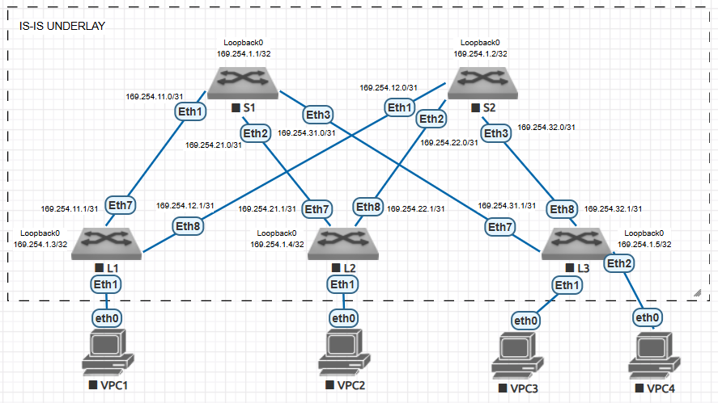

## Домашнее задание №1. Проектирование адресного пространства:

### Цель:
Собрать схему CLOS;
Распределить адресное пространство.

### Описание/Пошаговая инструкция выполнения домашнего задания:
В этой самостоятельной работе мы ожидаем, что вы самостоятельно:

#### 1) Соберете топологию CLOS, как на схеме:

#### 2) Распределите адресное пространство для Underlay сети;
#### 3) Зафиксируете в документации план работ, адресное пространство, схему сети, настройки (если перенесли на оборудование).

# Выполнение:

## План работ:

1) Выделить адресное пространство для интерфейсов Loopback;
2) Выделить адресное пространство для интерфейсов P-2-P;
3) Собрать схему сети согласно топологии представленной в задании;
4) Назначить адреса на сооветствующие интерфейсы;
5) Настроить протокол динамической маршрутизации Underlay;
6) Проверить связность между адресами на Loopback-интерфейсах.

## Адресное пространство:

| Назначение   | IP Network      |
| ------------ |:---------------:|
| Loopbacks    | 169.254.X.0/22  |
| P-2-P links  | 169.254.YZ.0/24  |

X - номер DC;
Y - номер Leaf;
Z - номер Spine.

## Cхема сети:

## Настройки сети:
