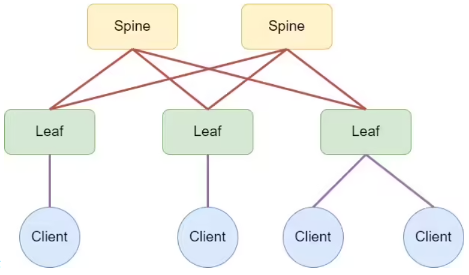
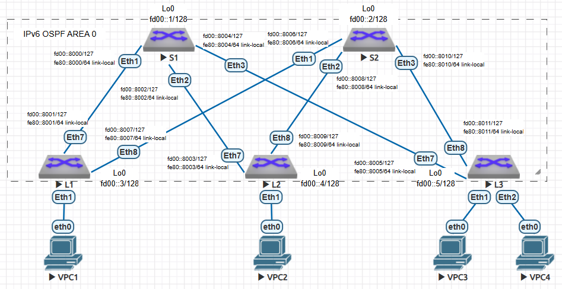

## Домашнее задание №2. Underlay - OSPF.

### Цели:
* Настроить OSPF для Underlay сети.

### Описание/Пошаговая инструкция выполнения домашнего задания:
В этой самостоятельной работе мы ожидаем, что вы самостоятельно:

#### 1) Настроите OSPF в Underlay сети, для IP связанности между всеми сетевыми устройствами;
#### 2) Зафиксируете в документации - план работы, адресное пространство, схему сети, конфигурацию устройств;
#### 3) Убедитесь в наличии IP связанности между устройствами в OSFP домене.

#### Топология сети:



# Выполнение:

## План работ:

1) Выделить адресное пространство для интерфейсов Loopback;
2) Выделить адресное пространство для интерфейсов P-2-P;
3) Собрать схему сети согласно топологии представленной в задании;
4) Назначить адреса на сооветствующие интерфейсы;
5) Настроить протокол динамической маршрутизации Underlay (учесть рекомендации);
6) Проверить связность между адресами на Loopback-интерфейсах.
7) Опубликовать листинг команд для проверки корректной работы сети с учетом реализованных рекомендаций.
8) Конфигурации всех устройств.

## Адресное пространство:

На этот раз будем использовать протокол IPv6. Количество адресов для интерфейсов Loopback берем из расчета максимального рекомендованного количества устройств на один Site - 1024.
Количество адресов для линков между устройствами берез из расчета максимально возможного их количества - 8 на каждый Leaf-коммутатор.

| Назначение   | IP Network      | IP Range      | Number of Hosts |
| ------------ |:---------------:|:---------------:|:---------------:|
| Loopbacks    | fd00::x/118  | fd00::0000 - fd00::03ff  | 1024 |
| P-2-P links  | fd00::8000/113  | fd00::8000 - fd00::ffff  | 32768 |
| Link-local  | fe80::8000/113(64) | fe80::8000 - fe80::ffff | 32768 |
| Router ID  | 1.y.1.z | none | none |

* Номер DC в адресный план не заложено, для последующих инсталляций берутся следующий по порядку диапазон адресов;
* x - порядковый номер коммутатора, при этом младшие адреса используются Spine-коммутаторами, последующие - Leaf-коммутаторами;
* Адреса для P-2-P интерфейсов между Spine- и Leaf-коммутаторами вибираются из диапазона с маской /127 и назначаются в порядке следования линков по топологии сети. При этом младший адрес назначается со стороны Spine-коммутатора, а старший - со стороны Leaf-коммутаторы;
* Адреса Link-local назначаются по из соображений назначенных адресов на P-2-P линках по последнему хекстету.
* Адрес для Router ID назначается по порядку следования, где: y = 1 - для Leaf-коммутаторов, y = 2 - для Spine-коммутаторов, а z - назначается по порядку следования для каждого из уровней.

## Cхема сети:


## Список реализованных рекомендаций:

* Использовать point-to-point на интерфейсах между Spine и Leaf коммутаторами (ipv6 ospf network point-to-point);
* Указывать в явном виде Router ID;
* OSPF должен быть выключен по-умолчанию на всех интерфейсах (passive-interface default);
* Один номер Area для каждого POD;
* Активировать OSPF только на тех интерфейсах, которые должны участвовать в процессе маршрутизации (ipv6 ospf 1 area 0);
* Использовать BFD;
* Избегать использование redistribute;
* Применять минимально необходимую конфигурацию OSPF;
* Настраивать OSPF для Underlay в GRT;
* Настройки аутентификации.

Дополнительно был отключен протокол STP на Spine-коммутаторах. Во избежание петель в рамках одного Leaf-коммутаторовна, подобных настроек на оных не производилось.

## Проверка работы Underlay-сети:

```
L1#show ipv6 route

VRF: default
Displaying 11 of 17 IPv6 routing table entries
Codes: C - connected, S - static, K - kernel, O3 - OSPFv3,
       B - Other BGP Routes, A B - BGP Aggregate, R - RIP,
       I L1 - IS-IS level 1, I L2 - IS-IS level 2, DH - DHCP,
       NG - Nexthop Group Static Route, M - Martian,
       DP - Dynamic Policy Route, L - VRF Leaked,
       RC - Route Cache Route

 O3       fd00::1/128 [110/20]
           via fe80::8000, Ethernet7
 O3       fd00::2/128 [110/20]
           via fe80::8006, Ethernet8
 C        fd00::3/128 [0/0]
           via Loopback0, directly connected
 O3       fd00::4/128 [110/30]
           via fe80::8000, Ethernet7
           via fe80::8006, Ethernet8
 O3       fd00::5/128 [110/30]
           via fe80::8000, Ethernet7
           via fe80::8006, Ethernet8
 C        fd00::8000/127 [0/1]
           via Ethernet7, directly connected
 O3       fd00::8002/127 [110/20]
           via fe80::8000, Ethernet7
 O3       fd00::8004/127 [110/20]
           via fe80::8000, Ethernet7
 C        fd00::8006/127 [0/1]
           via Ethernet8, directly connected
 O3       fd00::8008/127 [110/20]
           via fe80::8006, Ethernet8
 O3       fd00::8010/127 [110/20]
           via fe80::8006, Ethernet8

L1#ping fd00::3 rep 1
PING fd00::3(fd00::3) 52 data bytes
60 bytes from fd00::3: icmp_seq=1 ttl=64 time=1.07 ms

--- fd00::3 ping statistics ---
1 packets transmitted, 1 received, 0% packet loss, time 0ms
rtt min/avg/max/mdev = 1.076/1.076/1.076/0.000 ms
L1#ping fd00::4 rep 1
PING fd00::4(fd00::4) 52 data bytes
60 bytes from fd00::4: icmp_seq=1 ttl=63 time=36.1 ms

--- fd00::4 ping statistics ---
1 packets transmitted, 1 received, 0% packet loss, time 0ms
rtt min/avg/max/mdev = 36.144/36.144/36.144/0.000 ms
L1#ping fd00::5 rep 1
PING fd00::5(fd00::5) 52 data bytes
60 bytes from fd00::5: icmp_seq=1 ttl=63 time=18.8 ms

--- fd00::5 ping statistics ---
1 packets transmitted, 1 received, 0% packet loss, time 0ms
rtt min/avg/max/mdev = 18.870/18.870/18.870/0.000 ms
```

## Листинг команд:

```
show ipv6 neighbors
show ipv6 ospf 1 interface
show ipv6 ospf neighbor
show ipv6 ospf database
show ipv6 route
show spanning-tree
```

## Конфигурация устройств:
```
S1#show running-config
! Command: show running-config
! device: S1 (vEOS-lab, EOS-4.29.2F)
!
! boot system flash:/vEOS-lab.swi
!
no aaa root
!
transceiver qsfp default-mode 4x10G
!
service routing protocols model ribd
!
hostname S1
!
spanning-tree mode none
!
interface Ethernet1
   no switchport
   bfd interval 100 min-rx 100 multiplier 3
   ipv6 enable
   ipv6 address fd00::8000/127
   ipv6 address fe80::8000/64 link-local
   ipv6 ospf bfd
   ipv6 ospf network point-to-point
   ipv6 ospf authentication ipsec spi 100 md5 passphrase 7 kJLQ2UxPSLtsZ75QNgTh6g==
   ipv6 ospf 1 area 0.0.0.0
!
interface Ethernet2
   no switchport
   bfd interval 100 min-rx 100 multiplier 3
   ipv6 enable
   ipv6 address fd00::8002/127
   ipv6 address fe80::8002/64 link-local
   ipv6 ospf bfd
   ipv6 ospf network point-to-point
   ipv6 ospf authentication ipsec spi 100 md5 passphrase 7 SIlxYKscF9mRUDXhtqywJQ==
   ipv6 ospf 1 area 0.0.0.0
!
interface Ethernet3
   no switchport
   bfd interval 100 min-rx 100 multiplier 3
   ipv6 enable
   ipv6 address fd00::8004/127
   ipv6 address fe80::8004/64 link-local
   ipv6 ospf bfd
   ipv6 ospf network point-to-point
   ipv6 ospf authentication ipsec spi 100 md5 passphrase 7 SIlxYKscF9mRUDXhtqywJQ==
   ipv6 ospf 1 area 0.0.0.0
!
interface Ethernet4
   shutdown
!
interface Ethernet5
   shutdown
!
interface Ethernet6
   shutdown
!
interface Ethernet7
   shutdown
!
interface Ethernet8
   shutdown
!
interface Loopback0
   ipv6 enable
   ipv6 address fd00::1/128
   ipv6 ospf 1 area 0.0.0.0
!
interface Management1
!
no ip routing
!
ipv6 unicast-routing
!
ipv6 router ospf 1
   router-id 1.2.1.1
   passive-interface default
   no passive-interface Ethernet1
   no passive-interface Ethernet2
   no passive-interface Ethernet3
!
end


S2#show running-config
! Command: show running-config
! device: S2 (vEOS-lab, EOS-4.29.2F)
!
! boot system flash:/vEOS-lab.swi
!
no aaa root
!
transceiver qsfp default-mode 4x10G
!
service routing protocols model ribd
!
hostname S2
!
spanning-tree mode none
!
interface Ethernet1
   no switchport
   bfd interval 100 min-rx 100 multiplier 3
   ipv6 enable
   ipv6 address fd00::8006/127
   ipv6 address fe80::8006/64 link-local
   ipv6 ospf bfd
   ipv6 ospf network point-to-point
   ipv6 ospf authentication ipsec spi 100 md5 passphrase 7 kJLQ2UxPSLtsZ75QNgTh6g==
   ipv6 ospf 1 area 0.0.0.0
!
interface Ethernet2
   no switchport
   bfd interval 100 min-rx 100 multiplier 3
   ipv6 enable
   ipv6 address fd00::8008/127
   ipv6 address fe80::8008/64 link-local
   ipv6 ospf bfd
   ipv6 ospf network point-to-point
   ipv6 ospf authentication ipsec spi 100 md5 passphrase 7 SIlxYKscF9mRUDXhtqywJQ==
   ipv6 ospf 1 area 0.0.0.0
!
interface Ethernet3
   no switchport
   bfd interval 100 min-rx 100 multiplier 3
   ipv6 enable
   ipv6 address fd00::8010/127
   ipv6 address fe80::8010/64 link-local
   ipv6 ospf bfd
   ipv6 ospf network point-to-point
   ipv6 ospf authentication ipsec spi 100 md5 passphrase 7 SIlxYKscF9mRUDXhtqywJQ==
   ipv6 ospf 1 area 0.0.0.0
!
interface Ethernet4
   shutdown
!
interface Ethernet5
   shutdown
!
interface Ethernet6
   shutdown
!
interface Ethernet7
   shutdown
!
interface Ethernet8
   shutdown
!
interface Loopback0
   ipv6 enable
   ipv6 address fd00::2/128
   ipv6 ospf 1 area 0.0.0.0
!
interface Management1
!
no ip routing
!
ipv6 unicast-routing
!
ipv6 router ospf 1
   router-id 1.2.1.2
   passive-interface default
   no passive-interface Ethernet1
   no passive-interface Ethernet2
   no passive-interface Ethernet3
!
end


L1#show running-config
! Command: show running-config
! device: L1 (vEOS-lab, EOS-4.29.2F)
!
! boot system flash:/vEOS-lab.swi
!
no aaa root
!
transceiver qsfp default-mode 4x10G
!
service routing protocols model ribd
!
hostname L1
!
spanning-tree mode mstp
!
interface Ethernet1
!
interface Ethernet2
!
interface Ethernet3
!
interface Ethernet4
!
interface Ethernet5
!
interface Ethernet6
!
interface Ethernet7
   no switchport
   bfd interval 100 min-rx 100 multiplier 3
   ipv6 enable
   ipv6 address fd00::8001/127
   ipv6 address fe80::8001/64 link-local
   ipv6 ospf bfd
   ipv6 ospf network point-to-point
   ipv6 ospf authentication ipsec spi 100 md5 passphrase 7 tYektvZH6k3iPsqBlcFUIA==
   ipv6 ospf 1 area 0.0.0.0
!
interface Ethernet8
   no switchport
   bfd interval 100 min-rx 100 multiplier 3
   ipv6 enable
   ipv6 address fd00::8007/127
   ipv6 address fe80::8007/64 link-local
   ipv6 ospf bfd
   ipv6 ospf network point-to-point
   ipv6 ospf authentication ipsec spi 100 md5 passphrase 7 iY21IKpBYbs6+fO7EEqo0Q==
   ipv6 ospf 1 area 0.0.0.0
!
interface Loopback0
   ipv6 enable
   ipv6 address fd00::3/128
   ipv6 ospf 1 area 0.0.0.0
!
interface Management1
!
no ip routing
!
ipv6 unicast-routing
!
ipv6 router ospf 1
   router-id 1.1.1.1
   passive-interface default
   no passive-interface Ethernet7
   no passive-interface Ethernet8
!
end


L2#show running-config
! Command: show running-config
! device: L2 (vEOS-lab, EOS-4.29.2F)
!
! boot system flash:/vEOS-lab.swi
!
no aaa root
!
transceiver qsfp default-mode 4x10G
!
service routing protocols model ribd
!
hostname L2
!
spanning-tree mode mstp
!
interface Ethernet1
!
interface Ethernet2
!
interface Ethernet3
!
interface Ethernet4
!
interface Ethernet5
!
interface Ethernet6
!
interface Ethernet7
   no switchport
   bfd interval 100 min-rx 100 multiplier 3
   ipv6 enable
   ipv6 address fd00::8003/127
   ipv6 address fe80::8003/64 link-local
   ipv6 ospf bfd
   ipv6 ospf network point-to-point
   ipv6 ospf authentication ipsec spi 100 md5 passphrase 7 tYektvZH6k3iPsqBlcFUIA==
   ipv6 ospf 1 area 0.0.0.0
!
interface Ethernet8
   no switchport
   bfd interval 100 min-rx 100 multiplier 3
   ipv6 enable
   ipv6 address fd00::8009/127
   ipv6 address fe80::8009/64 link-local
   ipv6 ospf bfd
   ipv6 ospf network point-to-point
   ipv6 ospf authentication ipsec spi 100 md5 passphrase 7 iY21IKpBYbs6+fO7EEqo0Q==
   ipv6 ospf 1 area 0.0.0.0
!
interface Loopback0
   ipv6 enable
   ipv6 address fd00::4/128
   ipv6 ospf 1 area 0.0.0.0
!
interface Management1
!
no ip routing
!
ipv6 unicast-routing
!
ipv6 router ospf 1
   router-id 1.1.1.2
   passive-interface default
   no passive-interface Ethernet7
   no passive-interface Ethernet8
!
end


L3#show running-config
! Command: show running-config
! device: L3 (vEOS-lab, EOS-4.29.2F)
!
! boot system flash:/vEOS-lab.swi
!
no aaa root
!
transceiver qsfp default-mode 4x10G
!
service routing protocols model ribd
!
hostname L3
!
spanning-tree mode mstp
!
interface Ethernet1
!
interface Ethernet2
!
interface Ethernet3
!
interface Ethernet4
!
interface Ethernet5
!
interface Ethernet6
!
interface Ethernet7
   no switchport
   bfd interval 100 min-rx 100 multiplier 3
   ipv6 enable
   ipv6 address fd00::8005/127
   ipv6 address fe80::8005/64 link-local
   ipv6 ospf bfd
   ipv6 ospf network point-to-point
   ipv6 ospf authentication ipsec spi 100 md5 passphrase 7 tYektvZH6k3iPsqBlcFUIA==
   ipv6 ospf 1 area 0.0.0.0
!
interface Ethernet8
   no switchport
   bfd interval 100 min-rx 100 multiplier 3
   ipv6 enable
   ipv6 address fd00::8011/127
   ipv6 address fe80::8011/64 link-local
   ipv6 ospf bfd
   ipv6 ospf network point-to-point
   ipv6 ospf authentication ipsec spi 100 md5 passphrase 7 iY21IKpBYbs6+fO7EEqo0Q==
   ipv6 ospf 1 area 0.0.0.0
!
interface Loopback0
   ipv6 enable
   ipv6 address fd00::5/128
   ipv6 ospf 1 area 0.0.0.0
!
interface Management1
!
no ip routing
!
ipv6 unicast-routing
!
ipv6 router ospf 1
   router-id 1.1.1.3
   passive-interface default
   no passive-interface Ethernet7
   no passive-interface Ethernet8
!
end
```
