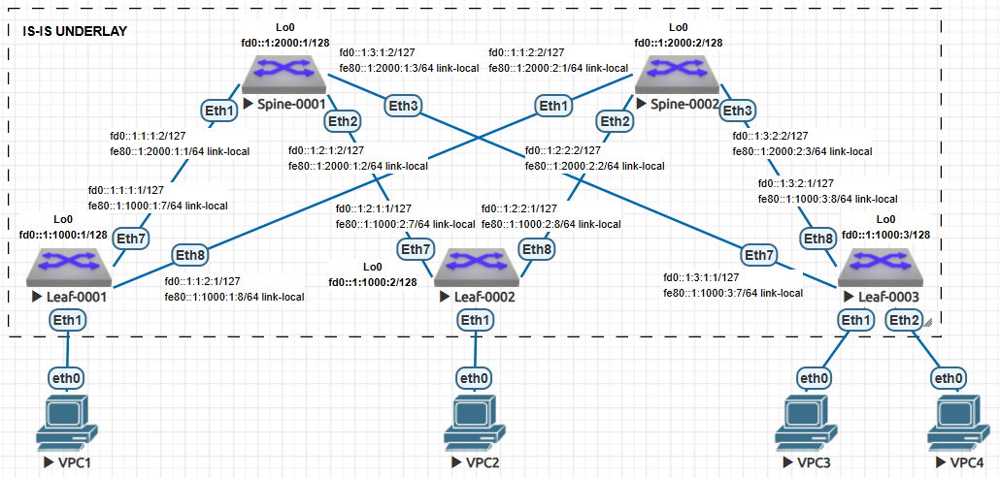

## Домашнее задание №2. Underlay - IS-IS.

### Цели:
* Настроить IS-IS для Underlay сети.

### Описание/Пошаговая инструкция выполнения домашнего задания:
В этой самостоятельной работе мы ожидаем, что вы самостоятельно:

#### 1) Настроите IS-IS в Underlay сети, для IP связанности между всеми сетевыми устройствами;
#### 2) Зафиксируете в документации - план работы, адресное пространство, схему сети, конфигурацию устройств;
#### 3) Убедитесь в наличии IP связанности между устройствами в IS-IS домене.

#### Топология сети:


# Выполнение:

## План работ:

1) Выделить адресное пространство для интерфейсов Loopback;
2) Выделить адресное пространство для интерфейсов P-2-P;
3) Собрать схему сети согласно топологии представленной в задании;
4) Назначить адреса на сооветствующие интерфейсы;
5) Настроить протокол динамической маршрутизации Underlay (учесть рекомендации);
6) Проверить связность между адресами на Loopback-интерфейсах;
7) Опубликовать листинг команд для проверки корректной работы сети с учетом реализованных рекомендаций (привести пример вывода команд с одного устройства);
8) Конфигурации устройств.

## Адресное пространство:

В целях удобства управления сетью, применим следующий метод присвоения адресов:

| Назначение   | IP шаблон |
| ------------ |:---------------:|
| Leaf loopbacks | 0fd0::P:1000:L/128 |
| Spine loopbacks | 0fd0::P:2000:S/128 |
| P-2-P links | 0fd0::P:L:S:N/127 |
| Leaf Link-local | fe80::P:1000:L:pL/64 |
| Spine Link-local | fe80::P:2000:S:pS/64 |
| Leaf IS-IS NET | 49.0001.0000.1000.L.00 |
| Spine IS-IS NET | 49.0001.0000.2000.S.00 |

В представленно шаблоне используются следующие переменные:

* P - номер POD;
* L - номер Leaf-коммутатора;
* S - номер Spine-коммутатора;
* pL - номер порта на Leaf-коммутаторе;
* pS - номер порта на Spine-коммутаторе;
* N = [1|2] - на стороне Leaf - N = 1, на стороне Spine - N = 2.


## Cхема сети:


## Список реализованных рекомендаций:

* Использовать point-to-point на интерфейсах между Spine и Leaf коммутаторами (isis network point-to-point);
* Использовать BFD;
* Внутри одного POD использовать маршрутизацию IS-IS Level-1 (is-type level-1);
* Для большего количества POD разделять их по зонам;
* Избегать использование redistribute;
* Применять минимально необходимую конфигурацию IS-IS;
* Настраивать IS-IS для Underlay в GRT;
* Настройки аутентификации (isis authentication).

Дополнительно был отключен протокол STP на Spine-коммутаторах. Во избежание петель в рамках одного Leaf-коммутаторовна, подобных настроек на оных не производилось.

## Проверка работы Underlay-сети:

```
Leaf-0001#show ipv6 route isis

VRF: default
Displaying 14 of 23 IPv6 routing table entries
Codes: C - connected, S - static, K - kernel, O3 - OSPFv3,
       B - Other BGP Routes, A B - BGP Aggregate, R - RIP,
       I L1 - IS-IS level 1, I L2 - IS-IS level 2, DH - DHCP,
       NG - Nexthop Group Static Route, M - Martian,
       DP - Dynamic Policy Route, L - VRF Leaked,
       RC - Route Cache Route

 I L1     fd0::1:1000:2/128 [115/30]
           via fe80::1:2000:1:1, Ethernet7
           via fe80::1:2000:2:1, Ethernet8
 I L1     fd0::1:1000:3/128 [115/30]
           via fe80::1:2000:1:1, Ethernet7
           via fe80::1:2000:2:1, Ethernet8
 I L1     fd0::1:2000:1/128 [115/20]
           via fe80::1:2000:1:1, Ethernet7
 I L1     fd0::1:2000:2/128 [115/20]
           via fe80::1:2000:2:1, Ethernet8
 I L1     fd0::1:1:1:2/127 [115/20]
           via fe80::1:2000:1:1, Ethernet7
 I L1     fd0::1:1:2:2/127 [115/20]
           via fe80::1:2000:2:1, Ethernet8
 I L1     fd0::1:2:1:0/127 [115/30]
           via fe80::1:2000:1:1, Ethernet7
           via fe80::1:2000:2:1, Ethernet8
 I L1     fd0::1:2:1:2/127 [115/20]
           via fe80::1:2000:1:1, Ethernet7
 I L1     fd0::1:2:2:0/127 [115/30]
           via fe80::1:2000:1:1, Ethernet7
           via fe80::1:2000:2:1, Ethernet8
 I L1     fd0::1:2:2:2/127 [115/20]
           via fe80::1:2000:2:1, Ethernet8
 I L1     fd0::1:3:1:0/127 [115/30]
           via fe80::1:2000:1:1, Ethernet7
           via fe80::1:2000:2:1, Ethernet8
 I L1     fd0::1:3:1:2/127 [115/20]
           via fe80::1:2000:1:1, Ethernet7
 I L1     fd0::1:3:2:0/127 [115/30]
           via fe80::1:2000:1:1, Ethernet7
           via fe80::1:2000:2:1, Ethernet8
 I L1     fd0::1:3:2:2/127 [115/20]
           via fe80::1:2000:2:1, Ethernet8

Leaf-0001#ping fd0::1:1000:1
PING fd0::1:1000:1(fd0::1:1000:1) 52 data bytes
60 bytes from fd0::1:1000:1: icmp_seq=1 ttl=64 time=1.14 ms
60 bytes from fd0::1:1000:1: icmp_seq=2 ttl=64 time=0.242 ms
60 bytes from fd0::1:1000:1: icmp_seq=3 ttl=64 time=0.225 ms
60 bytes from fd0::1:1000:1: icmp_seq=4 ttl=64 time=0.188 ms
60 bytes from fd0::1:1000:1: icmp_seq=5 ttl=64 time=0.191 ms

--- fd0::1:1000:1 ping statistics ---
5 packets transmitted, 5 received, 0% packet loss, time 11ms
rtt min/avg/max/mdev = 0.188/0.397/1.142/0.373 ms, ipg/ewma 2.951/0.755 ms

Leaf-0001#ping fd0::1:1000:2
PING fd0::1:1000:2(fd0::1:1000:2) 52 data bytes
60 bytes from fd0::1:1000:2: icmp_seq=1 ttl=63 time=62.1 ms
60 bytes from fd0::1:1000:2: icmp_seq=2 ttl=63 time=53.7 ms
60 bytes from fd0::1:1000:2: icmp_seq=3 ttl=63 time=60.1 ms
60 bytes from fd0::1:1000:2: icmp_seq=4 ttl=63 time=58.4 ms
60 bytes from fd0::1:1000:2: icmp_seq=5 ttl=63 time=59.4 ms

--- fd0::1:1000:2 ping statistics ---
5 packets transmitted, 5 received, 0% packet loss, time 51ms
rtt min/avg/max/mdev = 53.772/58.784/62.183/2.795 ms, pipe 5, ipg/ewma 12.803/60.524 ms

Leaf-0001#ping fd0::1:1000:3
PING fd0::1:1000:3(fd0::1:1000:3) 52 data bytes
60 bytes from fd0::1:1000:3: icmp_seq=1 ttl=63 time=29.6 ms
60 bytes from fd0::1:1000:3: icmp_seq=2 ttl=63 time=32.9 ms
60 bytes from fd0::1:1000:3: icmp_seq=3 ttl=63 time=34.2 ms
60 bytes from fd0::1:1000:3: icmp_seq=4 ttl=63 time=36.2 ms
60 bytes from fd0::1:1000:3: icmp_seq=5 ttl=63 time=38.1 ms

--- fd0::1:1000:3 ping statistics ---
5 packets transmitted, 5 received, 0% packet loss, time 94ms
rtt min/avg/max/mdev = 29.627/34.244/38.110/2.901 ms, pipe 3, ipg/ewma 23.635/32.135 ms
```

## Листинг команд с примерами вывода:

```
show ipv6 neighbors
show isis interface
show isis neighbors
show isis hostname
show isis database
show isis network topology
show ipv6 route isis
show bfd peers
```

#### Пример вывода команд с первого Leaf-коммутатора:

```
Leaf-0001#show ipv6 neighbors
IPv6 Address                                  Age Hardware Addr    State Interface
fe80::1:2000:1:1                          0:07:37 5000.0068.a17f   REACH Et7
fe80::1:2000:2:1                          1:52:44 5000.0088.2ff3   REACH Et8


Leaf-0001#show isis interface

IS-IS Instance: UNDERLAY VRF: default

  Interface Loopback0:
    Index: 11 SNPA: 0:0:0:0:0:0
    MTU: 65532 Type: loopback
    Supported address families: IPv6
    Area proxy boundary is disabled
    BFD IPv4 is disabled
    BFD IPv6 is enabled
    Hello padding is enabled
    Level 1:
      Metric: 10 (passive interface)
      Authentication mode: None
      TI-LFA protection is disabled for IPv4
      TI-LFA protection is disabled for IPv6
  Interface Ethernet7:
    Index: 20 SNPA: P2P
    MTU: 1497 Type: point-to-point
    Supported address families: IPv6
    Area proxy boundary is disabled
    Speed: 1000 mbps
    BFD IPv4 is enabled
    BFD IPv6 is enabled
    Hello padding is enabled
    Level 1:
      Metric: 10, Number of adjacencies: 1
      Link-ID: 14
      Authentication mode: MD5
      TI-LFA protection is disabled for IPv4
      TI-LFA protection is disabled for IPv6
  Interface Ethernet8:
    Index: 21 SNPA: P2P
    MTU: 1497 Type: point-to-point
    Supported address families: IPv6
    Area proxy boundary is disabled
    Speed: 1000 mbps
    BFD IPv4 is enabled
    BFD IPv6 is enabled
    Hello padding is enabled
    Level 1:
      Metric: 10, Number of adjacencies: 1
      Link-ID: 15
      Authentication mode: MD5
      TI-LFA protection is disabled for IPv4
      TI-LFA protection is disabled for IPv6


Leaf-0001#show isis neighbors

Instance  VRF      System Id        Type Interface          SNPA              State Hold time   Circuit Id
UNDERLAY  default  Spine-0001       L1   Ethernet7          P2P               UP    26          0E
UNDERLAY  default  Spine-0002       L1   Ethernet8          P2P               UP    27          0E


Leaf-0001#show isis hostname

IS-IS Instance: UNDERLAY VRF: default
Level  System ID           Hostname
L1     0000.1000.0001      Leaf-0001
L1     0000.1000.0002      Leaf-0002
L1     0000.1000.0003      Leaf-0003
L1     0000.2000.0001      Spine-0001
L1     0000.2000.0002      Spine-0002


IS-IS Instance: UNDERLAY VRF: default
  IS-IS Level 1 Link State Database
    LSPID                   Seq Num  Cksum  Life Length IS Flags
    Leaf-0001.00-00              39  10339   814    189 L1 <>
    Leaf-0002.00-00              31   9064   637    189 L1 <>
    Leaf-0003.00-00              33  65154   637    189 L1 <>
    Spine-0001.00-00             39  41891   672    239 L1 <>
    Spine-0002.00-00             38  29387   814    239 L1 <>


IS-IS Instance: UNDERLAY VRF: default
  IS-IS paths to level-1 routers
    System Id        Metric   IA Metric Next-Hop         Interface                SNPA
    Leaf-0002        20       0         Spine-0001       Ethernet7                P2P
                                        Spine-0002       Ethernet8                P2P
    Leaf-0003        20       0         Spine-0001       Ethernet7                P2P
                                        Spine-0002       Ethernet8                P2P
    Spine-0001       10       0         Spine-0001       Ethernet7                P2P
    Spine-0002       10       0         Spine-0002       Ethernet8                P2P


Leaf-0001#show ipv6 route isis

VRF: default
Displaying 14 of 23 IPv6 routing table entries
Codes: C - connected, S - static, K - kernel, O3 - OSPFv3,
       B - Other BGP Routes, A B - BGP Aggregate, R - RIP,
       I L1 - IS-IS level 1, I L2 - IS-IS level 2, DH - DHCP,
       NG - Nexthop Group Static Route, M - Martian,
       DP - Dynamic Policy Route, L - VRF Leaked,
       RC - Route Cache Route

 I L1     fd0::1:1000:2/128 [115/30]
           via fe80::1:2000:1:1, Ethernet7
           via fe80::1:2000:2:1, Ethernet8
 I L1     fd0::1:1000:3/128 [115/30]
           via fe80::1:2000:1:1, Ethernet7
           via fe80::1:2000:2:1, Ethernet8
 I L1     fd0::1:2000:1/128 [115/20]
           via fe80::1:2000:1:1, Ethernet7
 I L1     fd0::1:2000:2/128 [115/20]
           via fe80::1:2000:2:1, Ethernet8
 I L1     fd0::1:1:1:2/127 [115/20]
           via fe80::1:2000:1:1, Ethernet7
 I L1     fd0::1:1:2:2/127 [115/20]
           via fe80::1:2000:2:1, Ethernet8
 I L1     fd0::1:2:1:0/127 [115/30]
           via fe80::1:2000:1:1, Ethernet7
           via fe80::1:2000:2:1, Ethernet8
 I L1     fd0::1:2:1:2/127 [115/20]
           via fe80::1:2000:1:1, Ethernet7
 I L1     fd0::1:2:2:0/127 [115/30]
           via fe80::1:2000:1:1, Ethernet7
           via fe80::1:2000:2:1, Ethernet8
 I L1     fd0::1:2:2:2/127 [115/20]
           via fe80::1:2000:2:1, Ethernet8
 I L1     fd0::1:3:1:0/127 [115/30]
           via fe80::1:2000:1:1, Ethernet7
           via fe80::1:2000:2:1, Ethernet8
 I L1     fd0::1:3:1:2/127 [115/20]
           via fe80::1:2000:1:1, Ethernet7
 I L1     fd0::1:3:2:0/127 [115/30]
           via fe80::1:2000:1:1, Ethernet7
           via fe80::1:2000:2:1, Ethernet8
 I L1     fd0::1:3:2:2/127 [115/20]
           via fe80::1:2000:2:1, Ethernet8


Leaf-0001#show bfd peers
VRF name: default
-----------------
DstAddr              MyDisc   YourDisc Interface/Transport   Type         LastUp
---------------- ---------- ---------- ------------------- ------ --------------
fe80::1:2000:1:1 1381300306 2964254301       Ethernet7(20) normal 03/22/25 16:39
fe80::1:2000:2:1 1089196391 1373460164       Ethernet8(21) normal 03/22/25 16:42

   LastDown            LastDiag    State
-------------- ------------------- -----
         NA       No Diagnostic       Up
         NA       No Diagnostic       Up
```

## Конфигурации устройств:
```
Leaf-0001#show running-config
! Command: show running-config
! device: Leaf-0001 (vEOS-lab, EOS-4.29.2F)
!
! boot system flash:/vEOS-lab.swi
!
no aaa root
!
transceiver qsfp default-mode 4x10G
!
service routing protocols model ribd
!
hostname Leaf-0001
!
spanning-tree mode mstp
!
interface Ethernet1
!
interface Ethernet2
!
interface Ethernet3
!
interface Ethernet4
!
interface Ethernet5
!
interface Ethernet6
!
interface Ethernet7
   no switchport
   bfd interval 100 min-rx 100 multiplier 3
   ipv6 enable
   ipv6 address fd0::1:1:1:1/127
   ipv6 address fe80::1:1000:1:7/64 link-local
   isis enable UNDERLAY
   isis bfd
   isis network point-to-point
   isis authentication mode md5
   isis authentication key 7 lwMn+t/hkq7bII/k0RBS7w==
!
interface Ethernet8
   no switchport
   bfd interval 100 min-rx 100 multiplier 3
   ipv6 enable
   ipv6 address fd0::1:1:2:1/127
   ipv6 address fe80::1:1000:1:8/64 link-local
   isis enable UNDERLAY
   isis bfd
   isis network point-to-point
   isis authentication mode md5
   isis authentication key 7 lwMn+t/hkq7bII/k0RBS7w==
!
interface Loopback0
   ipv6 enable
   ipv6 address fd0::1:1000:1/128
   isis enable UNDERLAY
   no isis bfd
   isis passive
!
interface Management1
!
no ip routing
!
ipv6 unicast-routing
!
router isis UNDERLAY
   net 49.0001.0000.1000.0001.00
   is-type level-1
   !
   address-family ipv6 unicast
      bfd all-interfaces
!
end


Leaf-0002#show running-config
! Command: show running-config
! device: Leaf-0002 (vEOS-lab, EOS-4.29.2F)
!
! boot system flash:/vEOS-lab.swi
!
no aaa root
!
transceiver qsfp default-mode 4x10G
!
service routing protocols model ribd
!
hostname Leaf-0002
!
spanning-tree mode mstp
!
interface Ethernet1
!
interface Ethernet2
!
interface Ethernet3
!
interface Ethernet4
!
interface Ethernet5
!
interface Ethernet6
!
interface Ethernet7
   no switchport
   bfd interval 100 min-rx 100 multiplier 3
   ipv6 enable
   ipv6 address fd0::1:2:1:1/127
   ipv6 address fe80::1:1000:2:7/64 link-local
   isis enable UNDERLAY
   isis bfd
   isis network point-to-point
   isis authentication mode md5
   isis authentication key 7 lwMn+t/hkq7bII/k0RBS7w==
!
interface Ethernet8
   no switchport
   bfd interval 100 min-rx 100 multiplier 3
   ipv6 enable
   ipv6 address fd0::1:2:2:1/127
   ipv6 address fe80::1:1000:2:8/64 link-local
   isis enable UNDERLAY
   isis bfd
   isis network point-to-point
   isis authentication mode md5
   isis authentication key 7 lwMn+t/hkq7bII/k0RBS7w==
!
interface Loopback0
   ipv6 enable
   ipv6 address fd0::1:1000:2/128
   isis enable UNDERLAY
   no isis bfd
   isis passive
!
interface Management1
!
no ip routing
!
ipv6 unicast-routing
!
router isis UNDERLAY
   net 49.0001.0000.1000.0002.00
   is-type level-1
   !
   address-family ipv6 unicast
      bfd all-interfaces
!
end


Leaf-0003#show running-config
! Command: show running-config
! device: Leaf-0003 (vEOS-lab, EOS-4.29.2F)
!
! boot system flash:/vEOS-lab.swi
!
no aaa root
!
transceiver qsfp default-mode 4x10G
!
service routing protocols model ribd
!
hostname Leaf-0003
!
spanning-tree mode mstp
!
interface Ethernet1
!
interface Ethernet2
!
interface Ethernet3
!
interface Ethernet4
!
interface Ethernet5
!
interface Ethernet6
!
interface Ethernet7
   no switchport
   bfd interval 100 min-rx 100 multiplier 3
   ipv6 enable
   ipv6 address fd0::1:3:1:1/127
   ipv6 address fe80::1:1000:3:7/64 link-local
   isis enable UNDERLAY
   isis bfd
   isis network point-to-point
   isis authentication mode md5
   isis authentication key 7 lwMn+t/hkq7bII/k0RBS7w==
!
interface Ethernet8
   no switchport
   bfd interval 100 min-rx 100 multiplier 3
   ipv6 enable
   ipv6 address fd0::1:3:2:1/127
   ipv6 address fe80::1:1000:3:8/64 link-local
   isis enable UNDERLAY
   isis bfd
   isis network point-to-point
   isis authentication mode md5
   isis authentication key 7 lwMn+t/hkq7bII/k0RBS7w==
!
interface Loopback0
   ipv6 enable
   ipv6 address fd0::1:1000:3/128
   isis enable UNDERLAY
   no isis bfd
   isis passive
!
interface Management1
!
no ip routing
!
ipv6 unicast-routing
!
router isis UNDERLAY
   net 49.0001.0000.1000.0003.00
   is-type level-1
   !
   address-family ipv6 unicast
      bfd all-interfaces
!
end


Spine-0001#show running-config
! Command: show running-config
! device: Spine-0001 (vEOS-lab, EOS-4.29.2F)
!
! boot system flash:/vEOS-lab.swi
!
no aaa root
!
transceiver qsfp default-mode 4x10G
!
service routing protocols model ribd
!
hostname Spine-0001
!
spanning-tree mode none
!
interface Ethernet1
   no switchport
   bfd interval 100 min-rx 100 multiplier 3
   ipv6 enable
   ipv6 address fd0::1:1:1:2/127
   ipv6 address fe80::1:2000:1:1/64 link-local
   isis enable UNDERLAY
   isis bfd
   isis network point-to-point
   isis authentication mode md5
   isis authentication key 7 lwMn+t/hkq7bII/k0RBS7w==
!
interface Ethernet2
   no switchport
   bfd interval 100 min-rx 100 multiplier 3
   ipv6 enable
   ipv6 address fd0::1:2:1:2/127
   ipv6 address fe80::1:2000:1:2/64 link-local
   isis enable UNDERLAY
   isis bfd
   isis network point-to-point
   isis authentication mode md5
   isis authentication key 7 lwMn+t/hkq7bII/k0RBS7w==
!
interface Ethernet3
   no switchport
   bfd interval 100 min-rx 100 multiplier 3
   ipv6 enable
   ipv6 address fd0::1:3:1:2/127
   ipv6 address fe80::1:2000:1:3/64 link-local
   isis enable UNDERLAY
   isis bfd
   isis network point-to-point
   isis authentication mode md5
   isis authentication key 7 lwMn+t/hkq7bII/k0RBS7w==
!
interface Ethernet4
!
interface Ethernet5
!
interface Ethernet6
!
interface Ethernet7
!
interface Ethernet8
!
interface Loopback0
   ipv6 enable
   ipv6 address fd0::1:2000:1/128
   isis enable UNDERLAY
   no isis bfd
   isis passive
!
interface Management1
!
no ip routing
!
ipv6 unicast-routing
!
router isis UNDERLAY
   net 49.0001.0000.2000.0001.00
   is-type level-1
   !
   address-family ipv6 unicast
      bfd all-interfaces
!
end


Spine-0002#show running-config
! Command: show running-config
! device: Spine-0002 (vEOS-lab, EOS-4.29.2F)
!
! boot system flash:/vEOS-lab.swi
!
no aaa root
!
transceiver qsfp default-mode 4x10G
!
service routing protocols model ribd
!
hostname Spine-0002
!
spanning-tree mode none
!
interface Ethernet1
   no switchport
   bfd interval 100 min-rx 100 multiplier 3
   ipv6 enable
   ipv6 address fd0::1:1:2:2/127
   ipv6 address fe80::1:2000:2:1/64 link-local
   isis enable UNDERLAY
   isis bfd
   isis network point-to-point
   isis authentication mode md5
   isis authentication key 7 lwMn+t/hkq7bII/k0RBS7w==
!
interface Ethernet2
   no switchport
   bfd interval 100 min-rx 100 multiplier 3
   ipv6 enable
   ipv6 address fd0::1:2:2:2/127
   ipv6 address fe80::1:2000:2:2/64 link-local
   isis enable UNDERLAY
   isis bfd
   isis network point-to-point
   isis authentication mode md5
   isis authentication key 7 lwMn+t/hkq7bII/k0RBS7w==
!
interface Ethernet3
   no switchport
   bfd interval 100 min-rx 100 multiplier 3
   ipv6 enable
   ipv6 address fd0::1:3:2:2/127
   ipv6 address fe80::1:2000:2:3/64 link-local
   isis enable UNDERLAY
   isis bfd
   isis network point-to-point
   isis authentication mode md5
   isis authentication key 7 lwMn+t/hkq7bII/k0RBS7w==
!
interface Ethernet4
!
interface Ethernet5
!
interface Ethernet6
!
interface Ethernet7
!
interface Ethernet8
!
interface Loopback0
   ipv6 enable
   ipv6 address fd0::1:2000:2/128
   isis enable UNDERLAY
   no isis bfd
   isis passive
!
interface Management1
!
no ip routing
!
ipv6 unicast-routing
!
router isis UNDERLAY
   net 49.0001.0000.2000.0002.00
   is-type level-1
   !
   address-family ipv6 unicast
      bfd all-interfaces
!
end
```
