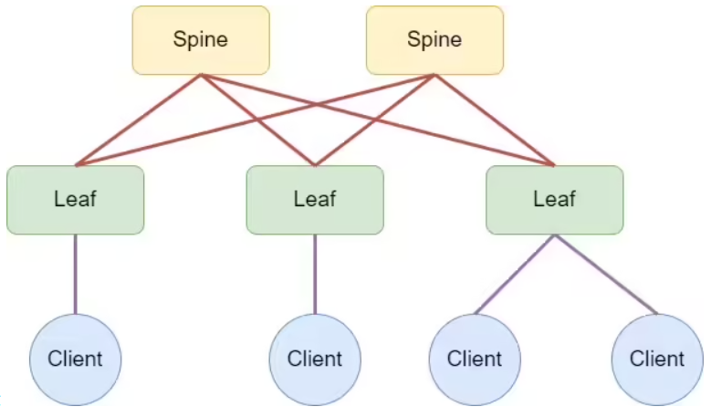

## Домашнее задание №4. Underlay - BGP.

### Цели:
* Настроить BGP для Underlay сети.

### Описание/Пошаговая инструкция выполнения домашнего задания:
В этой самостоятельной работе мы ожидаем, что вы самостоятельно:

#### 1) Настроите BGP в Underlay сети, для IP связанности между всеми сетевыми устройствами (iBGP или eBGP - решать вам!);
#### 2) Зафиксируете в документации - план работы, адресное пространство, схему сети, конфигурацию устройств;
#### 3) Убедитесь в наличии IP связанности между устройствами в BGP домене.

#### Топология сети:



# Выполнение:

## План работ:

1) Выделить адресное пространство для интерфейсов Loopback;
2) Выделить адресное пространство для интерфейсов P-2-P;
3) Собрать схему сети согласно топологии представленной в задании;
4) Назначить адреса на сооветствующие интерфейсы;
5) Настроить протокол динамической маршрутизации Underlay (учесть рекомендации);
6) Проверить связность между адресами на Loopback-интерфейсах;
7) Опубликовать листинг команд для проверки корректной работы сети с учетом реализованных рекомендаций (привести пример вывода команд с одного устройства);
8) Конфигурации устройств.

## Адресное пространство:

В целях удобства управления сетью и минимизации настроек, применим следующий метод присвоения адресов:

| Назначение   | IP шаблон |
| ------------ |:---------------:|
| Leaf loopbacks | 0fd0::P:1000:L/128 |
| Spine loopbacks | 0fd0::P:2000:S/128 |
| P-2-P links | link-local (EUI-64) |
| Router ID  | 1.x.y.z | none | none |

В представленно шаблоне используются следующие переменные:

* P - номер POD;
* L - номер Leaf-коммутатора;
* S - номер Spine-коммутатора;
* link-local (EUI-64) - адреса назначенные коммутаторами автоматически.
* Адрес для Router ID назначается: x = 1 - для Leaf-коммутаторов и x = 2 - для Spine-коммутаторов; y = 1 - для Spine-коммутаторов и y = [1...4] - для Leaf-коммутаторов, z - назначается по порядку следования одноранговых коммутаторов.

## Cхема сети:


## Список реализованных рекомендаций:

* Использовать схему ASN, исключающую проблему path-hunting (уникальный ASN для Leaf-коммутаторов, единый ASN для Spine-коммутаторов);
* Использовать ECMP (multipath);
* Использовать одну BGP-сессию для передачи информации для множественных AF;
* Использовать BFD, более агрессивные таймеры;
* Использовать route-map для анонса локальных префиксов;
* Суммировать маршруты только на Leaf-коммутаторах;
* Сохранять конфигурацию минимально необходимой и простой.

В целях унификации конфигурации в фабрике выбрана клинт-северная архитектура: Leaf-коммутаторы выступают в качестве клиента, подключаясь к Spine-коммутаторам по единым link-local адресам интерфесов Spine-коммутаторов и единому номеру AS Spine-коммутаторов (65535), в свою очередь Spine-коммутаторы как серверы "слушают" запросы клиентов - Leaf-коммутаторов и устанавливают соединение, отвечающее критериям клиента: диапазон адресов соседств - адреса из диапазона link-local EUI-64 (fe80::/64) и ASN соседа - из диапазона, зарезервированного под Leaf-коммутаторы (64512-65512). В целях упрощения конфигурации - применена шаблонизация с помощью peer group.

Дополнительно был отключен протокол STP на Spine-коммутаторах. Во избежание петель в рамках одного Leaf-коммутаторовна, подобных настроек на оных не производилось.

## Проверка работы Underlay-сети:

```
Leaf-0001#show ipv6 route

VRF: default
Displaying 5 of 9 IPv6 routing table entries
Codes: C - connected, S - static, K - kernel, O3 - OSPFv3,
       B - Other BGP Routes, A B - BGP Aggregate, R - RIP,
       I L1 - IS-IS level 1, I L2 - IS-IS level 2, DH - DHCP,
       NG - Nexthop Group Static Route, M - Martian,
       DP - Dynamic Policy Route, L - VRF Leaked,
       RC - Route Cache Route

 C        fd0::1:1000:1/128 [0/0]
           via Loopback0, directly connected
 B E      fd0::1:1000:2/128 [200/0]
           via fe80::5200:ff:fe5a:b32d, Ethernet7
           via fe80::5200:ff:fe99:6257, Ethernet8
 B E      fd0::1:1000:3/128 [200/0]
           via fe80::5200:ff:fe5a:b32d, Ethernet7
           via fe80::5200:ff:fe99:6257, Ethernet8
 B E      fd0::1:2000:1/128 [200/0]
           via fe80::5200:ff:fe5a:b32d, Ethernet7
 B E      fd0::1:2000:2/128 [200/0]
           via fe80::5200:ff:fe99:6257, Ethernet8


Leaf-0001#ping ipv6 fd0::1:1000:1 repeat 2
PING fd0::1:1000:1(fd0::1:1000:1) 52 data bytes
60 bytes from fd0::1:1000:1: icmp_seq=1 ttl=64 time=0.882 ms
60 bytes from fd0::1:1000:1: icmp_seq=2 ttl=64 time=0.166 ms

--- fd0::1:1000:1 ping statistics ---
2 packets transmitted, 2 received, 0% packet loss, time 1ms
rtt min/avg/max/mdev = 0.166/0.524/0.882/0.358 ms, ipg/ewma 1.295/0.792 ms


Leaf-0001#ping ipv6 fd0::1:1000:2 repeat 2
PING fd0::1:1000:2(fd0::1:1000:2) 52 data bytes
60 bytes from fd0::1:1000:2: icmp_seq=1 ttl=63 time=47.4 ms
60 bytes from fd0::1:1000:2: icmp_seq=2 ttl=63 time=41.0 ms

--- fd0::1:1000:2 ping statistics ---
2 packets transmitted, 2 received, 0% packet loss, time 13ms
rtt min/avg/max/mdev = 41.094/44.289/47.485/3.202 ms, pipe 2, ipg/ewma 13.757/46.686 ms


Leaf-0001#ping ipv6 fd0::1:1000:3 repeat 2
PING fd0::1:1000:3(fd0::1:1000:3) 52 data bytes
60 bytes from fd0::1:1000:3: icmp_seq=1 ttl=63 time=20.1 ms
60 bytes from fd0::1:1000:3: icmp_seq=2 ttl=63 time=18.9 ms

--- fd0::1:1000:3 ping statistics ---
2 packets transmitted, 2 received, 0% packet loss, time 15ms
rtt min/avg/max/mdev = 18.943/19.553/20.163/0.610 ms, pipe 2, ipg/ewma 15.484/20.010 ms

```

## Листинг команд с примерами вывода:

```
show ipv6 interface brief
show ipv6 neighbors
show ipv6 bgp summary
show ipv6 bgp peers
show bgp peer-group
show ipv6 bgp installed
show ipv6 bgp peers received-routes
show ipv6 route bgp
show ipv6 bgp fd0::1:1000:2/128 detail
show bfd peers
```

#### Пример вывода команд с первого Leaf-коммутатора:

```
Leaf-0001#show ipv6 interface brief
Interface  Status    MTU   IPv6 Address                 Addr State  Addr Source
---------- ------- ------ ---------------------------- ------------ -----------
Et7        up       1500   fe80::5200:ff:fe3b:34d4/64   up          link local
Et8        up       1500   fe80::5200:ff:fe3b:34d4/64   up          link local
Lo0        up      65535   fe80::ff:fe00:0/64           up          link local
                           fd0::1:1000:1/128            up          config


Leaf-0001#show ipv6 neighbors
IPv6 Address                                  Age Hardware Addr    State Interface
fe80::5200:ff:fe5a:b32d                   0:00:00 5000.005a.b32d   REACH Et7
fe80::5200:ff:fe99:6257                   0:00:01 5000.0099.6257   REACH Et8


Leaf-0001#show ipv6 bgp summary
BGP summary information for VRF default
Router identifier 1.1.1.1, local AS number 64512
Neighbor Status Codes: m - Under maintenance
  Neighbor         V  AS           MsgRcvd   MsgSent  InQ OutQ  Up/Down State   PfxRcd PfxAcc
  fe80::5200:ff:fe5a:b32d%Et7 4  65535          19977     19976    0    0 15:02:03 Estab   3      3
  fe80::5200:ff:fe99:6257%Et8 4  65535          18973     18979    0    0 15:48:20 Estab   3      3


Leaf-0001#show ipv6 bgp peers
BGP neighbor is fe80::5200:ff:fe5a:b32d%Et7, remote AS 65535, external link
  BGP version 4, remote router ID 1.2.1.1, VRF default
  Inherits configuration from and member of peer-group SPINE
  Negotiated BGP version 4
  Member of update group 2
  Last read 00:00:02, last write 00:00:02
  Hold time is 9, keepalive interval is 3 seconds
  Configured hold time is 9, keepalive interval is 3 seconds
  Connect timer is inactive
  Configured idle-restart time is 60 seconds
  Idle-restart timer is inactive
  BGP state is Established, up for 15:01:50
  Number of transitions to established: 7
  Last state was OpenConfirm
  Last event was RecvKeepAlive
  Last sent notification:Cease/administrative reset, Last time 15:49:44
  Last rcvd notification:Cease/other configuration change, Last time 15:01:54
  Neighbor Capabilities:
    Multiprotocol IPv6 Unicast: advertised and received and negotiated
    Four Octet ASN: advertised and received and negotiated
    Route Refresh: advertised and received and negotiated
    Send End-of-RIB messages: advertised and received and negotiated
    Additional-paths recv capability:
      IPv6 Unicast: advertised
    Additional-paths send capability:
      IPv6 Unicast: received
  Restart timer is inactive
  End of rib timer is inactive
  Message Statistics:
    InQ depth is 0
    OutQ depth is 0
                         Sent      Rcvd
    Opens:                 10        10
    Notifications:          4         5
    Updates:               19        20
    Keepalives:         19938     19937
    Route-Refresh:          0         0
    Total messages:     19971     19972
  Prefix Statistics:
                         Sent      Rcvd     Best Paths     Best ECMP Paths
    IPv4 Unicast:           0         0              0                   0
    IPv6 Unicast:           2         3              3                   2
    IPv4 SR-TE:             0         0              0                   0
    IPv6 SR-TE:             0         0              0                   0
  Inbound updates dropped by reason:
    AS path loop detection: 0
    Enforced First AS: 0
    Originator ID matches local router ID: 0
    Nexthop matches local IP address: 0
    Unexpected IPv6 nexthop for IPv4 routes: 0
    Nexthop invalid for single hop eBGP: 0
  Inbound updates with attribute errors:
    Resulting in removal of all paths in update (treat-as-withdraw): 0
    Resulting in AFI/SAFI disable: 0
    Resulting in attribute ignore: 0
  Inbound paths dropped by reason:
    IPv4 labeled-unicast NLRIs dropped due to excessive labels: 0
    IPv6 labeled-unicast NLRIs dropped due to excessive labels: 0
  Outbound paths dropped by reason:
    IPv4 local address not available: 0
    IPv6 local address not available: 0
    Inbound policy
    Outbound policy
Local AS is 64512, local router ID 1.1.1.1
TTL is 1
Local TCP address is fe80::5200:ff:fe3b:34d4, local port is 38185
Remote TCP address is fe80::5200:ff:fe5a:b32d%Et7, remote port is 179
Auto-Local-Addr is disabled
Bfd is enabled and state is Up
Private AS numbers removed from outbound updates to this neighbor if only private AS numbers are present
TCP Socket Information:
  TCP state is ESTABLISHED
  Recv-Q: 0/32768
  Send-Q: 19/32768
  Outgoing Maximum Segment Size (MSS): 1428
  Total Number of TCP retransmissions: 0
  Options:
    Timestamps enabled: yes
    Selective Acknowledgments enabled: yes
    Window Scale enabled: yes
    Explicit Congestion Notification (ECN) enabled: no
  Socket Statistics:
    Window Scale (wscale): 7,7
    Retransmission Timeout (rto): 220.0ms
    Round-trip Time (rtt/rtvar): 17.6ms/1.4ms
    Delayed Ack Timeout (ato): 40.0ms
    Congestion Window (cwnd): 10
    TCP Throughput: 6.50 Mbps
    Recv Round-trip Time (rcv_rtt): 527327.9ms
    Advertised Recv Window (rcv_space): 64952


BGP neighbor is fe80::5200:ff:fe99:6257%Et8, remote AS 65535, external link
  BGP version 4, remote router ID 1.2.1.2, VRF default
  Inherits configuration from and member of peer-group SPINE
  Negotiated BGP version 4
  Member of update group 2
  Last read 00:00:01, last write 00:00:01
  Hold time is 9, keepalive interval is 3 seconds
  Configured hold time is 9, keepalive interval is 3 seconds
  Connect timer is inactive
  Configured idle-restart time is 60 seconds
  Idle-restart timer is inactive
  BGP state is Established, up for 15:48:07
  Number of transitions to established: 1
  Last state was OpenConfirm
  Last event was RecvKeepAlive
  Last sent socket-error:local address fe80::5200:ff:fe3b:34d4%Et8 unavailable, Last time 15:48:11
  Neighbor Capabilities:
    Multiprotocol IPv6 Unicast: advertised and received and negotiated
    Four Octet ASN: advertised and received and negotiated
    Route Refresh: advertised and received and negotiated
    Send End-of-RIB messages: advertised and received and negotiated
    Additional-paths recv capability:
      IPv6 Unicast: advertised
    Additional-paths send capability:
      IPv6 Unicast: received
  Restart timer is inactive
  End of rib timer is inactive
  Message Statistics:
    InQ depth is 0
    OutQ depth is 0
                         Sent      Rcvd
    Opens:                  1         1
    Notifications:          0         0
    Updates:               10         4
    Keepalives:         18964     18964
    Route-Refresh:          0         0
    Total messages:     18975     18969
  Prefix Statistics:
                         Sent      Rcvd     Best Paths     Best ECMP Paths
    IPv4 Unicast:           0         0              0                   0
    IPv6 Unicast:           4         3              1                   2
    IPv4 SR-TE:             0         0              0                   0
    IPv6 SR-TE:             0         0              0                   0
  Inbound updates dropped by reason:
    AS path loop detection: 0
    Enforced First AS: 0
    Originator ID matches local router ID: 0
    Nexthop matches local IP address: 0
    Unexpected IPv6 nexthop for IPv4 routes: 0
    Nexthop invalid for single hop eBGP: 0
  Inbound updates with attribute errors:
    Resulting in removal of all paths in update (treat-as-withdraw): 0
    Resulting in AFI/SAFI disable: 0
    Resulting in attribute ignore: 0
  Inbound paths dropped by reason:
    IPv4 labeled-unicast NLRIs dropped due to excessive labels: 0
    IPv6 labeled-unicast NLRIs dropped due to excessive labels: 0
  Outbound paths dropped by reason:
    IPv4 local address not available: 0
    IPv6 local address not available: 0
    Inbound policy
    Outbound policy
Local AS is 64512, local router ID 1.1.1.1
TTL is 1
Local TCP address is fe80::5200:ff:fe3b:34d4, local port is 41195
Remote TCP address is fe80::5200:ff:fe99:6257%Et8, remote port is 179
Auto-Local-Addr is disabled
Bfd is enabled and state is Up
Private AS numbers removed from outbound updates to this neighbor if only private AS numbers are present
TCP Socket Information:
  TCP state is ESTABLISHED
  Recv-Q: 0/32768
  Send-Q: 0/32768
  Outgoing Maximum Segment Size (MSS): 1428
  Total Number of TCP retransmissions: 18
  Options:
    Timestamps enabled: yes
    Selective Acknowledgments enabled: yes
    Window Scale enabled: yes
    Explicit Congestion Notification (ECN) enabled: no
  Socket Statistics:
    Window Scale (wscale): 7,7
    Retransmission Timeout (rto): 220.0ms
    Round-trip Time (rtt/rtvar): 16.8ms/6.6ms
    Delayed Ack Timeout (ato): 40.0ms
    Congestion Window (cwnd): 10
    TCP Throughput: 6.79 Mbps
    Recv Round-trip Time (rcv_rtt): 527331.4ms
    Advertised Recv Window (rcv_space): 64952


Leaf-0001#show bgp peer-group
BGP peer-group is SPINE, remote AS 65535, peer-group external
  BGP version 4
  Static peer-group members:
    VRF default:
      fe80::5200:ff:fe5a:b32d%Et7, state: Established
        Negotiated MP Capabilities:
            IPv4 Unicast: No
            IPv6 Unicast: Yes
            IPv4 SR-TE: No
            IPv6 SR-TE: No
      fe80::5200:ff:fe99:6257%Et8, state: Established
        Negotiated MP Capabilities:
            IPv4 Unicast: No
            IPv6 Unicast: Yes
            IPv4 SR-TE: No
            IPv6 SR-TE: No


Leaf-0001#show ipv6 bgp installed
BGP routing table information for VRF default
Router identifier 1.1.1.1, local AS number 64512
Route status codes: s - suppressed, * - valid, > - active, # - not installed, E - ECMP head, e - ECMP
                    S - Stale, c - Contributing to ECMP, b - backup, L - labeled-unicast
Origin codes: i - IGP, e - EGP, ? - incomplete
AS Path Attributes: Or-ID - Originator ID, C-LST - Cluster List, LL Nexthop - Link Local Nexthop

         Network                Next Hop              Metric  LocPref Weight Path
 * >     fd0::1:1000:1/128      -                     0       0       -      i
 * >Ec   fd0::1:1000:2/128      fe80::5200:ff:fe5a:b32d%Et7 0       100     0      65535 64513 i
 *  ec   fd0::1:1000:2/128      fe80::5200:ff:fe99:6257%Et8 0       100     0      65535 64513 i
 * >Ec   fd0::1:1000:3/128      fe80::5200:ff:fe5a:b32d%Et7 0       100     0      65535 64514 i
 *  ec   fd0::1:1000:3/128      fe80::5200:ff:fe99:6257%Et8 0       100     0      65535 64514 i
 * >     fd0::1:2000:1/128      fe80::5200:ff:fe5a:b32d%Et7 0       100     0      65535 i
 * >     fd0::1:2000:2/128      fe80::5200:ff:fe99:6257%Et8 0       100     0      65535 i
 
 
Leaf-0001#show ipv6 bgp peers received-routes
BGP routing table information for VRF default
Router identifier 1.1.1.1, local AS number 64512
Route status codes: * - valid, > - active, # - not installed, E - ECMP head, e - ECMP
                    S - Stale, c - Contributing to ECMP,  b - backup, L = labeled-unicast
                    % - Pending BGP convergence
Origin codes: i - IGP, e - EGP, ? - incomplete
AS Path Attributes: Or-ID - Originator ID, C-LST -Cluster List, LL Nexthop - Link Local Nexthop

         Network             Next Hop         Metric  LocPref Weight  Path
 * >     fd0::1:1000:1/128   fd0::1:1000:1    -       -       -
 * >Ec   fd0::1:1000:2/128   fe80::5200:ff:fe99:6257%Et8 -       -       -       65535 64513 i
 *  ec   fd0::1:1000:2/128   fe80::5200:ff:fe5a:b32d%Et7 -       -       -       65535 64513 i
 * >Ec   fd0::1:1000:3/128   fe80::5200:ff:fe99:6257%Et8 -       -       -       65535 64514 i
 *  ec   fd0::1:1000:3/128   fe80::5200:ff:fe5a:b32d%Et7 -       -       -       65535 64514 i
 * >     fd0::1:2000:1/128   fe80::5200:ff:fe5a:b32d%Et7 -       -       -       65535 i
 * >     fd0::1:2000:2/128   fe80::5200:ff:fe99:6257%Et8 -       -       -       65535 i


Leaf-0001#show ipv6 route bgp

VRF: default
Displaying 4 of 9 IPv6 routing table entries
Codes: C - connected, S - static, K - kernel, O3 - OSPFv3,
       B - Other BGP Routes, A B - BGP Aggregate, R - RIP,
       I L1 - IS-IS level 1, I L2 - IS-IS level 2, DH - DHCP,
       NG - Nexthop Group Static Route, M - Martian,
       DP - Dynamic Policy Route, L - VRF Leaked,
       RC - Route Cache Route

 B E      fd0::1:1000:2/128 [200/0]
           via fe80::5200:ff:fe5a:b32d, Ethernet7
           via fe80::5200:ff:fe99:6257, Ethernet8
 B E      fd0::1:1000:3/128 [200/0]
           via fe80::5200:ff:fe5a:b32d, Ethernet7
           via fe80::5200:ff:fe99:6257, Ethernet8
 B E      fd0::1:2000:1/128 [200/0]
           via fe80::5200:ff:fe5a:b32d, Ethernet7
 B E      fd0::1:2000:2/128 [200/0]
           via fe80::5200:ff:fe99:6257, Ethernet8


Leaf-0001#show ipv6 bgp fd0::1:1000:2/128 detail
BGP routing table information for VRF default
Router identifier 1.1.1.1, local AS number 64512
Route status: [a.b.c.d] - Route is  queued for advertisement to peer.
BGP routing table entry for fd0::1:1000:2/128
 Paths: 2 available
  65535 64513
    fe80::5200:ff:fe99:6257%Et8 from fe80::5200:ff:fe99:6257%Et8 (1.2.1.2)
      Origin IGP, metric 0, localpref 100, IGP metric 1, weight 0, received 09:41:05 ago, valid, external, ECMP head, ECMP, best, ECMP contributor
      Rx SAFI: Unicast
  65535 64513
    fe80::5200:ff:fe5a:b32d%Et7 from fe80::5200:ff:fe5a:b32d%Et7 (1.2.1.1)
      Origin IGP, metric 0, localpref 100, IGP metric 1, weight 0, received 08:54:48 ago, valid, external, ECMP, ECMP contributor
      Rx SAFI: Unicast
      Not best: ECMP-Fast configured
 Advertised to 1 peers:
  peer-group SPINE:
    fe80::5200:ff:fe5a:b32d%Et7
	

Leaf-0001#show bfd peers
VRF name: default
-----------------
DstAddr                      MyDisc    YourDisc   Interface/Transport     Type
------------------------ ----------- ----------- --------------------- --------
fe80::5200:ff:fe5a:b32d  2184601430  2270713445         Ethernet7(19)   normal
fe80::5200:ff:fe99:6257  2283938878  1351851958         Ethernet8(20)   normal

           LastUp             LastDown            LastDiag    State
-------------------- -------------------- ------------------- -----
   03/29/25 11:18       03/29/25 11:18       No Diagnostic       Up
   03/29/25 11:18       03/29/25 11:18       No Diagnostic       Up
```

## Конфигурации устройств:
```
Leaf-0001#show running-config
! Command: show running-config
! device: Leaf-0001 (vEOS-lab, EOS-4.29.2F)
!
! boot system flash:/vEOS-lab.swi
!
no aaa root
!
transceiver qsfp default-mode 4x10G
!
service routing protocols model ribd
!
hostname Leaf-0001
!
spanning-tree mode mstp
!
interface Ethernet1
!
interface Ethernet2
!
interface Ethernet3
!
interface Ethernet4
!
interface Ethernet5
!
interface Ethernet6
!
interface Ethernet7
   no switchport
   ipv6 enable
!
interface Ethernet8
   no switchport
   ipv6 enable
!
interface Loopback0
   ipv6 enable
   ipv6 address fd0::1:1000:1/128
!
interface Management1
!
no ip routing
!
ipv6 prefix-list pl_Lo
   seq 0 permit fd0::/95 eq 128
!
ipv6 unicast-routing
!
route-map rm_Lo permit 10
   match ipv6 address prefix-list pl_Lo
!
route-map rm_Lo deny 20
!
router bgp 64512
   router-id 1.1.1.1
   no bgp default ipv4-unicast
   maximum-paths 8
   neighbor SPINE peer group
   neighbor SPINE remote-as 65535
   neighbor SPINE bfd
   neighbor SPINE timers 3 9
   neighbor SPINE idle-restart-timer 60
   neighbor fe80::5200:ff:fe5a:b32d%Et7 peer group SPINE
   neighbor fe80::5200:ff:fe99:6257%Et8 peer group SPINE
   redistribute connected route-map rm_Lo
   !
   address-family ipv6
      neighbor SPINE activate
!
end


Leaf-0002#show running-config
! Command: show running-config
! device: Leaf-0002 (vEOS-lab, EOS-4.29.2F)
!
! boot system flash:/vEOS-lab.swi
!
no aaa root
!
transceiver qsfp default-mode 4x10G
!
service routing protocols model ribd
!
hostname Leaf-0002
!
spanning-tree mode mstp
!
interface Ethernet1
!
interface Ethernet2
!
interface Ethernet3
!
interface Ethernet4
!
interface Ethernet5
!
interface Ethernet6
!
interface Ethernet7
   no switchport
   ipv6 enable
!
interface Ethernet8
   no switchport
   ipv6 enable
!
interface Loopback0
   ipv6 enable
   ipv6 address fd0::1:1000:2/128
!
interface Management1
!
no ip routing
!
ipv6 prefix-list pl_Lo
   seq 0 permit fd0::/95 eq 128
!
ipv6 unicast-routing
!
route-map rm_Lo permit 10
   match ipv6 address prefix-list pl_Lo
!
route-map rm_Lo deny 20
!
router bgp 64513
   router-id 1.1.1.2
   no bgp default ipv4-unicast
   maximum-paths 8
   neighbor SPINE peer group
   neighbor SPINE remote-as 65535
   neighbor SPINE bfd
   neighbor SPINE timers 3 9
   neighbor fe80::5200:ff:fe5a:b32d%Et7 peer group SPINE
   neighbor fe80::5200:ff:fe99:6257%Et8 peer group SPINE
   redistribute connected route-map rm_Lo
   !
   address-family ipv6
      neighbor SPINE activate
!
end


Leaf-0003#show running-config
! Command: show running-config
! device: Leaf-0003 (vEOS-lab, EOS-4.29.2F)
!
! boot system flash:/vEOS-lab.swi
!
no aaa root
!
transceiver qsfp default-mode 4x10G
!
service routing protocols model ribd
!
hostname Leaf-0003
!
spanning-tree mode mstp
!
interface Ethernet1
!
interface Ethernet2
!
interface Ethernet3
!
interface Ethernet4
!
interface Ethernet5
!
interface Ethernet6
!
interface Ethernet7
   no switchport
   ipv6 enable
!
interface Ethernet8
   no switchport
   ipv6 enable
!
interface Loopback0
   ipv6 enable
   ipv6 address fd0::1:1000:3/128
!
interface Management1
!
no ip routing
!
ipv6 prefix-list pl_Lo
   seq 0 permit fd0::/95 eq 128
!
ipv6 unicast-routing
!
route-map rm_Lo permit 10
   match ipv6 address prefix-list pl_Lo
!
route-map rm_Lo deny 20
!
router bgp 64514
   router-id 1.1.1.3
   maximum-paths 10
   neighbor SPINE peer group
   neighbor SPINE remote-as 65535
   neighbor SPINE bfd
   neighbor SPINE timers 3 9
   neighbor fe80::5200:ff:fe5a:b32d%Et7 peer group SPINE
   neighbor fe80::5200:ff:fe99:6257%Et8 peer group SPINE
   redistribute connected route-map rm_Lo
   !
   address-family ipv6
      neighbor SPINE activate
!
end


Spine-0001#show running-config
! Command: show running-config
! device: Spine-0001 (vEOS-lab, EOS-4.29.2F)
!
! boot system flash:/vEOS-lab.swi
!
no aaa root
!
transceiver qsfp default-mode 4x10G
!
service routing protocols model ribd
!
hostname Spine-0001
!
spanning-tree mode none
!
interface Ethernet1
   no switchport
   ipv6 enable
!
interface Ethernet2
   no switchport
   ipv6 enable
!
interface Ethernet3
   no switchport
   ipv6 enable
!
interface Ethernet4
!
interface Ethernet5
!
interface Ethernet6
!
interface Ethernet7
!
interface Ethernet8
!
interface Loopback0
   ipv6 enable
   ipv6 address fd0::1:2000:1/128
!
interface Management1
!
no ip routing
!
ipv6 prefix-list pl_Lo
   seq 0 permit fd0::/95 eq 128
!
ipv6 unicast-routing
!
route-map rm_Lo permit 10
   match ipv6 address prefix-list pl_Lo
!
route-map rm_Lo deny 20
!
peer-filter pf_accept_leaf_as-range
   10 match as-range 64512-65512 result accept
   20 match as-range 1-4294967295 result reject
!
router bgp 65535
   router-id 1.2.1.1
   no bgp default ipv4-unicast
   bgp listen range fe80::/64 peer-group LEAF peer-filter pf_accept_leaf_as-range
   neighbor LEAF peer group
   neighbor LEAF bfd
   neighbor LEAF timers 3 9
   redistribute connected route-map rm_Lo
   !
   address-family ipv6
      neighbor LEAF activate
!
end


Spine-0002#show running-config
! Command: show running-config
! device: Spine-0002 (vEOS-lab, EOS-4.29.2F)
!
! boot system flash:/vEOS-lab.swi
!
no aaa root
!
transceiver qsfp default-mode 4x10G
!
service routing protocols model ribd
!
hostname Spine-0002
!
spanning-tree mode none
!
interface Ethernet1
   no switchport
   ipv6 enable
!
interface Ethernet2
   no switchport
   ipv6 enable
!
interface Ethernet3
   no switchport
   ipv6 enable
!
interface Ethernet4
!
interface Ethernet5
!
interface Ethernet6
!
interface Ethernet7
!
interface Ethernet8
!
interface Loopback0
   ipv6 enable
   ipv6 address fd0::1:2000:2/128
!
interface Management1
!
no ip routing
!
ipv6 prefix-list pl_Lo
   seq 0 permit fd0::/95 eq 128
!
ipv6 unicast-routing
!
route-map rm_Lo permit 10
   match ipv6 address prefix-list pl_Lo
!
route-map rm_Lo deny 20
!
peer-filter pf_accept_leaf_as-range
   10 match as-range 64512-65512 result accept
   20 match as-range 1-4294967295 result reject
!
router bgp 65535
   router-id 1.2.1.2
   no bgp default ipv4-unicast
   bgp listen range fe80::/64 peer-group LEAF peer-filter pf_accept_leaf_as-range
   neighbor LEAF peer group
   neighbor LEAF bfd
   neighbor LEAF timers 3 9
   redistribute connected route-map rm_Lo
   !
   address-family ipv6
      neighbor LEAF activate
!
end
```
