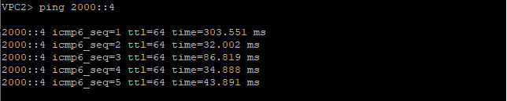

## Домашнее задание №5. VxLAN. L2 VNI.

### Цели:
* Настроить Overlay на основе VxLAN EVPN для L2 связанности между клиентами.

### Описание/Пошаговая инструкция выполнения домашнего задания:
В этой самостоятельной работе мы ожидаем, что вы самостоятельно:

#### 1) Настроите BGP peering между Leaf и Spine в AF l2vpn evpn;
#### 2) Настроите связанность между клиентами в первой зоне и убедитесь в её наличии;
#### 3) Зафиксируете в документации - план работы, адресное пространство, схему сети, конфигурацию устройств.

#### Топология сети:


# Выполнение:

## План работ:

1) Выделить адресное пространство для endpoint-ов;
2) Зафиксировать значения для Overlay-сети;
3) Собрать схему сети согласно топологии представленной в задании;
4) Опубликовать список реализованных функций Overlay-сети (Control- и Data-plane) для реализации L2 VNI (MAC-VRF);
5) Проверить связность между VPC;
6) Вывести дамп трафика проходящего через фабрику;
7) Опубликовать листинг команд для проверки корректной работы сети;
8) Конфигурации устройств.

Используем Underlay-сеть построенную в предыдущем задании.

## Адресное пространство:

| Назначение   | IP |
| ------------ |:---------------:|
| VPC1 | 2000::1/64 |
| VPC2 | 2000::2/64 |
| VPC3 | 2000::3/64 |
| VPC4 | 2000::4/64 |

## Параметры Overlay-сети:

| Назначение   | VLAN ID | VNI | RD | RT |
| ------------ |:---------------:|:---------------:|:---------------:|:---------------:|
| MAC-VRF 1 | 10 | 100010 | auto | 65000:10 |
| MAC-VRF 2 | 20 | 100020 | auto | 65000:20 |

## Cхема сети:


## Список реализованных функций:

* Организовано EVPN eBGP-соседство между Leaf-коммутаторами и Spine-коммутаторами на адресах Loopback-интерфейсов;
* Настроена передача Extended community;
* Каждому локальному сегменту (VLAN) присвоено автоматическое назначение RD и RT соглано параметрам Overlay-сети;

* Для инкапсуляции/декапсуляции на каждом VTEP настроен интерфейс Vxlan1, адресом источника которого является адрес интерфейса Loopback; 
* Значение порта UDP для инкапсуляции в VXLAN оставлено по-умолчанию и равно 4789;
* Соответствие меджу VLAN и VNI настроено согласно параметрам Overlay-сети.

* Порты доступа для VPC1 и VPC3 настроены в сегмент сети MAC-VRF 1;
* Порты доступа для VPC2 и VPC4 настроены в сегмент сети MAC-VRF 2;
* Номера VLAN ID на VTEP не изменены.

## Проверка работы Overlay-сети:




## Дамп трафика:


## Листинг команд с примерами вывода:
#### Листинг:
```
show bgp evpn summary
show bgp evpn instance
show bgp evpn
show bgp evpn detail (optional)
show interfaces vxlan 1
show vxlan control-plane
show vxlan flood vtep
show vxlan vni
show vxlan address-table
show mac address-table
```

#### Пример вывода команд с третьего Leaf-коммутатора:

```
Leaf-0003#show bgp evpn summary
BGP summary information for VRF default
Router identifier 1.1.1.3, local AS number 64514
Neighbor Status Codes: m - Under maintenance
  Neighbor      V AS           MsgRcvd   MsgSent  InQ OutQ  Up/Down State   PfxRcd PfxAcc
  fd0::1:2000:1 4 65535            581       584    0    0 03:13:52 Estab   4      4
  fd0::1:2000:2 4 65535            587       612    0    0 02:25:29 Estab   4      4
```
```
Leaf-0003#show bgp evpn instance
EVPN instance: VLAN 10
  Route distinguisher: 0:0
  Route target import: Route-Target-AS:65000:100010
  Route target export: Route-Target-AS:65000:100010
  Service interface: VLAN-based
  Local VXLAN IP address: fd0::1:1000:3
  VXLAN: enabled
  MPLS: disabled
EVPN instance: VLAN 20
  Route distinguisher: 0:0
  Route target import: Route-Target-AS:65000:100020
  Route target export: Route-Target-AS:65000:100020
  Service interface: VLAN-based
  Local VXLAN IP address: fd0::1:1000:3
  VXLAN: enabled
  MPLS: disabled
```
```
Leaf-0003#show bgp evpn
BGP routing table information for VRF default
Router identifier 1.1.1.3, local AS number 64514
Route status codes: * - valid, > - active, S - Stale, E - ECMP head, e - ECMP
                    c - Contributing to ECMP, % - Pending BGP convergence
Origin codes: i - IGP, e - EGP, ? - incomplete
AS Path Attributes: Or-ID - Originator ID, C-LST - Cluster List, LL Nexthop - Link Local Nexthop

          Network                Next Hop              Metric  LocPref Weight  Path
 * >Ec    RD: 1.1.1.1:10 mac-ip 0050.7966.6823
                                 fd0::1:1000:1         -       100     0       65535 64512 i
 *  ec    RD: 1.1.1.1:10 mac-ip 0050.7966.6823
                                 fd0::1:1000:1         -       100     0       65535 64512 i
 * >Ec    RD: 1.1.1.2:20 mac-ip 0050.7966.6824
                                 fd0::1:1000:2         -       100     0       65535 64513 i
 *  ec    RD: 1.1.1.2:20 mac-ip 0050.7966.6824
                                 fd0::1:1000:2         -       100     0       65535 64513 i
 * >      RD: 1.1.1.3:10 mac-ip 0050.7966.6825
                                 -                     -       -       0       i
 * >      RD: 1.1.1.3:20 mac-ip 0050.7966.6826
                                 -                     -       -       0       i
 * >Ec    RD: 1.1.1.1:10 imet fd0::1:1000:1
                                 fd0::1:1000:1         -       100     0       65535 64512 i
 *  ec    RD: 1.1.1.1:10 imet fd0::1:1000:1
                                 fd0::1:1000:1         -       100     0       65535 64512 i
 * >Ec    RD: 1.1.1.2:20 imet fd0::1:1000:2
                                 fd0::1:1000:2         -       100     0       65535 64513 i
 *  ec    RD: 1.1.1.2:20 imet fd0::1:1000:2
                                 fd0::1:1000:2         -       100     0       65535 64513 i
 * >      RD: 1.1.1.3:10 imet fd0::1:1000:3
                                 -                     -       -       0       i
 * >      RD: 1.1.1.3:20 imet fd0::1:1000:3
                                 -                     -       -       0       i
```
```
Leaf-0003#show interfaces vxlan 1
Vxlan1 is up, line protocol is up (connected)
  Hardware is Vxlan
  Source interface is Loopback0 and is active with fd0::1:1000:3
  Listening on UDP port 4789
  Vxlan Encapsulation is IPv6
  Replication/Flood Mode is headend with Flood List Source: EVPN
  Remote MAC learning via EVPN
  VNI mapping to VLANs
  Static VLAN to VNI mapping is
    [10, 100010]      [20, 100020]
  Note: All Dynamic VLANs used by VCS are internal VLANs.
        Use 'show vxlan vni' for details.
  Static VRF to VNI mapping is not configured
  Headend replication flood vtep list is:
    10 fd0::1:1000:1
    20 fd0::1:1000:2
  Shared Router MAC is 0000.0000.0000
 ```
 ```
Leaf-0003#show vxlan control-plane
   VLAN       Control Plane       Direction    Source
---------- ------------------- --------------- -------------
   10         EVPN                both         configuration
   20         EVPN                both         configuration
```
```
Leaf-0003#show vxlan flood vtep
          VXLAN Flood VTEP Table
--------------------------------------------------------------------------------

VLANS                            Ip Address
-----------------------------   ------------------------------------------------
10                              fd0::1:1000:1
20                              fd0::1:1000:2
```
```
Leaf-0003#show vxlan vni
VNI to VLAN Mapping for Vxlan1
VNI          VLAN       Source       Interface       802.1Q Tag
------------ ---------- ------------ --------------- ----------
100010       10         static       Ethernet1       untagged
                                     Vxlan1          10
100020       20         static       Ethernet2       untagged
                                     Vxlan1          20

VNI to dynamic VLAN Mapping for Vxlan1
VNI       VLAN       VRF       Source
--------- ---------- --------- ------------

```	
```
Leaf-0003#show vxlan address-table
          Vxlan Mac Address Table
----------------------------------------------------------------------

VLAN  Mac Address     Type      Prt  VTEP             Moves   Last Move
----  -----------     ----      ---  ----             -----   ---------
  10  0050.7966.6823  EVPN      Vx1  fd0::1:1000:1    1       0:05:44 ago
  20  0050.7966.6824  EVPN      Vx1  fd0::1:1000:2    1       0:05:49 ago
Total Remote Mac Addresses for this criterion: 2
```
```
Leaf-0003#show mac address-table
          Mac Address Table
------------------------------------------------------------------

Vlan    Mac Address       Type        Ports      Moves   Last Move
----    -----------       ----        -----      -----   ---------
  10    0050.7966.6823    DYNAMIC     Vx1        1       0:06:26 ago
  10    0050.7966.6825    DYNAMIC     Et1        1       0:06:26 ago
  20    0050.7966.6824    DYNAMIC     Vx1        1       0:06:30 ago
  20    0050.7966.6826    DYNAMIC     Et2        1       0:06:30 ago
Total Mac Addresses for this criterion: 4

          Multicast Mac Address Table
------------------------------------------------------------------

Vlan    Mac Address       Type        Ports
----    -----------       ----        -----
Total Mac Addresses for this criterion: 0
```

## Конфигурации устройств:
```
Leaf-0001#show running-config
! Command: show running-config
! device: Leaf-0001 (vEOS-lab, EOS-4.29.2F)
!
! boot system flash:/vEOS-lab.swi
!
no aaa root
!
transceiver qsfp default-mode 4x10G
!
service routing protocols model multi-agent
!
hostname Leaf-0001
!
spanning-tree mode mstp
!
vlan 10
!
interface Ethernet1
   description VPC1
   switchport access vlan 10
!
interface Ethernet2
   shutdown
!
interface Ethernet3
   shutdown
!
interface Ethernet4
   shutdown
!
interface Ethernet5
   shutdown
!
interface Ethernet6
   shutdown
!
interface Ethernet7
   no switchport
   bfd interval 100 min-rx 100 multiplier 3
   ipv6 enable
!
interface Ethernet8
   no switchport
   bfd interval 100 min-rx 100 multiplier 3
   ipv6 enable
!
interface Loopback0
   ipv6 enable
   ipv6 address fd0::1:1000:1/128
!
interface Management1
!
interface Vxlan1
   vxlan source-interface Loopback0
   vxlan udp-port 4789
   vxlan encapsulation ipv6
   vxlan vlan 10 vni 100010
!
no ip routing
!
ipv6 unicast-routing
!
router bgp 64512
   router-id 1.1.1.1
   no bgp default ipv4-unicast
   maximum-paths 8
   neighbor SPINE peer group
   neighbor SPINE bfd
   neighbor SPINE timers 3 9
   neighbor SPINE idle-restart-timer 60
   neighbor SPINE_EVPN peer group
   neighbor SPINE_EVPN remote-as 65535
   neighbor SPINE_EVPN update-source Loopback0
   neighbor SPINE_EVPN ebgp-multihop 2
   neighbor SPINE_EVPN send-community extended
   neighbor fd0::1:2000:1 peer group SPINE_EVPN
   neighbor fd0::1:2000:2 peer group SPINE_EVPN
   redistribute connected
   neighbor interface Et7-8 peer-group SPINE remote-as 65535
   !
   vlan 10
      rd auto
      route-target both 65000:100010
      redistribute learned
   !
   address-family evpn
      no neighbor SPINE activate
      neighbor SPINE_EVPN activate
   !
   address-family ipv6
      neighbor SPINE activate
      no neighbor SPINE_EVPN activate
!
end
```
```
Leaf-0002#show running-config
! Command: show running-config
! device: Leaf-0002 (vEOS-lab, EOS-4.29.2F)
!
! boot system flash:/vEOS-lab.swi
!
no aaa root
!
transceiver qsfp default-mode 4x10G
!
service routing protocols model multi-agent
!
hostname Leaf-0002
!
spanning-tree mode mstp
!
vlan 20
!
interface Ethernet1
   description VPC2
   switchport access vlan 20
!
interface Ethernet2
   shutdown
!
interface Ethernet3
   shutdown
!
interface Ethernet4
   shutdown
!
interface Ethernet5
   shutdown
!
interface Ethernet6
   shutdown
!
interface Ethernet7
   no switchport
   bfd interval 100 min-rx 100 multiplier 3
   ipv6 enable
!
interface Ethernet8
   no switchport
   bfd interval 100 min-rx 100 multiplier 3
   ipv6 enable
!
interface Loopback0
   ipv6 enable
   ipv6 address fd0::1:1000:2/128
!
interface Management1
!
interface Vxlan1
   vxlan source-interface Loopback0
   vxlan udp-port 4789
   vxlan encapsulation ipv6
   vxlan vlan 20 vni 100020
!
no ip routing
!
ipv6 unicast-routing
!
router bgp 64513
   router-id 1.1.1.2
   no bgp default ipv4-unicast
   maximum-paths 8
   neighbor SPINE peer group
   neighbor SPINE bfd
   neighbor SPINE timers 3 9
   neighbor SPINE idle-restart-timer 60
   neighbor SPINE_EVPN peer group
   neighbor SPINE_EVPN remote-as 65535
   neighbor SPINE_EVPN update-source Loopback0
   neighbor SPINE_EVPN ebgp-multihop 2
   neighbor SPINE_EVPN send-community extended
   neighbor fd0::1:2000:1 peer group SPINE_EVPN
   neighbor fd0::1:2000:2 peer group SPINE_EVPN
   redistribute connected
   neighbor interface Et7-8 peer-group SPINE remote-as 65535
   !
   vlan 20
      rd auto
      route-target both 65000:100020
      redistribute learned
   !
   address-family evpn
      no neighbor SPINE activate
      neighbor SPINE_EVPN activate
   !
   address-family ipv6
      neighbor SPINE activate
      no neighbor SPINE_EVPN activate
!
end
```
```
Leaf-0003#show running-config
! Command: show running-config
! device: Leaf-0003 (vEOS-lab, EOS-4.29.2F)
!
! boot system flash:/vEOS-lab.swi
!
no aaa root
!
transceiver qsfp default-mode 4x10G
!
service routing protocols model multi-agent
!
hostname Leaf-0003
!
spanning-tree mode mstp
!
vlan 10,20
!
interface Ethernet1
   description VPC3
   switchport access vlan 10
!
interface Ethernet2
   description VPC4
   switchport access vlan 20
!
interface Ethernet3
   shutdown
!
interface Ethernet4
   shutdown
!
interface Ethernet5
   shutdown
!
interface Ethernet6
   shutdown
!
interface Ethernet7
   no switchport
   bfd interval 100 min-rx 100 multiplier 3
   ipv6 enable
!
interface Ethernet8
   no switchport
   bfd interval 100 min-rx 100 multiplier 3
   ipv6 enable
!
interface Loopback0
   ipv6 enable
   ipv6 address fd0::1:1000:3/128
!
interface Management1
!
interface Vlan10
   ipv6 enable
   ipv6 address 2001::2/64
!
interface Vxlan1
   vxlan source-interface Loopback0
   vxlan udp-port 4789
   vxlan encapsulation ipv6
   vxlan vlan 10 vni 100010
   vxlan vlan 20 vni 100020
!
no ip routing
!
ipv6 unicast-routing
!
router bgp 64514
   router-id 1.1.1.3
   no bgp default ipv4-unicast
   maximum-paths 8
   neighbor SPINE peer group
   neighbor SPINE bfd
   neighbor SPINE timers 3 9
   neighbor SPINE idle-restart-timer 60
   neighbor SPINE_EVPN peer group
   neighbor SPINE_EVPN remote-as 65535
   neighbor SPINE_EVPN update-source Loopback0
   neighbor SPINE_EVPN ebgp-multihop 2
   neighbor SPINE_EVPN send-community extended
   neighbor fd0::1:2000:1 peer group SPINE_EVPN
   neighbor fd0::1:2000:2 peer group SPINE_EVPN
   redistribute connected
   neighbor interface Et7-8 peer-group SPINE remote-as 65535
   !
   vlan 10
      rd auto
      route-target both 65000:100010
      redistribute learned
   !
   vlan 20
      rd auto
      route-target both 65000:100020
      redistribute learned
   !
   address-family evpn
      no neighbor SPINE activate
      neighbor SPINE_EVPN activate
   !
   address-family ipv6
      neighbor SPINE activate
      no neighbor SPINE_EVPN activate
!
end
```
```
Spine-0001#show running-config
! Command: show running-config
! device: Spine-0001 (vEOS-lab, EOS-4.29.2F)
!
! boot system flash:/vEOS-lab.swi
!
no aaa root
!
transceiver qsfp default-mode 4x10G
!
service routing protocols model multi-agent
!
hostname Spine-0001
!
spanning-tree mode none
!
interface Ethernet1
   no switchport
   bfd interval 100 min-rx 100 multiplier 3
   ipv6 enable
!
interface Ethernet2
   no switchport
   bfd interval 100 min-rx 100 multiplier 3
   ipv6 enable
!
interface Ethernet3
   no switchport
   bfd interval 100 min-rx 100 multiplier 3
   ipv6 enable
!
interface Ethernet4
   shutdown
!
interface Ethernet5
   shutdown
!
interface Ethernet6
   shutdown
!
interface Ethernet7
   shutdown
!
interface Ethernet8
   shutdown
!
interface Loopback0
   ipv6 enable
   ipv6 address fd0::1:2000:1/128
!
interface Management1
!
no ip routing
!
ipv6 unicast-routing
!
peer-filter pf_accept_leaf_as-range
   10 match as-range 64512-65512 result accept
!
router bgp 65535
   router-id 1.2.1.1
   no bgp default ipv4-unicast
   maximum-paths 8
   bgp listen range fe80::/64 peer-group LEAF peer-filter pf_accept_leaf_as-range
   neighbor LEAF peer group
   neighbor LEAF bfd
   neighbor LEAF timers 3 9
   neighbor LEAF idle-restart-timer 60
   neighbor LEAF_EVPN peer group
   neighbor LEAF_EVPN next-hop-unchanged
   neighbor LEAF_EVPN update-source Loopback0
   neighbor LEAF_EVPN ebgp-multihop 2
   neighbor LEAF_EVPN send-community extended
   neighbor fd0::1:1000:1 peer group LEAF_EVPN
   neighbor fd0::1:1000:1 remote-as 64512
   neighbor fd0::1:1000:2 peer group LEAF_EVPN
   neighbor fd0::1:1000:2 remote-as 64513
   neighbor fd0::1:1000:3 peer group LEAF_EVPN
   neighbor fd0::1:1000:3 remote-as 64514
   redistribute connected
   !
   address-family evpn
      no neighbor LEAF activate
      neighbor LEAF_EVPN activate
   !
   address-family ipv6
      neighbor LEAF activate
      no neighbor LEAF_EVPN activate
!
end
```
```
Spine-0002#show running-config
! Command: show running-config
! device: Spine-0002 (vEOS-lab, EOS-4.29.2F)
!
! boot system flash:/vEOS-lab.swi
!
no aaa root
!
transceiver qsfp default-mode 4x10G
!
service routing protocols model multi-agent
!
hostname Spine-0002
!
spanning-tree mode none
!
interface Ethernet1
   no switchport
   bfd interval 100 min-rx 100 multiplier 3
   ipv6 enable
!
interface Ethernet2
   no switchport
   bfd interval 100 min-rx 100 multiplier 3
   ipv6 enable
!
interface Ethernet3
   no switchport
   bfd interval 100 min-rx 100 multiplier 3
   ipv6 enable
!
interface Ethernet4
   shutdown
!
interface Ethernet5
   shutdown
!
interface Ethernet6
   shutdown
!
interface Ethernet7
   shutdown
!
interface Ethernet8
   shutdown
!
interface Loopback0
   ipv6 enable
   ipv6 address fd0::1:2000:2/128
!
interface Management1
!
no ip routing
!
ipv6 unicast-routing
!
peer-filter pf_accept_leaf_as-range
   10 match as-range 64512-65512 result accept
!
router bgp 65535
   router-id 1.2.1.2
   no bgp default ipv4-unicast
   maximum-paths 8
   bgp listen range fe80::/64 peer-group LEAF peer-filter pf_accept_leaf_as-range
   neighbor LEAF peer group
   neighbor LEAF bfd
   neighbor LEAF timers 3 9
   neighbor LEAF idle-restart-timer 60
   neighbor LEAF_EVPN peer group
   neighbor LEAF_EVPN next-hop-unchanged
   neighbor LEAF_EVPN update-source Loopback0
   neighbor LEAF_EVPN ebgp-multihop 2
   neighbor LEAF_EVPN send-community extended
   neighbor fd0::1:1000:1 peer group LEAF_EVPN
   neighbor fd0::1:1000:1 remote-as 64512
   neighbor fd0::1:1000:2 peer group LEAF_EVPN
   neighbor fd0::1:1000:2 remote-as 64513
   neighbor fd0::1:1000:3 peer group LEAF_EVPN
   neighbor fd0::1:1000:3 remote-as 64514
   redistribute connected
   !
   address-family evpn
      no neighbor LEAF activate
      neighbor LEAF_EVPN activate
   !
   address-family ipv6
      neighbor LEAF activate
      no neighbor LEAF_EVPN activate
!
end
```
