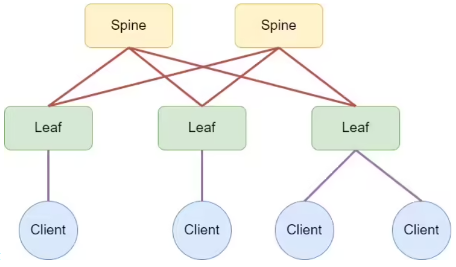
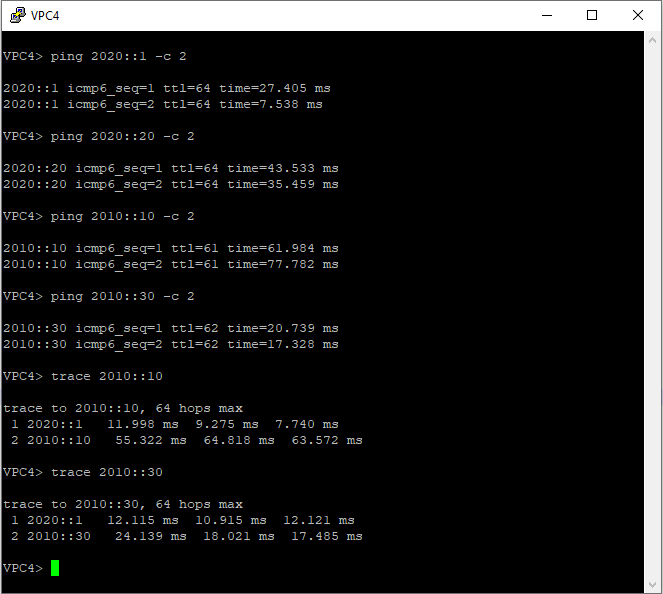
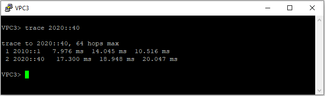

## Домашнее задание №6. VxLAN. L3 VNI.

### Цели:
* Настроить маршрутизацию в рамках Overlay между клиентами.

### Описание/Пошаговая инструкция выполнения домашнего задания:
В этой самостоятельной работе мы ожидаем, что вы самостоятельно:

#### 1) Настроите каждого клиента в своем VNI;
#### 2) Настроите маршрутизацию между клиентами;
#### 3) Зафиксируете в документации - план работы, адресное пространство, схему сети, конфигурацию устройств.

#### Топология сети:



# Выполнение:

## План работ:

1) Выделить адресное пространство для endpoint-ов;
2) Зафиксировать значения для Overlay-сети;
3) Собрать схему сети согласно топологии представленной в задании;
4) Опубликовать список реализованных функций Overlay-сети (Control- и Data-plane) для реализации L3 VNI (IP-VRF);
5) Проверить связность между VPC;
6) Вывести дамп трафика проходящего через фабрику;
7) Опубликовать листинг команд для проверки корректной работы сети;
8) Конфигурации устройств.

Используем Underlay-сеть построенную в предыдущем задании.

## Адресное пространство:

| Назначение   | IP-шлюза | VLAN ID |
| ------------ |:---------------:|:---------------:|
| DAG 1 | 2010::1/64 | 10 |
| DAG 2 | 2020::2/64 | 20 |

| Назначение   | IP |
| ------------ |:---------------:|
| VPC1 | 2010::10/64 |
| VPC2 | 2020::20/64 |
| VPC3 | 2010::30/64 |
| VPC4 | 2020::40/64 |

## Параметры Overlay-сети:

| Назначение   | VLAN ID | VNI | RD | RT |
| ------------ |:---------------:|:---------------:|:---------------:|:---------------:|
| MAC-VRF 1 | 10 | 100010 | auto (Router ID:VLAN ID) | 65000:100010 |
| MAC-VRF 2 | 20 | 100020 | auto (Router ID:VLAN ID) | 65000:100020 |
| IP-VRF | - | 10102 | 1.1.1.x:10102 | 65000:10102 |

Где x - номер Leaf-коммутатора.

## Cхема сети:


## Список реализованных функций:

* Организовано EVPN eBGP-соседство между Leaf-коммутаторами и Spine-коммутаторами на адресах Loopback-интерфейсов;
* Настроена передача Extended community;
* Каждому локальному сегменту (VLAN) присвоены RD и RT соглано параметрам Overlay-сети.
#
* Для инкапсуляции/декапсуляции на каждом VTEP настроен интерфейс Vxlan1, адресом источника которого является адрес интерфейса Loopback; 
* Значение порта UDP для инкапсуляции в VXLAN оставлено по-умолчанию и равно 4789;
* Соответствие меджу VLAN и VNI настроено согласно параметрам Overlay-сети.
#
* Порты доступа для VPC1 и VPC3 настроены в сегмент сети MAC-VRF 1;
* Порты доступа для VPC2 и VPC4 настроены в сегмент сети MAC-VRF 2;
* Номера VLAN ID на VTEP не изменены.
#
* Для маршрутизации между сегментами сети используем L3VNI (Symmetric IRB).

## Проверка работы Overlay-сети:






## Дамп трафика:
### 1) BGP EVPN Update-сообщения
##### При запросах с VPC3 к VPC2 (от Leaf-0003 до Spine-0001):
_MP_RICH_NLRI.PNG "This is a dump BGP EVPN MP_RICH_NLRI.")
_EXT_COMM.PNG "This is a dump BGP EVPN EXT_COMM.")
##### При запросах с VPC3 к VPC2 (от Spine-0001 до Leaf-0002):
_MP_RICH_NLRI.PNG "This is a dump BGP EVPN MP_RICH_NLRI.")
_EXT_COMM.PNG "This is a dump BGP EVPN EXT_COMM.")
##### При запросах с VPC3 к VPC2 (от Leaf-0002 до Spine-0001):
_BGP_UPD_1_MP_RICH_NLRI.PNG "This is a dump BGP EVPN MP_RICH_NLRI.")
_BGP_UPD_1_MP_EXT_COMM.PNG "This is a dump BGP EVPN EXT_COMM.")
_BGP_UPD_2_MP_RICH_NLRI.PNG "This is a dump BGP EVPN MP_RICH_NLRI.")
_BGP_UPD_2_EXT_COMM.PNG "This is a dump BGP EVPN EXT_COMM.")
##### При запросах с VPC3 к VPC2 (от Spine-0001 до Leaf-0003):
_BGP_UPD_1_MP_RICH_NLRI.PNG "This is a dump BGP EVPN MP_RICH_NLRI.")
_BGP_UPD_1_EXT_COMM.PNG "This is a dump BGP EVPN EXT_COMM.")
_BGP_UPD_2_MP_RICH_NLRI.PNG "This is a dump BGP EVPN MP_RICH_NLRI.")
_BGP_UPD_2_EXT_COMM.PNG "This is a dump BGP EVPN EXT_COMM.")
### 2) ICMPv6 Request- и Replay-сообщения
.PNG "This is a dump ICMPv6 Replay.")

.PNG "This is a dump ICMPv6 Request.")

## Листинг команд с примерами вывода:
#### Листинг:
```
show bgp summary
show bgp evpn summary
show bgp evpn instance
show bgp evpn
show bgp evpn detail
show interfaces vxlan 1
show vxlan control-plane
show vxlan flood vtep
show vxlan vni
show ipv6 route vrf sIRB
show ipv6 route vrf sIRB host
show vxlan address-table
show mac address-table
```

#### Выводы команд со всех Leaf-коммутаторов:

```
Leaf-0001#show bgp summary
BGP summary information for VRF default
Router identifier 1.1.1.1, local AS number 64512
Neighbor                             AS Session State AFI/SAFI                AFI/SAFI State   NLRI Rcd   NLRI Acc
--------------------------- ----------- ------------- ----------------------- -------------- ---------- ----------
fd0::1:2000:1                     65535 Established   L2VPN EVPN              Negotiated              8          8
fd0::1:2000:2                     65535 Established   L2VPN EVPN              Negotiated              8          8
fe80::5200:ff:fe5a:b32d%Et7       65535 Established   IPv6 Unicast            Negotiated              3          3
fe80::5200:ff:fe99:6257%Et8       65535 Established   IPv6 Unicast            Negotiated              3          3

Leaf-0002#show  bgp summary
BGP summary information for VRF default
Router identifier 1.1.1.2, local AS number 64513
Neighbor                             AS Session State AFI/SAFI                AFI/SAFI State   NLRI Rcd   NLRI Acc
--------------------------- ----------- ------------- ----------------------- -------------- ---------- ----------
fd0::1:2000:1                     65535 Established   L2VPN EVPN              Negotiated              8          8
fd0::1:2000:2                     65535 Established   L2VPN EVPN              Negotiated              8          8
fe80::5200:ff:fe5a:b32d%Et7       65535 Established   IPv6 Unicast            Negotiated              3          3
fe80::5200:ff:fe99:6257%Et8       65535 Established   IPv6 Unicast            Negotiated              3          3

Leaf-0003#show bgp summary
BGP summary information for VRF default
Router identifier 1.1.1.3, local AS number 64514
Neighbor                             AS Session State AFI/SAFI                AFI/SAFI State   NLRI Rcd   NLRI Acc
--------------------------- ----------- ------------- ----------------------- -------------- ---------- ----------
fd0::1:2000:1                     65535 Established   L2VPN EVPN              Negotiated              8          8
fd0::1:2000:2                     65535 Established   L2VPN EVPN              Negotiated              8          8
fe80::5200:ff:fe5a:b32d%Et7       65535 Established   IPv6 Unicast            Negotiated              3          3
fe80::5200:ff:fe99:6257%Et8       65535 Established   IPv6 Unicast            Negotiated              3          3
```
```
Leaf-0001#show bgp evpn summary
BGP summary information for VRF default
Router identifier 1.1.1.1, local AS number 64512
Neighbor Status Codes: m - Under maintenance
  Neighbor      V AS           MsgRcvd   MsgSent  InQ OutQ  Up/Down State   PfxRcd PfxAcc
  fd0::1:2000:1 4 65535           3792      3733    0    0    1d18h Estab   8      8
  fd0::1:2000:2 4 65535            574       644    0    0 00:21:19 Estab   8      8

Leaf-0002#show bgp evpn summary
BGP summary information for VRF default
Router identifier 1.1.1.2, local AS number 64513
Neighbor Status Codes: m - Under maintenance
  Neighbor      V AS           MsgRcvd   MsgSent  InQ OutQ  Up/Down State   PfxRcd PfxAcc
  fd0::1:2000:1 4 65535          16491     15428    0    0    1d18h Estab   8      8
  fd0::1:2000:2 4 65535          13143     12383    0    0 00:20:52 Estab   8      8

Leaf-0003#show bgp evpn summary
BGP summary information for VRF default
Router identifier 1.1.1.3, local AS number 64514
Neighbor Status Codes: m - Under maintenance
  Neighbor      V AS           MsgRcvd   MsgSent  InQ OutQ  Up/Down State   PfxRcd PfxAcc
  fd0::1:2000:1 4 65535          15325     14653    0    0    1d19h Estab   8      8
  fd0::1:2000:2 4 65535          12031     11592    0    0 00:20:48 Estab   8      8
```
```
Leaf-0001#show bgp evpn instance
EVPN instance: VLAN 10
  Route distinguisher: 0:0
  Route target import: Route-Target-AS:65000:100010
  Route target export: Route-Target-AS:65000:100010
  Service interface: VLAN-based
  Local VXLAN IP address: fd0::1:1000:1
  VXLAN: enabled
  MPLS: disabled

Leaf-0002#show bgp evpn instance
EVPN instance: VLAN 20
  Route distinguisher: 0:0
  Route target import: Route-Target-AS:65000:100020
  Route target export: Route-Target-AS:65000:100020
  Service interface: VLAN-based
  Local VXLAN IP address: fd0::1:1000:2
  VXLAN: enabled
  MPLS: disabled

Leaf-0003#show bgp evpn instance
EVPN instance: VLAN 10
  Route distinguisher: 0:0
  Route target import: Route-Target-AS:65000:100010
  Route target export: Route-Target-AS:65000:100010
  Service interface: VLAN-based
  Local VXLAN IP address: fd0::1:1000:3
  VXLAN: enabled
  MPLS: disabled
EVPN instance: VLAN 20
  Route distinguisher: 0:0
  Route target import: Route-Target-AS:65000:100020
  Route target export: Route-Target-AS:65000:100020
  Service interface: VLAN-based
  Local VXLAN IP address: fd0::1:1000:3
  VXLAN: enabled
  MPLS: disabled
```
```
Leaf-0001#show bgp evpn
BGP routing table information for VRF default
Router identifier 1.1.1.1, local AS number 64512
Route status codes: * - valid, > - active, S - Stale, E - ECMP head, e - ECMP
                    c - Contributing to ECMP, % - Pending BGP convergence
Origin codes: i - IGP, e - EGP, ? - incomplete
AS Path Attributes: Or-ID - Originator ID, C-LST - Cluster List, LL Nexthop - Link Local Nexthop

          Network                Next Hop              Metric  LocPref Weight  Path
 * >      RD: 1.1.1.1:10 mac-ip 0050.7966.6823
                                 -                     -       -       0       i
 * >      RD: 1.1.1.1:10 mac-ip 0050.7966.6823 2010::10
                                 -                     -       -       0       i
 * >Ec    RD: 1.1.1.2:20 mac-ip 0050.7966.6824
                                 fd0::1:1000:2         -       100     0       65535 64513 i
 *  ec    RD: 1.1.1.2:20 mac-ip 0050.7966.6824
                                 fd0::1:1000:2         -       100     0       65535 64513 i
 * >Ec    RD: 1.1.1.2:20 mac-ip 0050.7966.6824 2020::20
                                 fd0::1:1000:2         -       100     0       65535 64513 i
 *  ec    RD: 1.1.1.2:20 mac-ip 0050.7966.6824 2020::20
                                 fd0::1:1000:2         -       100     0       65535 64513 i
 * >Ec    RD: 1.1.1.3:10 mac-ip 0050.7966.6825
                                 fd0::1:1000:3         -       100     0       65535 64514 i
 *  ec    RD: 1.1.1.3:10 mac-ip 0050.7966.6825
                                 fd0::1:1000:3         -       100     0       65535 64514 i
 * >Ec    RD: 1.1.1.3:10 mac-ip 0050.7966.6825 2010::30
                                 fd0::1:1000:3         -       100     0       65535 64514 i
 *  ec    RD: 1.1.1.3:10 mac-ip 0050.7966.6825 2010::30
                                 fd0::1:1000:3         -       100     0       65535 64514 i
 * >Ec    RD: 1.1.1.3:20 mac-ip 0050.7966.6826
                                 fd0::1:1000:3         -       100     0       65535 64514 i
 *  ec    RD: 1.1.1.3:20 mac-ip 0050.7966.6826
                                 fd0::1:1000:3         -       100     0       65535 64514 i
 * >Ec    RD: 1.1.1.3:20 mac-ip 0050.7966.6826 2020::40
                                 fd0::1:1000:3         -       100     0       65535 64514 i
 *  ec    RD: 1.1.1.3:20 mac-ip 0050.7966.6826 2020::40
                                 fd0::1:1000:3         -       100     0       65535 64514 i
 * >      RD: 1.1.1.1:10 imet fd0::1:1000:1
                                 -                     -       -       0       i
 * >Ec    RD: 1.1.1.2:20 imet fd0::1:1000:2
                                 fd0::1:1000:2         -       100     0       65535 64513 i
 *  ec    RD: 1.1.1.2:20 imet fd0::1:1000:2
                                 fd0::1:1000:2         -       100     0       65535 64513 i
 * >Ec    RD: 1.1.1.3:10 imet fd0::1:1000:3
                                 fd0::1:1000:3         -       100     0       65535 64514 i
 *  ec    RD: 1.1.1.3:10 imet fd0::1:1000:3
                                 fd0::1:1000:3         -       100     0       65535 64514 i
 * >Ec    RD: 1.1.1.3:20 imet fd0::1:1000:3
                                 fd0::1:1000:3         -       100     0       65535 64514 i
 *  ec    RD: 1.1.1.3:20 imet fd0::1:1000:3
                                 fd0::1:1000:3         -       100     0       65535 64514 i
 * >      RD: 1.1.1.1:10102 ip-prefix 2010::/64
                                 -                     -       -       0       i
 * >Ec    RD: 1.1.1.2:10102 ip-prefix 2020::/64
                                 fd0::1:1000:2         -       100     0       65535 64513 i
 *  ec    RD: 1.1.1.2:10102 ip-prefix 2020::/64
                                 fd0::1:1000:2         -       100     0       65535 64513 i

Leaf-0002#show bgp evpn
BGP routing table information for VRF default
Router identifier 1.1.1.2, local AS number 64513
Route status codes: * - valid, > - active, S - Stale, E - ECMP head, e - ECMP
                    c - Contributing to ECMP, % - Pending BGP convergence
Origin codes: i - IGP, e - EGP, ? - incomplete
AS Path Attributes: Or-ID - Originator ID, C-LST - Cluster List, LL Nexthop - Link Local Nexthop

          Network                Next Hop              Metric  LocPref Weight  Path
 * >Ec    RD: 1.1.1.1:10 mac-ip 0050.7966.6823
                                 fd0::1:1000:1         -       100     0       65535 64512 i
 *  ec    RD: 1.1.1.1:10 mac-ip 0050.7966.6823
                                 fd0::1:1000:1         -       100     0       65535 64512 i
 * >Ec    RD: 1.1.1.1:10 mac-ip 0050.7966.6823 2010::10
                                 fd0::1:1000:1         -       100     0       65535 64512 i
 *  ec    RD: 1.1.1.1:10 mac-ip 0050.7966.6823 2010::10
                                 fd0::1:1000:1         -       100     0       65535 64512 i
 * >      RD: 1.1.1.2:20 mac-ip 0050.7966.6824
                                 -                     -       -       0       i
 * >      RD: 1.1.1.2:20 mac-ip 0050.7966.6824 2020::20
                                 -                     -       -       0       i
 * >Ec    RD: 1.1.1.3:10 mac-ip 0050.7966.6825
                                 fd0::1:1000:3         -       100     0       65535 64514 i
 *  ec    RD: 1.1.1.3:10 mac-ip 0050.7966.6825
                                 fd0::1:1000:3         -       100     0       65535 64514 i
 * >Ec    RD: 1.1.1.3:10 mac-ip 0050.7966.6825 2010::30
                                 fd0::1:1000:3         -       100     0       65535 64514 i
 *  ec    RD: 1.1.1.3:10 mac-ip 0050.7966.6825 2010::30
                                 fd0::1:1000:3         -       100     0       65535 64514 i
 * >Ec    RD: 1.1.1.3:20 mac-ip 0050.7966.6826
                                 fd0::1:1000:3         -       100     0       65535 64514 i
 *  ec    RD: 1.1.1.3:20 mac-ip 0050.7966.6826
                                 fd0::1:1000:3         -       100     0       65535 64514 i
 * >Ec    RD: 1.1.1.3:20 mac-ip 0050.7966.6826 2020::40
                                 fd0::1:1000:3         -       100     0       65535 64514 i
 *  ec    RD: 1.1.1.3:20 mac-ip 0050.7966.6826 2020::40
                                 fd0::1:1000:3         -       100     0       65535 64514 i
 * >Ec    RD: 1.1.1.1:10 imet fd0::1:1000:1
                                 fd0::1:1000:1         -       100     0       65535 64512 i
 *  ec    RD: 1.1.1.1:10 imet fd0::1:1000:1
                                 fd0::1:1000:1         -       100     0       65535 64512 i
 * >      RD: 1.1.1.2:20 imet fd0::1:1000:2
                                 -                     -       -       0       i
 * >Ec    RD: 1.1.1.3:10 imet fd0::1:1000:3
                                 fd0::1:1000:3         -       100     0       65535 64514 i
 *  ec    RD: 1.1.1.3:10 imet fd0::1:1000:3
                                 fd0::1:1000:3         -       100     0       65535 64514 i
 * >Ec    RD: 1.1.1.3:20 imet fd0::1:1000:3
                                 fd0::1:1000:3         -       100     0       65535 64514 i
 *  ec    RD: 1.1.1.3:20 imet fd0::1:1000:3
                                 fd0::1:1000:3         -       100     0       65535 64514 i
 * >Ec    RD: 1.1.1.1:10102 ip-prefix 2010::/64
                                 fd0::1:1000:1         -       100     0       65535 64512 i
 *  ec    RD: 1.1.1.1:10102 ip-prefix 2010::/64
                                 fd0::1:1000:1         -       100     0       65535 64512 i
 * >      RD: 1.1.1.2:10102 ip-prefix 2020::/64
                                 -                     -       -       0       i

Leaf-0003#show bgp evpn
BGP routing table information for VRF default
Router identifier 1.1.1.3, local AS number 64514
Route status codes: * - valid, > - active, S - Stale, E - ECMP head, e - ECMP
                    c - Contributing to ECMP, % - Pending BGP convergence
Origin codes: i - IGP, e - EGP, ? - incomplete
AS Path Attributes: Or-ID - Originator ID, C-LST - Cluster List, LL Nexthop - Link Local Nexthop

          Network                Next Hop              Metric  LocPref Weight  Path
 * >Ec    RD: 1.1.1.1:10 mac-ip 0050.7966.6823
                                 fd0::1:1000:1         -       100     0       65535 64512 i
 *  ec    RD: 1.1.1.1:10 mac-ip 0050.7966.6823
                                 fd0::1:1000:1         -       100     0       65535 64512 i
 * >Ec    RD: 1.1.1.1:10 mac-ip 0050.7966.6823 2010::10
                                 fd0::1:1000:1         -       100     0       65535 64512 i
 *  ec    RD: 1.1.1.1:10 mac-ip 0050.7966.6823 2010::10
                                 fd0::1:1000:1         -       100     0       65535 64512 i
 * >Ec    RD: 1.1.1.2:20 mac-ip 0050.7966.6824
                                 fd0::1:1000:2         -       100     0       65535 64513 i
 *  ec    RD: 1.1.1.2:20 mac-ip 0050.7966.6824
                                 fd0::1:1000:2         -       100     0       65535 64513 i
 * >Ec    RD: 1.1.1.2:20 mac-ip 0050.7966.6824 2020::20
                                 fd0::1:1000:2         -       100     0       65535 64513 i
 *  ec    RD: 1.1.1.2:20 mac-ip 0050.7966.6824 2020::20
                                 fd0::1:1000:2         -       100     0       65535 64513 i
 * >      RD: 1.1.1.3:10 mac-ip 0050.7966.6825
                                 -                     -       -       0       i
 * >      RD: 1.1.1.3:10 mac-ip 0050.7966.6825 2010::30
                                 -                     -       -       0       i
 * >      RD: 1.1.1.3:20 mac-ip 0050.7966.6826
                                 -                     -       -       0       i
 * >      RD: 1.1.1.3:20 mac-ip 0050.7966.6826 2020::40
                                 -                     -       -       0       i
 * >Ec    RD: 1.1.1.1:10 imet fd0::1:1000:1
                                 fd0::1:1000:1         -       100     0       65535 64512 i
 *  ec    RD: 1.1.1.1:10 imet fd0::1:1000:1
                                 fd0::1:1000:1         -       100     0       65535 64512 i
 * >Ec    RD: 1.1.1.2:20 imet fd0::1:1000:2
                                 fd0::1:1000:2         -       100     0       65535 64513 i
 *  ec    RD: 1.1.1.2:20 imet fd0::1:1000:2
                                 fd0::1:1000:2         -       100     0       65535 64513 i
 * >      RD: 1.1.1.3:10 imet fd0::1:1000:3
                                 -                     -       -       0       i
 * >      RD: 1.1.1.3:20 imet fd0::1:1000:3
                                 -                     -       -       0       i
 * >Ec    RD: 1.1.1.1:10102 ip-prefix 2010::/64
                                 fd0::1:1000:1         -       100     0       65535 64512 i
 *  ec    RD: 1.1.1.1:10102 ip-prefix 2010::/64
                                 fd0::1:1000:1         -       100     0       65535 64512 i
 * >Ec    RD: 1.1.1.2:10102 ip-prefix 2020::/64
                                 fd0::1:1000:2         -       100     0       65535 64513 i
 *  ec    RD: 1.1.1.2:10102 ip-prefix 2020::/64
                                 fd0::1:1000:2         -       100     0       65535 64513 i
```
```
Leaf-0001#show bgp evpn detail
BGP routing table information for VRF default
Router identifier 1.1.1.1, local AS number 64512
BGP routing table entry for mac-ip 0050.7966.6823, Route Distinguisher: 1.1.1.1:10
 Paths: 1 available
  Local
    - from - (0.0.0.0)
      Origin IGP, metric -, localpref -, weight 0, tag 0, valid, local, best
      Extended Community: Route-Target-AS:65000:100010 TunnelEncap:tunnelTypeVxlan
      VNI: 100010 ESI: 0000:0000:0000:0000:0000
BGP routing table entry for mac-ip 0050.7966.6823 2010::10, Route Distinguisher: 1.1.1.1:10
 Paths: 1 available
  Local
    - from - (0.0.0.0)
      Origin IGP, metric -, localpref -, weight 0, tag 0, valid, local, best
      Extended Community: Route-Target-AS:65000:10102 Route-Target-AS:65000:100010 TunnelEncap:tunnelTypeVxlan
      VNI: 100010 L3 VNI: 10102 ESI: 0000:0000:0000:0000:0000
BGP routing table entry for mac-ip 0050.7966.6824, Route Distinguisher: 1.1.1.2:20
 Paths: 2 available
  65535 64513
    fd0::1:1000:2 from fd0::1:2000:1 (1.2.1.1)
      Origin IGP, metric -, localpref 100, weight 0, tag 0, valid, external, ECMP head, ECMP, best, ECMP contributor
      Extended Community: Route-Target-AS:65000:100020 TunnelEncap:tunnelTypeVxlan
      VNI: 100020 ESI: 0000:0000:0000:0000:0000
  65535 64513
    fd0::1:1000:2 from fd0::1:2000:2 (1.2.1.2)
      Origin IGP, metric -, localpref 100, weight 0, tag 0, valid, external, ECMP, ECMP contributor
      Extended Community: Route-Target-AS:65000:100020 TunnelEncap:tunnelTypeVxlan
      VNI: 100020 ESI: 0000:0000:0000:0000:0000
BGP routing table entry for mac-ip 0050.7966.6824 2020::20, Route Distinguisher: 1.1.1.2:20
 Paths: 2 available
  65535 64513
    fd0::1:1000:2 from fd0::1:2000:1 (1.2.1.1)
      Origin IGP, metric -, localpref 100, weight 0, tag 0, valid, external, ECMP head, ECMP, best, ECMP contributor
      Extended Community: Route-Target-AS:65000:10102 Route-Target-AS:65000:100020 TunnelEncap:tunnelTypeVxlan EvpnRouterMac:50:00:00:aa:5c:3a
      VNI: 100020 L3 VNI: 10102 ESI: 0000:0000:0000:0000:0000
  65535 64513
    fd0::1:1000:2 from fd0::1:2000:2 (1.2.1.2)
      Origin IGP, metric -, localpref 100, weight 0, tag 0, valid, external, ECMP, ECMP contributor
      Extended Community: Route-Target-AS:65000:10102 Route-Target-AS:65000:100020 TunnelEncap:tunnelTypeVxlan EvpnRouterMac:50:00:00:aa:5c:3a
      VNI: 100020 L3 VNI: 10102 ESI: 0000:0000:0000:0000:0000
BGP routing table entry for mac-ip 0050.7966.6825, Route Distinguisher: 1.1.1.3:10
 Paths: 2 available
  65535 64514
    fd0::1:1000:3 from fd0::1:2000:1 (1.2.1.1)
      Origin IGP, metric -, localpref 100, weight 0, tag 0, valid, external, ECMP head, ECMP, best, ECMP contributor
      Extended Community: Route-Target-AS:65000:100010 TunnelEncap:tunnelTypeVxlan EvpnMacMobility:2
      VNI: 100010 ESI: 0000:0000:0000:0000:0000
  65535 64514
    fd0::1:1000:3 from fd0::1:2000:2 (1.2.1.2)
      Origin IGP, metric -, localpref 100, weight 0, tag 0, valid, external, ECMP, ECMP contributor
      Extended Community: Route-Target-AS:65000:100010 TunnelEncap:tunnelTypeVxlan EvpnMacMobility:2
      VNI: 100010 ESI: 0000:0000:0000:0000:0000
BGP routing table entry for mac-ip 0050.7966.6825 2010::30, Route Distinguisher: 1.1.1.3:10
 Paths: 2 available
  65535 64514
    fd0::1:1000:3 from fd0::1:2000:1 (1.2.1.1)
      Origin IGP, metric -, localpref 100, weight 0, tag 0, valid, external, ECMP head, ECMP, best, ECMP contributor
      Extended Community: Route-Target-AS:65000:100010 TunnelEncap:tunnelTypeVxlan EvpnMacMobility:2
      VNI: 100010 ESI: 0000:0000:0000:0000:0000
  65535 64514
    fd0::1:1000:3 from fd0::1:2000:2 (1.2.1.2)
      Origin IGP, metric -, localpref 100, weight 0, tag 0, valid, external, ECMP, ECMP contributor
      Extended Community: Route-Target-AS:65000:100010 TunnelEncap:tunnelTypeVxlan EvpnMacMobility:2
      VNI: 100010 ESI: 0000:0000:0000:0000:0000
BGP routing table entry for mac-ip 0050.7966.6826, Route Distinguisher: 1.1.1.3:20
 Paths: 2 available
  65535 64514
    fd0::1:1000:3 from fd0::1:2000:1 (1.2.1.1)
      Origin IGP, metric -, localpref 100, weight 0, tag 0, valid, external, ECMP head, ECMP, best, ECMP contributor
      Extended Community: Route-Target-AS:65000:100020 TunnelEncap:tunnelTypeVxlan EvpnMacMobility:1
      VNI: 100020 ESI: 0000:0000:0000:0000:0000
  65535 64514
    fd0::1:1000:3 from fd0::1:2000:2 (1.2.1.2)
      Origin IGP, metric -, localpref 100, weight 0, tag 0, valid, external, ECMP, ECMP contributor
      Extended Community: Route-Target-AS:65000:100020 TunnelEncap:tunnelTypeVxlan EvpnMacMobility:1
      VNI: 100020 ESI: 0000:0000:0000:0000:0000
BGP routing table entry for mac-ip 0050.7966.6826 2020::40, Route Distinguisher: 1.1.1.3:20
 Paths: 2 available
  65535 64514
    fd0::1:1000:3 from fd0::1:2000:1 (1.2.1.1)
      Origin IGP, metric -, localpref 100, weight 0, tag 0, valid, external, ECMP head, ECMP, best, ECMP contributor
      Extended Community: Route-Target-AS:65000:100020 TunnelEncap:tunnelTypeVxlan EvpnMacMobility:1
      VNI: 100020 ESI: 0000:0000:0000:0000:0000
  65535 64514
    fd0::1:1000:3 from fd0::1:2000:2 (1.2.1.2)
      Origin IGP, metric -, localpref 100, weight 0, tag 0, valid, external, ECMP, ECMP contributor
      Extended Community: Route-Target-AS:65000:100020 TunnelEncap:tunnelTypeVxlan EvpnMacMobility:1
      VNI: 100020 ESI: 0000:0000:0000:0000:0000
BGP routing table entry for imet fd0::1:1000:1, Route Distinguisher: 1.1.1.1:10
 Paths: 1 available
  Local
    - from - (0.0.0.0)
      Origin IGP, metric -, localpref -, weight 0, tag 0, valid, local, best
      Extended Community: Route-Target-AS:65000:100010 TunnelEncap:tunnelTypeVxlan
      VNI: 100010
      PMSI Tunnel: Ingress Replication, MPLS Label: 100010, Leaf Information Required: false, Tunnel ID: fd0::1:1000:1
BGP routing table entry for imet fd0::1:1000:2, Route Distinguisher: 1.1.1.2:20
 Paths: 2 available
  65535 64513
    fd0::1:1000:2 from fd0::1:2000:1 (1.2.1.1)
      Origin IGP, metric -, localpref 100, weight 0, tag 0, valid, external, ECMP head, ECMP, best, ECMP contributor
      Extended Community: Route-Target-AS:65000:100020 TunnelEncap:tunnelTypeVxlan
      VNI: 100020
      PMSI Tunnel: Ingress Replication, MPLS Label: 100020, Leaf Information Required: false, Tunnel ID: fd0::1:1000:2
  65535 64513
    fd0::1:1000:2 from fd0::1:2000:2 (1.2.1.2)
      Origin IGP, metric -, localpref 100, weight 0, tag 0, valid, external, ECMP, ECMP contributor
      Extended Community: Route-Target-AS:65000:100020 TunnelEncap:tunnelTypeVxlan
      VNI: 100020
      PMSI Tunnel: Ingress Replication, MPLS Label: 100020, Leaf Information Required: false, Tunnel ID: fd0::1:1000:2
BGP routing table entry for imet fd0::1:1000:3, Route Distinguisher: 1.1.1.3:10
 Paths: 2 available
  65535 64514
    fd0::1:1000:3 from fd0::1:2000:1 (1.2.1.1)
      Origin IGP, metric -, localpref 100, weight 0, tag 0, valid, external, ECMP head, ECMP, best, ECMP contributor
      Extended Community: Route-Target-AS:65000:100010 TunnelEncap:tunnelTypeVxlan
      VNI: 100010
      PMSI Tunnel: Ingress Replication, MPLS Label: 100010, Leaf Information Required: false, Tunnel ID: fd0::1:1000:3
  65535 64514
    fd0::1:1000:3 from fd0::1:2000:2 (1.2.1.2)
      Origin IGP, metric -, localpref 100, weight 0, tag 0, valid, external, ECMP, ECMP contributor
      Extended Community: Route-Target-AS:65000:100010 TunnelEncap:tunnelTypeVxlan
      VNI: 100010
      PMSI Tunnel: Ingress Replication, MPLS Label: 100010, Leaf Information Required: false, Tunnel ID: fd0::1:1000:3
BGP routing table entry for imet fd0::1:1000:3, Route Distinguisher: 1.1.1.3:20
 Paths: 2 available
  65535 64514
    fd0::1:1000:3 from fd0::1:2000:1 (1.2.1.1)
      Origin IGP, metric -, localpref 100, weight 0, tag 0, valid, external, ECMP head, ECMP, best, ECMP contributor
      Extended Community: Route-Target-AS:65000:100020 TunnelEncap:tunnelTypeVxlan
      VNI: 100020
      PMSI Tunnel: Ingress Replication, MPLS Label: 100020, Leaf Information Required: false, Tunnel ID: fd0::1:1000:3
  65535 64514
    fd0::1:1000:3 from fd0::1:2000:2 (1.2.1.2)
      Origin IGP, metric -, localpref 100, weight 0, tag 0, valid, external, ECMP, ECMP contributor
      Extended Community: Route-Target-AS:65000:100020 TunnelEncap:tunnelTypeVxlan
      VNI: 100020
      PMSI Tunnel: Ingress Replication, MPLS Label: 100020, Leaf Information Required: false, Tunnel ID: fd0::1:1000:3
BGP routing table entry for ip-prefix 2010::/64, Route Distinguisher: 1.1.1.1:10102
 Paths: 1 available
  Local
    - from - (0.0.0.0)
      Origin IGP, metric -, localpref -, weight 0, tag 0, valid, local, best, redistributed (Connected)
      Extended Community: Route-Target-AS:65000:10102 TunnelEncap:tunnelTypeVxlan EvpnRouterMac:50:00:00:3b:34:d4
      VNI: 10102
BGP routing table entry for ip-prefix 2020::/64, Route Distinguisher: 1.1.1.2:10102
 Paths: 2 available
  65535 64513
    fd0::1:1000:2 from fd0::1:2000:1 (1.2.1.1)
      Origin IGP, metric -, localpref 100, weight 0, tag 0, valid, external, ECMP head, ECMP, best, ECMP contributor
      Extended Community: Route-Target-AS:65000:10102 TunnelEncap:tunnelTypeVxlan EvpnRouterMac:50:00:00:aa:5c:3a
      VNI: 10102
  65535 64513
    fd0::1:1000:2 from fd0::1:2000:2 (1.2.1.2)
      Origin IGP, metric -, localpref 100, weight 0, tag 0, valid, external, ECMP, ECMP contributor
      Extended Community: Route-Target-AS:65000:10102 TunnelEncap:tunnelTypeVxlan EvpnRouterMac:50:00:00:aa:5c:3a
      VNI: 10102

Leaf-0002#show bgp evpn detail
BGP routing table information for VRF default
Router identifier 1.1.1.2, local AS number 64513
BGP routing table entry for mac-ip 0050.7966.6823, Route Distinguisher: 1.1.1.1:10
 Paths: 2 available
  65535 64512
    fd0::1:1000:1 from fd0::1:2000:2 (1.2.1.2)
      Origin IGP, metric -, localpref 100, weight 0, tag 0, valid, external, ECMP head, ECMP, best, ECMP contributor
      Extended Community: Route-Target-AS:65000:100010 TunnelEncap:tunnelTypeVxlan
      VNI: 100010 ESI: 0000:0000:0000:0000:0000
  65535 64512
    fd0::1:1000:1 from fd0::1:2000:1 (1.2.1.1)
      Origin IGP, metric -, localpref 100, weight 0, tag 0, valid, external, ECMP, ECMP contributor
      Extended Community: Route-Target-AS:65000:100010 TunnelEncap:tunnelTypeVxlan
      VNI: 100010 ESI: 0000:0000:0000:0000:0000
BGP routing table entry for mac-ip 0050.7966.6823 2010::10, Route Distinguisher: 1.1.1.1:10
 Paths: 2 available
  65535 64512
    fd0::1:1000:1 from fd0::1:2000:2 (1.2.1.2)
      Origin IGP, metric -, localpref 100, weight 0, tag 0, valid, external, ECMP head, ECMP, best, ECMP contributor
      Extended Community: Route-Target-AS:65000:10102 Route-Target-AS:65000:100010 TunnelEncap:tunnelTypeVxlan EvpnRouterMac:50:00:00:3b:34:d4
      VNI: 100010 L3 VNI: 10102 ESI: 0000:0000:0000:0000:0000
  65535 64512
    fd0::1:1000:1 from fd0::1:2000:1 (1.2.1.1)
      Origin IGP, metric -, localpref 100, weight 0, tag 0, valid, external, ECMP, ECMP contributor
      Extended Community: Route-Target-AS:65000:10102 Route-Target-AS:65000:100010 TunnelEncap:tunnelTypeVxlan EvpnRouterMac:50:00:00:3b:34:d4
      VNI: 100010 L3 VNI: 10102 ESI: 0000:0000:0000:0000:0000
BGP routing table entry for mac-ip 0050.7966.6824, Route Distinguisher: 1.1.1.2:20
 Paths: 1 available
  Local
    - from - (0.0.0.0)
      Origin IGP, metric -, localpref -, weight 0, tag 0, valid, local, best
      Extended Community: Route-Target-AS:65000:100020 TunnelEncap:tunnelTypeVxlan
      VNI: 100020 ESI: 0000:0000:0000:0000:0000
BGP routing table entry for mac-ip 0050.7966.6824 2020::20, Route Distinguisher: 1.1.1.2:20
 Paths: 1 available
  Local
    - from - (0.0.0.0)
      Origin IGP, metric -, localpref -, weight 0, tag 0, valid, local, best
      Extended Community: Route-Target-AS:65000:10102 Route-Target-AS:65000:100020 TunnelEncap:tunnelTypeVxlan
      VNI: 100020 L3 VNI: 10102 ESI: 0000:0000:0000:0000:0000
BGP routing table entry for mac-ip 0050.7966.6825, Route Distinguisher: 1.1.1.3:10
 Paths: 2 available
  65535 64514
    fd0::1:1000:3 from fd0::1:2000:2 (1.2.1.2)
      Origin IGP, metric -, localpref 100, weight 0, tag 0, valid, external, ECMP head, ECMP, best, ECMP contributor
      Extended Community: Route-Target-AS:65000:100010 TunnelEncap:tunnelTypeVxlan EvpnMacMobility:2
      VNI: 100010 ESI: 0000:0000:0000:0000:0000
  65535 64514
    fd0::1:1000:3 from fd0::1:2000:1 (1.2.1.1)
      Origin IGP, metric -, localpref 100, weight 0, tag 0, valid, external, ECMP, ECMP contributor
      Extended Community: Route-Target-AS:65000:100010 TunnelEncap:tunnelTypeVxlan EvpnMacMobility:2
      VNI: 100010 ESI: 0000:0000:0000:0000:0000
BGP routing table entry for mac-ip 0050.7966.6825 2010::30, Route Distinguisher: 1.1.1.3:10
 Paths: 2 available
  65535 64514
    fd0::1:1000:3 from fd0::1:2000:2 (1.2.1.2)
      Origin IGP, metric -, localpref 100, weight 0, tag 0, valid, external, ECMP head, ECMP, best, ECMP contributor
      Extended Community: Route-Target-AS:65000:100010 TunnelEncap:tunnelTypeVxlan EvpnMacMobility:2
      VNI: 100010 ESI: 0000:0000:0000:0000:0000
  65535 64514
    fd0::1:1000:3 from fd0::1:2000:1 (1.2.1.1)
      Origin IGP, metric -, localpref 100, weight 0, tag 0, valid, external, ECMP, ECMP contributor
      Extended Community: Route-Target-AS:65000:100010 TunnelEncap:tunnelTypeVxlan EvpnMacMobility:2
      VNI: 100010 ESI: 0000:0000:0000:0000:0000
BGP routing table entry for mac-ip 0050.7966.6826, Route Distinguisher: 1.1.1.3:20
 Paths: 2 available
  65535 64514
    fd0::1:1000:3 from fd0::1:2000:2 (1.2.1.2)
      Origin IGP, metric -, localpref 100, weight 0, tag 0, valid, external, ECMP head, ECMP, best, ECMP contributor
      Extended Community: Route-Target-AS:65000:100020 TunnelEncap:tunnelTypeVxlan EvpnMacMobility:1
      VNI: 100020 ESI: 0000:0000:0000:0000:0000
  65535 64514
    fd0::1:1000:3 from fd0::1:2000:1 (1.2.1.1)
      Origin IGP, metric -, localpref 100, weight 0, tag 0, valid, external, ECMP, ECMP contributor
      Extended Community: Route-Target-AS:65000:100020 TunnelEncap:tunnelTypeVxlan EvpnMacMobility:1
      VNI: 100020 ESI: 0000:0000:0000:0000:0000
BGP routing table entry for mac-ip 0050.7966.6826 2020::40, Route Distinguisher: 1.1.1.3:20
 Paths: 2 available
  65535 64514
    fd0::1:1000:3 from fd0::1:2000:2 (1.2.1.2)
      Origin IGP, metric -, localpref 100, weight 0, tag 0, valid, external, ECMP head, ECMP, best, ECMP contributor
      Extended Community: Route-Target-AS:65000:100020 TunnelEncap:tunnelTypeVxlan EvpnMacMobility:1
      VNI: 100020 ESI: 0000:0000:0000:0000:0000
  65535 64514
    fd0::1:1000:3 from fd0::1:2000:1 (1.2.1.1)
      Origin IGP, metric -, localpref 100, weight 0, tag 0, valid, external, ECMP, ECMP contributor
      Extended Community: Route-Target-AS:65000:100020 TunnelEncap:tunnelTypeVxlan EvpnMacMobility:1
      VNI: 100020 ESI: 0000:0000:0000:0000:0000
BGP routing table entry for imet fd0::1:1000:1, Route Distinguisher: 1.1.1.1:10
 Paths: 2 available
  65535 64512
    fd0::1:1000:1 from fd0::1:2000:2 (1.2.1.2)
      Origin IGP, metric -, localpref 100, weight 0, tag 0, valid, external, ECMP head, ECMP, best, ECMP contributor
      Extended Community: Route-Target-AS:65000:100010 TunnelEncap:tunnelTypeVxlan
      VNI: 100010
      PMSI Tunnel: Ingress Replication, MPLS Label: 100010, Leaf Information Required: false, Tunnel ID: fd0::1:1000:1
  65535 64512
    fd0::1:1000:1 from fd0::1:2000:1 (1.2.1.1)
      Origin IGP, metric -, localpref 100, weight 0, tag 0, valid, external, ECMP, ECMP contributor
      Extended Community: Route-Target-AS:65000:100010 TunnelEncap:tunnelTypeVxlan
      VNI: 100010
      PMSI Tunnel: Ingress Replication, MPLS Label: 100010, Leaf Information Required: false, Tunnel ID: fd0::1:1000:1
BGP routing table entry for imet fd0::1:1000:2, Route Distinguisher: 1.1.1.2:20
 Paths: 1 available
  Local
    - from - (0.0.0.0)
      Origin IGP, metric -, localpref -, weight 0, tag 0, valid, local, best
      Extended Community: Route-Target-AS:65000:100020 TunnelEncap:tunnelTypeVxlan
      VNI: 100020
      PMSI Tunnel: Ingress Replication, MPLS Label: 100020, Leaf Information Required: false, Tunnel ID: fd0::1:1000:2
BGP routing table entry for imet fd0::1:1000:3, Route Distinguisher: 1.1.1.3:10
 Paths: 2 available
  65535 64514
    fd0::1:1000:3 from fd0::1:2000:2 (1.2.1.2)
      Origin IGP, metric -, localpref 100, weight 0, tag 0, valid, external, ECMP head, ECMP, best, ECMP contributor
      Extended Community: Route-Target-AS:65000:100010 TunnelEncap:tunnelTypeVxlan
      VNI: 100010
      PMSI Tunnel: Ingress Replication, MPLS Label: 100010, Leaf Information Required: false, Tunnel ID: fd0::1:1000:3
  65535 64514
    fd0::1:1000:3 from fd0::1:2000:1 (1.2.1.1)
      Origin IGP, metric -, localpref 100, weight 0, tag 0, valid, external, ECMP, ECMP contributor
      Extended Community: Route-Target-AS:65000:100010 TunnelEncap:tunnelTypeVxlan
      VNI: 100010
      PMSI Tunnel: Ingress Replication, MPLS Label: 100010, Leaf Information Required: false, Tunnel ID: fd0::1:1000:3
BGP routing table entry for imet fd0::1:1000:3, Route Distinguisher: 1.1.1.3:20
 Paths: 2 available
  65535 64514
    fd0::1:1000:3 from fd0::1:2000:2 (1.2.1.2)
      Origin IGP, metric -, localpref 100, weight 0, tag 0, valid, external, ECMP head, ECMP, best, ECMP contributor
      Extended Community: Route-Target-AS:65000:100020 TunnelEncap:tunnelTypeVxlan
      VNI: 100020
      PMSI Tunnel: Ingress Replication, MPLS Label: 100020, Leaf Information Required: false, Tunnel ID: fd0::1:1000:3
  65535 64514
    fd0::1:1000:3 from fd0::1:2000:1 (1.2.1.1)
      Origin IGP, metric -, localpref 100, weight 0, tag 0, valid, external, ECMP, ECMP contributor
      Extended Community: Route-Target-AS:65000:100020 TunnelEncap:tunnelTypeVxlan
      VNI: 100020
      PMSI Tunnel: Ingress Replication, MPLS Label: 100020, Leaf Information Required: false, Tunnel ID: fd0::1:1000:3
BGP routing table entry for ip-prefix 2010::/64, Route Distinguisher: 1.1.1.1:10102
 Paths: 2 available
  65535 64512
    fd0::1:1000:1 from fd0::1:2000:2 (1.2.1.2)
      Origin IGP, metric -, localpref 100, weight 0, tag 0, valid, external, ECMP head, ECMP, best, ECMP contributor
      Extended Community: Route-Target-AS:65000:10102 TunnelEncap:tunnelTypeVxlan EvpnRouterMac:50:00:00:3b:34:d4
      VNI: 10102
  65535 64512
    fd0::1:1000:1 from fd0::1:2000:1 (1.2.1.1)
      Origin IGP, metric -, localpref 100, weight 0, tag 0, valid, external, ECMP, ECMP contributor
      Extended Community: Route-Target-AS:65000:10102 TunnelEncap:tunnelTypeVxlan EvpnRouterMac:50:00:00:3b:34:d4
      VNI: 10102
BGP routing table entry for ip-prefix 2020::/64, Route Distinguisher: 1.1.1.2:10102
 Paths: 1 available
  Local
    - from - (0.0.0.0)
      Origin IGP, metric -, localpref -, weight 0, tag 0, valid, local, best, redistributed (Connected)
      Extended Community: Route-Target-AS:65000:10102 TunnelEncap:tunnelTypeVxlan EvpnRouterMac:50:00:00:aa:5c:3a
      VNI: 10102

Leaf-0003#show bgp evpn detail
BGP routing table information for VRF default
Router identifier 1.1.1.3, local AS number 64514
BGP routing table entry for mac-ip 0050.7966.6823, Route Distinguisher: 1.1.1.1:10
 Paths: 2 available
  65535 64512
    fd0::1:1000:1 from fd0::1:2000:2 (1.2.1.2)
      Origin IGP, metric -, localpref 100, weight 0, tag 0, valid, external, ECMP head, ECMP, best, ECMP contributor
      Extended Community: Route-Target-AS:65000:100010 TunnelEncap:tunnelTypeVxlan
      VNI: 100010 ESI: 0000:0000:0000:0000:0000
  65535 64512
    fd0::1:1000:1 from fd0::1:2000:1 (1.2.1.1)
      Origin IGP, metric -, localpref 100, weight 0, tag 0, valid, external, ECMP, ECMP contributor
      Extended Community: Route-Target-AS:65000:100010 TunnelEncap:tunnelTypeVxlan
      VNI: 100010 ESI: 0000:0000:0000:0000:0000
BGP routing table entry for mac-ip 0050.7966.6823 2010::10, Route Distinguisher: 1.1.1.1:10
 Paths: 2 available
  65535 64512
    fd0::1:1000:1 from fd0::1:2000:2 (1.2.1.2)
      Origin IGP, metric -, localpref 100, weight 0, tag 0, valid, external, ECMP head, ECMP, best, ECMP contributor
      Extended Community: Route-Target-AS:65000:10102 Route-Target-AS:65000:100010 TunnelEncap:tunnelTypeVxlan EvpnRouterMac:50:00:00:3b:34:d4
      VNI: 100010 L3 VNI: 10102 ESI: 0000:0000:0000:0000:0000
  65535 64512
    fd0::1:1000:1 from fd0::1:2000:1 (1.2.1.1)
      Origin IGP, metric -, localpref 100, weight 0, tag 0, valid, external, ECMP, ECMP contributor
      Extended Community: Route-Target-AS:65000:10102 Route-Target-AS:65000:100010 TunnelEncap:tunnelTypeVxlan EvpnRouterMac:50:00:00:3b:34:d4
      VNI: 100010 L3 VNI: 10102 ESI: 0000:0000:0000:0000:0000
BGP routing table entry for mac-ip 0050.7966.6824, Route Distinguisher: 1.1.1.2:20
 Paths: 2 available
  65535 64513
    fd0::1:1000:2 from fd0::1:2000:2 (1.2.1.2)
      Origin IGP, metric -, localpref 100, weight 0, tag 0, valid, external, ECMP head, ECMP, best, ECMP contributor
      Extended Community: Route-Target-AS:65000:100020 TunnelEncap:tunnelTypeVxlan
      VNI: 100020 ESI: 0000:0000:0000:0000:0000
  65535 64513
    fd0::1:1000:2 from fd0::1:2000:1 (1.2.1.1)
      Origin IGP, metric -, localpref 100, weight 0, tag 0, valid, external, ECMP, ECMP contributor
      Extended Community: Route-Target-AS:65000:100020 TunnelEncap:tunnelTypeVxlan
      VNI: 100020 ESI: 0000:0000:0000:0000:0000
BGP routing table entry for mac-ip 0050.7966.6824 2020::20, Route Distinguisher: 1.1.1.2:20
 Paths: 2 available
  65535 64513
    fd0::1:1000:2 from fd0::1:2000:2 (1.2.1.2)
      Origin IGP, metric -, localpref 100, weight 0, tag 0, valid, external, ECMP head, ECMP, best, ECMP contributor
      Extended Community: Route-Target-AS:65000:10102 Route-Target-AS:65000:100020 TunnelEncap:tunnelTypeVxlan EvpnRouterMac:50:00:00:aa:5c:3a
      VNI: 100020 L3 VNI: 10102 ESI: 0000:0000:0000:0000:0000
  65535 64513
    fd0::1:1000:2 from fd0::1:2000:1 (1.2.1.1)
      Origin IGP, metric -, localpref 100, weight 0, tag 0, valid, external, ECMP, ECMP contributor
      Extended Community: Route-Target-AS:65000:10102 Route-Target-AS:65000:100020 TunnelEncap:tunnelTypeVxlan EvpnRouterMac:50:00:00:aa:5c:3a
      VNI: 100020 L3 VNI: 10102 ESI: 0000:0000:0000:0000:0000
BGP routing table entry for mac-ip 0050.7966.6825, Route Distinguisher: 1.1.1.3:10
 Paths: 1 available
  Local
    - from - (0.0.0.0)
      Origin IGP, metric -, localpref -, weight 0, tag 0, valid, local, best
      Extended Community: Route-Target-AS:65000:100010 TunnelEncap:tunnelTypeVxlan EvpnMacMobility:2
      VNI: 100010 ESI: 0000:0000:0000:0000:0000
BGP routing table entry for mac-ip 0050.7966.6825 2010::30, Route Distinguisher: 1.1.1.3:10
 Paths: 1 available
  Local
    - from - (0.0.0.0)
      Origin IGP, metric -, localpref -, weight 0, tag 0, valid, local, best
      Extended Community: Route-Target-AS:65000:100010 TunnelEncap:tunnelTypeVxlan EvpnMacMobility:2
      VNI: 100010 ESI: 0000:0000:0000:0000:0000
BGP routing table entry for mac-ip 0050.7966.6826, Route Distinguisher: 1.1.1.3:20
 Paths: 1 available
  Local
    - from - (0.0.0.0)
      Origin IGP, metric -, localpref -, weight 0, tag 0, valid, local, best
      Extended Community: Route-Target-AS:65000:100020 TunnelEncap:tunnelTypeVxlan EvpnMacMobility:1
      VNI: 100020 ESI: 0000:0000:0000:0000:0000
BGP routing table entry for mac-ip 0050.7966.6826 2020::40, Route Distinguisher: 1.1.1.3:20
 Paths: 1 available
  Local
    - from - (0.0.0.0)
      Origin IGP, metric -, localpref -, weight 0, tag 0, valid, local, best
      Extended Community: Route-Target-AS:65000:100020 TunnelEncap:tunnelTypeVxlan EvpnMacMobility:1
      VNI: 100020 ESI: 0000:0000:0000:0000:0000
BGP routing table entry for imet fd0::1:1000:1, Route Distinguisher: 1.1.1.1:10
 Paths: 2 available
  65535 64512
    fd0::1:1000:1 from fd0::1:2000:2 (1.2.1.2)
      Origin IGP, metric -, localpref 100, weight 0, tag 0, valid, external, ECMP head, ECMP, best, ECMP contributor
      Extended Community: Route-Target-AS:65000:100010 TunnelEncap:tunnelTypeVxlan
      VNI: 100010
      PMSI Tunnel: Ingress Replication, MPLS Label: 100010, Leaf Information Required: false, Tunnel ID: fd0::1:1000:1
  65535 64512
    fd0::1:1000:1 from fd0::1:2000:1 (1.2.1.1)
      Origin IGP, metric -, localpref 100, weight 0, tag 0, valid, external, ECMP, ECMP contributor
      Extended Community: Route-Target-AS:65000:100010 TunnelEncap:tunnelTypeVxlan
      VNI: 100010
      PMSI Tunnel: Ingress Replication, MPLS Label: 100010, Leaf Information Required: false, Tunnel ID: fd0::1:1000:1
BGP routing table entry for imet fd0::1:1000:2, Route Distinguisher: 1.1.1.2:20
 Paths: 2 available
  65535 64513
    fd0::1:1000:2 from fd0::1:2000:2 (1.2.1.2)
      Origin IGP, metric -, localpref 100, weight 0, tag 0, valid, external, ECMP head, ECMP, best, ECMP contributor
      Extended Community: Route-Target-AS:65000:100020 TunnelEncap:tunnelTypeVxlan
      VNI: 100020
      PMSI Tunnel: Ingress Replication, MPLS Label: 100020, Leaf Information Required: false, Tunnel ID: fd0::1:1000:2
  65535 64513
    fd0::1:1000:2 from fd0::1:2000:1 (1.2.1.1)
      Origin IGP, metric -, localpref 100, weight 0, tag 0, valid, external, ECMP, ECMP contributor
      Extended Community: Route-Target-AS:65000:100020 TunnelEncap:tunnelTypeVxlan
      VNI: 100020
      PMSI Tunnel: Ingress Replication, MPLS Label: 100020, Leaf Information Required: false, Tunnel ID: fd0::1:1000:2
BGP routing table entry for imet fd0::1:1000:3, Route Distinguisher: 1.1.1.3:10
 Paths: 1 available
  Local
    - from - (0.0.0.0)
      Origin IGP, metric -, localpref -, weight 0, tag 0, valid, local, best
      Extended Community: Route-Target-AS:65000:100010 TunnelEncap:tunnelTypeVxlan
      VNI: 100010
      PMSI Tunnel: Ingress Replication, MPLS Label: 100010, Leaf Information Required: false, Tunnel ID: fd0::1:1000:3
BGP routing table entry for imet fd0::1:1000:3, Route Distinguisher: 1.1.1.3:20
 Paths: 1 available
  Local
    - from - (0.0.0.0)
      Origin IGP, metric -, localpref -, weight 0, tag 0, valid, local, best
      Extended Community: Route-Target-AS:65000:100020 TunnelEncap:tunnelTypeVxlan
      VNI: 100020
      PMSI Tunnel: Ingress Replication, MPLS Label: 100020, Leaf Information Required: false, Tunnel ID: fd0::1:1000:3
BGP routing table entry for ip-prefix 2010::/64, Route Distinguisher: 1.1.1.1:10102
 Paths: 2 available
  65535 64512
    fd0::1:1000:1 from fd0::1:2000:2 (1.2.1.2)
      Origin IGP, metric -, localpref 100, weight 0, tag 0, valid, external, ECMP head, ECMP, best, ECMP contributor
      Extended Community: Route-Target-AS:65000:10102 TunnelEncap:tunnelTypeVxlan EvpnRouterMac:50:00:00:3b:34:d4
      VNI: 10102
  65535 64512
    fd0::1:1000:1 from fd0::1:2000:1 (1.2.1.1)
      Origin IGP, metric -, localpref 100, weight 0, tag 0, valid, external, ECMP, ECMP contributor
      Extended Community: Route-Target-AS:65000:10102 TunnelEncap:tunnelTypeVxlan EvpnRouterMac:50:00:00:3b:34:d4
      VNI: 10102
BGP routing table entry for ip-prefix 2020::/64, Route Distinguisher: 1.1.1.2:10102
 Paths: 2 available
  65535 64513
    fd0::1:1000:2 from fd0::1:2000:2 (1.2.1.2)
      Origin IGP, metric -, localpref 100, weight 0, tag 0, valid, external, ECMP head, ECMP, best, ECMP contributor
      Extended Community: Route-Target-AS:65000:10102 TunnelEncap:tunnelTypeVxlan EvpnRouterMac:50:00:00:aa:5c:3a
      VNI: 10102
  65535 64513
    fd0::1:1000:2 from fd0::1:2000:1 (1.2.1.1)
      Origin IGP, metric -, localpref 100, weight 0, tag 0, valid, external, ECMP, ECMP contributor
      Extended Community: Route-Target-AS:65000:10102 TunnelEncap:tunnelTypeVxlan EvpnRouterMac:50:00:00:aa:5c:3a
      VNI: 10102
 ```
 ```
Leaf-0001#show interfaces vxlan 1
Vxlan1 is up, line protocol is up (connected)
  Hardware is Vxlan
  Source interface is Loopback0 and is active with fd0::1:1000:1
  Listening on UDP port 4789
  Vxlan Encapsulation is IPv6
  Replication/Flood Mode is headend with Flood List Source: EVPN
  Remote MAC learning via EVPN
  VNI mapping to VLANs
  Static VLAN to VNI mapping is
    [10, 100010]
  Dynamic VLAN to VNI mapping for 'evpn' is
    [4093, 10102]
  Note: All Dynamic VLANs used by VCS are internal VLANs.
        Use 'show vxlan vni' for details.
  Static VRF to VNI mapping is
   [sIRB, 10102]
  Headend replication flood vtep list is:
    10 fd0::1:1000:3
  Shared Router MAC is 0000.0000.0000

Leaf-0002#show interfaces vxlan 1
Vxlan1 is up, line protocol is up (connected)
  Hardware is Vxlan
  Source interface is Loopback0 and is active with fd0::1:1000:2
  Listening on UDP port 4789
  Vxlan Encapsulation is IPv6
  Replication/Flood Mode is headend with Flood List Source: EVPN
  Remote MAC learning via EVPN
  VNI mapping to VLANs
  Static VLAN to VNI mapping is
    [20, 100020]
  Dynamic VLAN to VNI mapping for 'evpn' is
    [4091, 10102]
  Note: All Dynamic VLANs used by VCS are internal VLANs.
        Use 'show vxlan vni' for details.
  Static VRF to VNI mapping is
   [sIRB, 10102]
  Headend replication flood vtep list is:
    20 fd0::1:1000:3
  Shared Router MAC is 0000.0000.0000

Leaf-0003#show interfaces vxlan 1
Vxlan1 is up, line protocol is up (connected)
  Hardware is Vxlan
  Source interface is Loopback0 and is active with fd0::1:1000:3
  Listening on UDP port 4789
  Vxlan Encapsulation is IPv6
  Replication/Flood Mode is headend with Flood List Source: EVPN
  Remote MAC learning via EVPN
  VNI mapping to VLANs
  Static VLAN to VNI mapping is
    [10, 100010]      [20, 100020]
  Dynamic VLAN to VNI mapping for 'evpn' is
    [4091, 10102]
  Note: All Dynamic VLANs used by VCS are internal VLANs.
        Use 'show vxlan vni' for details.
  Static VRF to VNI mapping is
   [sIRB, 10102]
  Headend replication flood vtep list is:
    10 fd0::1:1000:1
    20 fd0::1:1000:2
  Shared Router MAC is 0000.0000.0000
 ```
 ```
Leaf-0001#show vxlan control-plane
   VLAN       Control Plane       Direction    Source
---------- ------------------- --------------- -------------
   10         EVPN                both         configuration

Leaf-0002#show vxlan control-plane
   VLAN       Control Plane       Direction    Source
---------- ------------------- --------------- -------------
   20         EVPN                both         configuration

Leaf-0003#show vxlan control-plane
   VLAN       Control Plane       Direction    Source
---------- ------------------- --------------- -------------
   10         EVPN                both         configuration
   20         EVPN                both         configuration
```
```
Leaf-0001#show vxlan flood vtep
          VXLAN Flood VTEP Table
--------------------------------------------------------------------------------

VLANS                            Ip Address
-----------------------------   ------------------------------------------------
10                              fd0::1:1000:3

Leaf-0002#show vxlan flood vtep
          VXLAN Flood VTEP Table
--------------------------------------------------------------------------------

VLANS                            Ip Address
-----------------------------   ------------------------------------------------
20                              fd0::1:1000:3

Leaf-0003#show vxlan flood vtep
          VXLAN Flood VTEP Table
--------------------------------------------------------------------------------

VLANS                            Ip Address
-----------------------------   ------------------------------------------------
10                              fd0::1:1000:1
20                              fd0::1:1000:2
```
```
Leaf-0001#show vxlan vni
VNI to VLAN Mapping for Vxlan1
VNI          VLAN       Source       Interface       802.1Q Tag
------------ ---------- ------------ --------------- ----------
100010       10         static       Ethernet1       untagged
                                     Vxlan1          10

VNI to dynamic VLAN Mapping for Vxlan1
VNI         VLAN       VRF        Source
----------- ---------- ---------- ------------
10102       4093       sIRB       evpn

Leaf-0002#show vxlan vni
VNI to VLAN Mapping for Vxlan1
VNI          VLAN       Source       Interface       802.1Q Tag
------------ ---------- ------------ --------------- ----------
100020       20         static       Ethernet1       untagged
                                     Vxlan1          20

VNI to dynamic VLAN Mapping for Vxlan1
VNI         VLAN       VRF        Source
----------- ---------- ---------- ------------
10102       4091       sIRB       evpn

Leaf-0003#show vxlan vni
VNI to VLAN Mapping for Vxlan1
VNI          VLAN       Source       Interface       802.1Q Tag
------------ ---------- ------------ --------------- ----------
100010       10         static       Ethernet1       untagged
                                     Vxlan1          10
100020       20         static       Ethernet2       untagged
                                     Vxlan1          20

VNI to dynamic VLAN Mapping for Vxlan1
VNI         VLAN       VRF        Source
----------- ---------- ---------- ------------
10102       4091       sIRB       evpn
```	
```
Leaf-0001#show ipv6 route vrf sIRB

VRF: sIRB
Displaying 3 of 7 IPv6 routing table entries
Codes: C - connected, S - static, K - kernel, O3 - OSPFv3,
       B - Other BGP Routes, A B - BGP Aggregate, R - RIP,
       I L1 - IS-IS level 1, I L2 - IS-IS level 2, DH - DHCP,
       NG - Nexthop Group Static Route, M - Martian,
       DP - Dynamic Policy Route, L - VRF Leaked,
       RC - Route Cache Route

 C        2010::/64 [0/0]
           via Vlan10, directly connected
 B E      2020::20/128 [200/0]
           via VTEP fd0::1:1000:2 VNI 10102 router-mac 50:00:00:aa:5c:3a local-interface Vxlan1
 B E      2020::/64 [200/0]
           via VTEP fd0::1:1000:2 VNI 10102 router-mac 50:00:00:aa:5c:3a local-interface Vxlan1

Leaf-0002#show ipv6 route vrf sIRB

VRF: sIRB
Displaying 3 of 7 IPv6 routing table entries
Codes: C - connected, S - static, K - kernel, O3 - OSPFv3,
       B - Other BGP Routes, A B - BGP Aggregate, R - RIP,
       I L1 - IS-IS level 1, I L2 - IS-IS level 2, DH - DHCP,
       NG - Nexthop Group Static Route, M - Martian,
       DP - Dynamic Policy Route, L - VRF Leaked,
       RC - Route Cache Route

 B E      2010::10/128 [200/0]
           via VTEP fd0::1:1000:1 VNI 10102 router-mac 50:00:00:3b:34:d4 local-interface Vxlan1
 B E      2010::/64 [200/0]
           via VTEP fd0::1:1000:1 VNI 10102 router-mac 50:00:00:3b:34:d4 local-interface Vxlan1
 C        2020::/64 [0/0]
           via Vlan20, directly connected

Leaf-0003#show ipv6 route vrf sIRB

VRF: sIRB
Displaying 2 of 7 IPv6 routing table entries
Codes: C - connected, S - static, K - kernel, O3 - OSPFv3,
       B - Other BGP Routes, A B - BGP Aggregate, R - RIP,
       I L1 - IS-IS level 1, I L2 - IS-IS level 2, DH - DHCP,
       NG - Nexthop Group Static Route, M - Martian,
       DP - Dynamic Policy Route, L - VRF Leaked,
       RC - Route Cache Route

 C        2010::/64 [0/0]
           via Vlan10, directly connected
 C        2020::/64 [0/0]
           via Vlan20, directly connected
```
```
Leaf-0001#show ipv6 route vrf sIRB host

VRF: sIRB
R - receive, F - FIB, A - attached

 R  2010::1 to cpu
 A  2010::10 on Vlan10
 A  2010::30 on Vlan10
 F  2020::20
 A  fe80::1220:30ff:fe40:5060 on Vlan10

Leaf-0002#show ipv6 route vrf sIRB host

VRF: sIRB
R - receive, F - FIB, A - attached

 F  2010::10
 R  2020::1 to cpu
 A  2020::20 on Vlan20
 A  2020::40 on Vlan20
 A  fe80::1220:30ff:fe40:5060 on Vlan20

Leaf-0003#show ipv6 route vrf sIRB host

VRF: sIRB
R - receive, F - FIB, A - attached

 R  2010::1 to cpu
 A  2010::10 on Vlan10
 A  2010::30 on Vlan10
 R  2020::1 to cpu
 A  2020::20 on Vlan20
 A  2020::40 on Vlan20
 A  fe80::1220:30ff:fe40:5060 on Vlan10
                              on Vlan20
```
```
Leaf-0001#show vxlan address-table
          Vxlan Mac Address Table
----------------------------------------------------------------------

VLAN  Mac Address     Type      Prt  VTEP             Moves   Last Move
----  -----------     ----      ---  ----             -----   ---------
  10  0050.7966.6825  EVPN      Vx1  fd0::1:1000:3    2       0:00:30 ago
4093  5000.00aa.5c3a  EVPN      Vx1  fd0::1:1000:2    1       0:23:57 ago
Total Remote Mac Addresses for this criterion: 2

Leaf-0002#show vxlan address-table
          Vxlan Mac Address Table
----------------------------------------------------------------------

VLAN  Mac Address     Type      Prt  VTEP             Moves   Last Move
----  -----------     ----      ---  ----             -----   ---------
  20  0050.7966.6826  EVPN      Vx1  fd0::1:1000:3    2       0:00:49 ago
4091  5000.003b.34d4  EVPN      Vx1  fd0::1:1000:1    1       0:24:18 ago
Total Remote Mac Addresses for this criterion: 2

Leaf-0003#show vxlan address-table
          Vxlan Mac Address Table
----------------------------------------------------------------------

VLAN  Mac Address     Type      Prt  VTEP             Moves   Last Move
----  -----------     ----      ---  ----             -----   ---------
  10  0050.7966.6823  EVPN      Vx1  fd0::1:1000:1    1       0:00:57 ago
  20  0050.7966.6824  EVPN      Vx1  fd0::1:1000:2    1       0:00:57 ago
4091  5000.003b.34d4  EVPN      Vx1  fd0::1:1000:1    1       0:24:31 ago
4091  5000.00aa.5c3a  EVPN      Vx1  fd0::1:1000:2    1       0:03:57 ago
Total Remote Mac Addresses for this criterion: 4
```
```
Leaf-0001#show mac address-table
          Mac Address Table
------------------------------------------------------------------

Vlan    Mac Address       Type        Ports      Moves   Last Move
----    -----------       ----        -----      -----   ---------
  10    0050.7966.6823    DYNAMIC     Et1        1       1:20:39 ago
  10    0050.7966.6825    DYNAMIC     Vx1        2       0:01:39 ago
  10    1020.3040.5060    STATIC      Cpu
4093    1020.3040.5060    STATIC      Cpu
4093    5000.00aa.5c3a    DYNAMIC     Vx1        1       0:25:05 ago
Total Mac Addresses for this criterion: 5

          Multicast Mac Address Table
------------------------------------------------------------------

Vlan    Mac Address       Type        Ports
----    -----------       ----        -----
Total Mac Addresses for this criterion: 0

Leaf-0002#show mac address-table
          Mac Address Table
------------------------------------------------------------------

Vlan    Mac Address       Type        Ports      Moves   Last Move
----    -----------       ----        -----      -----   ---------
   1    1020.3040.5060    STATIC      Cpu
  20    0050.7966.6824    DYNAMIC     Et1        1       1:21:01 ago
  20    0050.7966.6826    DYNAMIC     Vx1        2       0:02:15 ago
  20    1020.3040.5060    STATIC      Cpu
4091    1020.3040.5060    STATIC      Cpu
4091    5000.003b.34d4    DYNAMIC     Vx1        1       0:25:43 ago
Total Mac Addresses for this criterion: 6

          Multicast Mac Address Table
------------------------------------------------------------------

Vlan    Mac Address       Type        Ports
----    -----------       ----        -----
Total Mac Addresses for this criterion: 0

Leaf-0003#show mac address-table
          Mac Address Table
------------------------------------------------------------------

Vlan    Mac Address       Type        Ports      Moves   Last Move
----    -----------       ----        -----      -----   ---------
   1    1020.3040.5060    STATIC      Cpu
  10    0050.7966.6823    DYNAMIC     Vx1        1       0:02:26 ago
  10    0050.7966.6825    DYNAMIC     Et1        2       0:35:23 ago
  10    1020.3040.5060    STATIC      Cpu
  20    0050.7966.6824    DYNAMIC     Vx1        1       0:02:26 ago
  20    0050.7966.6826    DYNAMIC     Et2        3       0:44:30 ago
  20    1020.3040.5060    STATIC      Cpu
4091    1020.3040.5060    STATIC      Cpu
4091    5000.003b.34d4    DYNAMIC     Vx1        1       0:26:00 ago
4091    5000.00aa.5c3a    DYNAMIC     Vx1        1       0:05:26 ago
Total Mac Addresses for this criterion: 10

          Multicast Mac Address Table
------------------------------------------------------------------

Vlan    Mac Address       Type        Ports
----    -----------       ----        -----
Total Mac Addresses for this criterion: 0
```

## Конфигурации устройств:
```
Leaf-0001#show running-config
! Command: show running-config
! device: Leaf-0001 (vEOS-lab, EOS-4.29.2F)
!
! boot system flash:/vEOS-lab.swi
!
no aaa root
!
transceiver qsfp default-mode 4x10G
!
service routing protocols model multi-agent
!
hostname Leaf-0001
!
spanning-tree mode mstp
!
vlan 10
!
vrf instance sIRB
!
interface Ethernet1
   description VPC1
   switchport access vlan 10
!
interface Ethernet2
   shutdown
!
interface Ethernet3
   shutdown
!
interface Ethernet4
   shutdown
!
interface Ethernet5
   shutdown
!
interface Ethernet6
   shutdown
!
interface Ethernet7
   no switchport
   bfd interval 100 min-rx 100 multiplier 3
   ipv6 enable
!
interface Ethernet8
   no switchport
   bfd interval 100 min-rx 100 multiplier 3
   ipv6 enable
!
interface Loopback0
   ipv6 enable
   ipv6 address fd0::1:1000:1/128
!
interface Management1
!
interface Vlan10
   vrf sIRB
   ipv6 enable
   ipv6 address virtual 2010::1/64
!
interface Vxlan1
   vxlan source-interface Loopback0
   vxlan udp-port 4789
   vxlan encapsulation ipv6
   vxlan vlan 10 vni 100010
   vxlan vrf sIRB vni 10102
!
ip virtual-router mac-address 10:20:30:40:50:60
!
no ip routing
no ip routing vrf sIRB
!
ipv6 unicast-routing
ipv6 unicast-routing vrf sIRB
!
router bgp 64512
   router-id 1.1.1.1
   maximum-paths 8
   neighbor SPINE peer group
   neighbor SPINE bfd
   neighbor SPINE bfd interval 100 min-rx 100 multiplier 3
   neighbor SPINE timers 3 9
   neighbor SPINE idle-restart-timer 60
   neighbor SPINE_EVPN peer group
   neighbor SPINE_EVPN remote-as 65535
   neighbor SPINE_EVPN update-source Loopback0
   neighbor SPINE_EVPN ebgp-multihop 3
   neighbor SPINE_EVPN send-community extended
   neighbor fd0::1:2000:1 peer group SPINE_EVPN
   neighbor fd0::1:2000:2 peer group SPINE_EVPN
   redistribute connected
   neighbor interface Et7-8 peer-group SPINE remote-as 65535
   !
   vlan 10
      rd auto
      route-target both 65000:100010
      redistribute learned
   !
   address-family evpn
      no neighbor SPINE activate
      neighbor SPINE_EVPN activate
   !
   address-family ipv6
      neighbor SPINE activate
      no neighbor SPINE_EVPN activate
   !
   vrf sIRB
      rd 1.1.1.1:10102
      route-target import evpn 65000:10102
      route-target export evpn 65000:10102
      redistribute connected
!
end
```
```
Leaf-0002#show running-config
! Command: show running-config
! device: Leaf-0002 (vEOS-lab, EOS-4.29.2F)
!
! boot system flash:/vEOS-lab.swi
!
no aaa root
!
transceiver qsfp default-mode 4x10G
!
service routing protocols model multi-agent
!
hostname Leaf-0002
!
spanning-tree mode mstp
!
vlan 20
!
vrf instance sIRB
!
interface Ethernet1
   description VPC2
   switchport access vlan 20
!
interface Ethernet2
   shutdown
!
interface Ethernet3
   shutdown
!
interface Ethernet4
   shutdown
!
interface Ethernet5
   shutdown
!
interface Ethernet6
   shutdown
!
interface Ethernet7
   no switchport
   bfd interval 100 min-rx 100 multiplier 3
   ipv6 enable
!
interface Ethernet8
   no switchport
   bfd interval 100 min-rx 100 multiplier 3
   ipv6 enable
!
interface Loopback0
   ipv6 enable
   ipv6 address fd0::1:1000:2/128
!
interface Management1
!
interface Vlan20
   vrf sIRB
   ipv6 enable
   ipv6 address virtual 2020::1/64
!
interface Vxlan1
   vxlan source-interface Loopback0
   vxlan udp-port 4789
   vxlan encapsulation ipv6
   vxlan vlan 20 vni 100020
   vxlan vrf sIRB vni 10102
!
ip virtual-router mac-address 10:20:30:40:50:60
!
no ip routing
no ip routing vrf sIRB
!
ipv6 unicast-routing
ipv6 unicast-routing vrf sIRB
!
router bgp 64513
   router-id 1.1.1.2
   maximum-paths 8
   neighbor SPINE peer group
   neighbor SPINE bfd
   neighbor SPINE bfd interval 100 min-rx 100 multiplier 3
   neighbor SPINE timers 3 9
   neighbor SPINE idle-restart-timer 60
   neighbor SPINE_EVPN peer group
   neighbor SPINE_EVPN remote-as 65535
   neighbor SPINE_EVPN update-source Loopback0
   neighbor SPINE_EVPN ebgp-multihop 3
   neighbor SPINE_EVPN send-community extended
   neighbor fd0::1:2000:1 peer group SPINE_EVPN
   neighbor fd0::1:2000:2 peer group SPINE_EVPN
   redistribute connected
   neighbor interface Et7-8 peer-group SPINE remote-as 65535
   !
   vlan 20
      rd auto
      route-target both 65000:100020
      redistribute learned
   !
   address-family evpn
      no neighbor SPINE activate
      neighbor SPINE_EVPN activate
   !
   address-family ipv6
      neighbor SPINE activate
      no neighbor SPINE_EVPN activate
   !
   vrf sIRB
      rd 1.1.1.2:10102
      route-target import evpn 65000:10102
      route-target export evpn 65000:10102
      redistribute connected
!
end
```
```
Leaf-0003#show running-config
! Command: show running-config
! device: Leaf-0003 (vEOS-lab, EOS-4.29.2F)
!
! boot system flash:/vEOS-lab.swi
!
no aaa root
!
transceiver qsfp default-mode 4x10G
!
service routing protocols model multi-agent
!
hostname Leaf-0003
!
spanning-tree mode mstp
!
vlan 10,20
!
vrf instance sIRB
!
interface Ethernet1
   description VPC3
   switchport access vlan 10
!
interface Ethernet2
   description VPC4
   switchport access vlan 20
!
interface Ethernet3
   shutdown
!
interface Ethernet4
   shutdown
!
interface Ethernet5
   shutdown
!
interface Ethernet6
   shutdown
!
interface Ethernet7
   no switchport
   bfd interval 100 min-rx 100 multiplier 3
   ipv6 enable
!
interface Ethernet8
   no switchport
   bfd interval 100 min-rx 100 multiplier 3
   ipv6 enable
!
interface Loopback0
   ipv6 enable
   ipv6 address fd0::1:1000:3/128
!
interface Management1
!
interface Vlan10
   vrf sIRB
   ipv6 enable
   ipv6 address virtual 2010::1/64
!
interface Vlan20
   vrf sIRB
   ipv6 enable
   ipv6 address virtual 2020::1/64
!
interface Vxlan1
   vxlan source-interface Loopback0
   vxlan udp-port 4789
   vxlan encapsulation ipv6
   vxlan vlan 10 vni 100010
   vxlan vlan 20 vni 100020
   vxlan vrf sIRB vni 10102
!
ip virtual-router mac-address 10:20:30:40:50:60
!
no ip routing
no ip routing vrf sIRB
!
ipv6 unicast-routing
ipv6 unicast-routing vrf sIRB
!
router bgp 64514
   router-id 1.1.1.3
   maximum-paths 8
   neighbor SPINE peer group
   neighbor SPINE bfd
   neighbor SPINE bfd interval 100 min-rx 100 multiplier 3
   neighbor SPINE timers 3 9
   neighbor SPINE idle-restart-timer 60
   neighbor SPINE_EVPN peer group
   neighbor SPINE_EVPN remote-as 65535
   neighbor SPINE_EVPN update-source Loopback0
   neighbor SPINE_EVPN ebgp-multihop 3
   neighbor SPINE_EVPN send-community extended
   neighbor fd0::1:2000:1 peer group SPINE_EVPN
   neighbor fd0::1:2000:2 peer group SPINE_EVPN
   redistribute connected
   neighbor interface Et7-8 peer-group SPINE remote-as 65535
   !
   vlan 10
      rd auto
      route-target both 65000:100010
      redistribute learned
   !
   vlan 20
      rd auto
      route-target both 65000:100020
      redistribute learned
   !
   address-family evpn
      no neighbor SPINE activate
      neighbor SPINE_EVPN activate
   !
   address-family ipv6
      neighbor SPINE activate
      no neighbor SPINE_EVPN activate
   !
   vrf sIRB
      rd 1.1.1.3:10102
      route-target import evpn 65000:10102
      route-target export evpn 65000:10102
      redistribute connected
!
end
```
```
Spine-0001#show running-config
! Command: show running-config
! device: Spine-0001 (vEOS-lab, EOS-4.29.2F)
!
! boot system flash:/vEOS-lab.swi
!
no aaa root
!
transceiver qsfp default-mode 4x10G
!
service routing protocols model multi-agent
!
hostname Spine-0001
!
spanning-tree mode none
!
interface Ethernet1
   no switchport
   bfd interval 100 min-rx 100 multiplier 3
   ipv6 enable
!
interface Ethernet2
   no switchport
   bfd interval 100 min-rx 100 multiplier 3
   ipv6 enable
!
interface Ethernet3
   no switchport
   bfd interval 100 min-rx 100 multiplier 3
   ipv6 enable
!
interface Ethernet4
   shutdown
!
interface Ethernet5
   shutdown
!
interface Ethernet6
   shutdown
!
interface Ethernet7
   shutdown
!
interface Ethernet8
   shutdown
!
interface Loopback0
   ipv6 enable
   ipv6 address fd0::1:2000:1/128
!
interface Management1
!
no ip routing
!
ipv6 unicast-routing
!
peer-filter pf_accept_leaf_as-range
   10 match as-range 64512-65512 result accept
!
router bgp 65535
   router-id 1.2.1.1
   maximum-paths 8
   bgp listen range fe80::/64 peer-group LEAF peer-filter pf_accept_leaf_as-range
   neighbor LEAF peer group
   neighbor LEAF bfd
   neighbor LEAF bfd interval 100 min-rx 100 multiplier 3
   neighbor LEAF timers 3 9
   neighbor LEAF idle-restart-timer 60
   neighbor LEAF_EVPN peer group
   neighbor LEAF_EVPN next-hop-unchanged
   neighbor LEAF_EVPN update-source Loopback0
   neighbor LEAF_EVPN ebgp-multihop 3
   neighbor LEAF_EVPN send-community extended
   neighbor fd0::1:1000:1 peer group LEAF_EVPN
   neighbor fd0::1:1000:1 remote-as 64512
   neighbor fd0::1:1000:2 peer group LEAF_EVPN
   neighbor fd0::1:1000:2 remote-as 64513
   neighbor fd0::1:1000:3 peer group LEAF_EVPN
   neighbor fd0::1:1000:3 remote-as 64514
   redistribute connected
   !
   address-family evpn
      no neighbor LEAF activate
      neighbor LEAF_EVPN activate
   !
   address-family ipv6
      neighbor LEAF activate
      no neighbor LEAF_EVPN activate
!
end
```
```
Spine-0002#show running-config
! Command: show running-config
! device: Spine-0002 (vEOS-lab, EOS-4.29.2F)
!
! boot system flash:/vEOS-lab.swi
!
no aaa root
!
transceiver qsfp default-mode 4x10G
!
service routing protocols model multi-agent
!
hostname Spine-0002
!
spanning-tree mode none
!
interface Ethernet1
   no switchport
   bfd interval 100 min-rx 100 multiplier 3
   ipv6 enable
!
interface Ethernet2
   no switchport
   bfd interval 100 min-rx 100 multiplier 3
   ipv6 enable
!
interface Ethernet3
   no switchport
   bfd interval 100 min-rx 100 multiplier 3
   ipv6 enable
!
interface Ethernet4
   shutdown
!
interface Ethernet5
   shutdown
!
interface Ethernet6
   shutdown
!
interface Ethernet7
   shutdown
!
interface Ethernet8
   shutdown
!
interface Loopback0
   ipv6 enable
   ipv6 address fd0::1:2000:2/128
!
interface Management1
!
no ip routing
!
ipv6 unicast-routing
!
peer-filter pf_accept_leaf_as-range
   10 match as-range 64512-65512 result accept
!
router bgp 65535
   router-id 1.2.1.2
   maximum-paths 8
   bgp listen range fe80::/64 peer-group LEAF peer-filter pf_accept_leaf_as-range
   neighbor LEAF peer group
   neighbor LEAF bfd
   neighbor LEAF bfd interval 100 min-rx 100 multiplier 3
   neighbor LEAF timers 3 9
   neighbor LEAF idle-restart-timer 60
   neighbor LEAF_EVPN peer group
   neighbor LEAF_EVPN next-hop-unchanged
   neighbor LEAF_EVPN update-source Loopback0
   neighbor LEAF_EVPN ebgp-multihop 3
   neighbor LEAF_EVPN send-community extended
   neighbor fd0::1:1000:1 peer group LEAF_EVPN
   neighbor fd0::1:1000:1 remote-as 64512
   neighbor fd0::1:1000:2 peer group LEAF_EVPN
   neighbor fd0::1:1000:2 remote-as 64513
   neighbor fd0::1:1000:3 peer group LEAF_EVPN
   neighbor fd0::1:1000:3 remote-as 64514
   redistribute connected
   !
   address-family evpn
      no neighbor LEAF activate
      neighbor LEAF_EVPN activate
   !
   address-family ipv6
      neighbor LEAF activate
      no neighbor LEAF_EVPN activate
!
end
```
