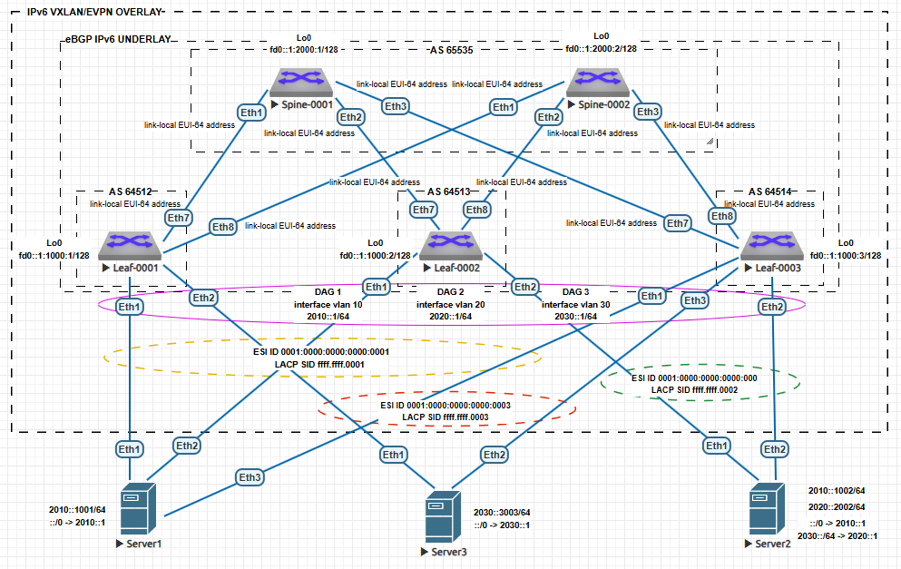

## Домашнее задание №7. VXLAN. Multihoming.

### Цели:
* Настроить отказоустойчивое подключение клиентов с использованием EVPN Multihoming.

### Описание/Пошаговая инструкция выполнения домашнего задания:
В этой самостоятельной работе мы ожидаем, что вы самостоятельно:

#### 1) Подключите клиентов двумя линками к различным Leaf;
#### 2) Настроите агрегированный канал со стороны клиента;
#### 3) Настроите multihoming для работы в Overlay сети. Если используете Cisco NXOS - vPC, если иной вендор - то ESI LAG (либо MC-LAG с поддержкой VXLAN);
#### 4) Зафиксируете в документации - план работы, адресное пространство, схему сети, конфигурацию устройств;
#### 5) Опционально - протестировать отказоустойчивость - убедиться, что связнность не теряется при отключении одного из линков.

# Выполнение:

## План работ:

1) Выделить адресное пространство для endpoint-ов;
2) Зафиксировать значения для Overlay-сети;
4) Опубликовать список реализованных функций Overlay-сети (Control- и Data-plane) для реализации Multihoming;
5) Проверить связность между VPC;
6) Вывести дамп трафика в Control- и Data-plane в штатной и нештатной ситуации (имитация аварийного состояния);
7) Опубликовать листинг команд для проверки корректной работы сети;
8) Привести конфигурации устройств.

Используем Underlay-сеть построенную в предыдущем домашнем задании.

## Адресное пространство:

| Назначение | IP-шлюза | VLAN ID |
| ------------ |:---------------:|:---------------:|
| DAG 1 | 2010::1/64 | 10 |
| DAG 2 | 2020::1/64 | 20 |
| DAG 3 | 2030::1/64 | 30 |

| Назначение | IP 1 | IP 2 | DG | Optional route |
| ------------ |:---------------:|:---------------:|:---------------:|:---------------:|
| Server1 | 2010::1001/64 | - | 2010::1/64 | - |
| Server2 | 2010::1002/64 | 2020::2002/64 | 2010::1/64 | 2030::/64 via 2020::1 |
| Server3 | 2030::3003/64 | - | 2030::1/64 | - |

## Параметры Overlay-сети:

| Назначение | VLAN ID | VNI | RD | RT |
| ------------ |:---------------:|:---------------:|:---------------:|:---------------:|
| MAC-VRF 1 | 10 | 100010 | auto (Router ID:VLAN ID) | 65000:100010 |
| MAC-VRF 2 | 20 | 100020 | auto (Router ID:VLAN ID) | 65000:100020 |
| MAC-VRF 3 | 30 | 100030 | auto (Router ID:VLAN ID) | 65000:100030 |
| IP-VRF | - | 10102 | 1.1.1.x:10102 | 65000:10102 |

Где x - номер Leaf-коммутатора.

## Параметры ESI для серверов:

| Назначение | Интерфейс | ESI ID | RT | LACP SID |
| ------------ |:---------------:|:---------------:|:---------------:|:---------------:|
| Server1 | Port-channel 1 | 0001:0000:0000:0000:0001 | 00:01:00:00:00:01 | ffff.ffff.0001 |
| Server2 | Port-channel 2 | 0001:0000:0000:0000:0002 | 00:01:00:00:00:02 | ffff.ffff.0002 |
| Server3 | Port-channel 3 | 0001:0000:0000:0000:0003 | 00:01:00:00:00:03 | ffff.ffff.0003 |

## Cхема сети:



## Список реализованных функций:

* Базовые настройки Underlay и Overlay сетей остаются прежними (Symmetric IRB);
* Все Leaf-коммутаторы имею идентичную конфигурацию за исключение конфигураций ESI;
* В качестве хостов подключенных к фабрике используем тот же образ, что и для коммутаторов;
* Первый сервер подлючен ко всем Leaf-коммутаторам, имеет один адрес и маршрут по-умолчанию в своей сети;
* Второй сервер подлючен ко второму и к третьему Leaf-коммутаторам, имеет два адреса, маршрут по-умолчанию и специфический маршрут;
* Третий сервер подлючен к первому и к третьему Leaf-коммутаторам, имеет один адрес и маршрут по-умолчанию в своей сети.

## Проверка работы Overlay-сети:


## Дамп трафика (при отключении/включении порта Ethetnet2 на Server2):
### 1) Отключение порта
##### Update-сообщение MP_UNRICH_NLRI (withdrawn routes) соответствующиe ESI-сегменту для Server2 отправленное Leaf-0003 в фабрику - Route Type 1 (Ethernet auto-discovery) и Route Type 4 (Ethernet segment route):

##### Update-сообщения MP_UNRICH_NLRI (withdrawn routes) соответствующиe сервисному Overlay-сегменту для Server2 отправленные Leaf-0003 в фабрику - Route Type 2 (MAC/IP advertisement route):


##### Update-сообщение MP_UNRICH_NLRI (withdrawn routes) соответствующих IP-адресов интерфесов Server2 Overlay-сегмента отправленные из фабрики к Leaf-0003 - Route Type 2 (MAC/IP advertisement route):

### 2) Включение порта
##### Update-сообщение MP_RICH_NLRI соответствующиe ESI-сегменту для Server2 отправленные Leaf-0003 в фабрику - Route Type 1 (Ethernet auto-discovery) и Route Type 4 (Ethernet segment route):


##### Update-сообщения MP_RICH_NLRI и EXTENDED_COMMUNITIES для MAC VRF соответствующиe сервисному Overlay-сегменту для Server2 отправленные Leaf-0003 в фабрику - Route Type 1 (Ethernet auto-discovery)/Route Target MAC-VRF VLAN 10 и Route Type 1 (Ethernet auto-discovery)/Route Target MAC-VRF VLAN 20:


## Листинг команд с примерами вывода:
#### Листинг:
```
show bgp evpn route-type auto-discovery
show bgp evpn route-type ethernet-segment
show bgp evpn esi [ESI ID]
show bgp evpn esi [ESI ID] detail
show bgp evpn instance
show bgp evpn route-type mac-ip [MAC] vni [VNI] detail
show mac address-table
```

#### Выводы команд с коммутатора Leaf-0003:

```
Leaf-0003#show bgp evpn route-type auto-discovery
BGP routing table information for VRF default
Router identifier 1.1.1.3, local AS number 64514
Route status codes: * - valid, > - active, S - Stale, E - ECMP head, e - ECMP
                    c - Contributing to ECMP, % - Pending BGP convergence
Origin codes: i - IGP, e - EGP, ? - incomplete
AS Path Attributes: Or-ID - Originator ID, C-LST - Cluster List, LL Nexthop - Link Local Nexthop

          Network                Next Hop              Metric  LocPref Weight  Path
 * >      RD: 1.1.1.1:10 auto-discovery 0 0001:0000:0000:0000:0001
                                 fd0::1:1000:1         -       100     0       65535 64512 i
 * >      RD: 1.1.1.2:10 auto-discovery 0 0001:0000:0000:0000:0001
                                 fd0::1:1000:2         -       100     0       65535 64513 i
 * >      RD: 1.1.1.3:10 auto-discovery 0 0001:0000:0000:0000:0001
                                 -                     -       -       0       i
 * >      RD: 1.1.1.1:1 auto-discovery 0001:0000:0000:0000:0001
                                 fd0::1:1000:1         -       100     0       65535 64512 i
 * >      RD: 1.1.1.2:1 auto-discovery 0001:0000:0000:0000:0001
                                 fd0::1:1000:2         -       100     0       65535 64513 i
 * >      RD: 1.1.1.3:1 auto-discovery 0001:0000:0000:0000:0001
                                 -                     -       -       0       i
 * >      RD: 1.1.1.2:10 auto-discovery 0 0001:0000:0000:0000:0002
                                 fd0::1:1000:2         -       100     0       65535 64513 i
 * >      RD: 1.1.1.2:20 auto-discovery 0 0001:0000:0000:0000:0002
                                 fd0::1:1000:2         -       100     0       65535 64513 i
 * >      RD: 1.1.1.3:10 auto-discovery 0 0001:0000:0000:0000:0002
                                 -                     -       -       0       i
 * >      RD: 1.1.1.3:20 auto-discovery 0 0001:0000:0000:0000:0002
                                 -                     -       -       0       i
 * >      RD: 1.1.1.2:1 auto-discovery 0001:0000:0000:0000:0002
                                 fd0::1:1000:2         -       100     0       65535 64513 i
 * >      RD: 1.1.1.3:1 auto-discovery 0001:0000:0000:0000:0002
                                 -                     -       -       0       i
 * >      RD: 1.1.1.1:30 auto-discovery 0 0001:0000:0000:0000:0003
                                 fd0::1:1000:1         -       100     0       65535 64512 i
 * >      RD: 1.1.1.3:30 auto-discovery 0 0001:0000:0000:0000:0003
                                 -                     -       -       0       i
 * >      RD: 1.1.1.1:1 auto-discovery 0001:0000:0000:0000:0003
                                 fd0::1:1000:1         -       100     0       65535 64512 i
 * >      RD: 1.1.1.3:1 auto-discovery 0001:0000:0000:0000:0003
                                 -                     -       -       0       i
```
```
Leaf-0003#show bgp evpn route-type ethernet-segment
BGP routing table information for VRF default
Router identifier 1.1.1.3, local AS number 64514
Route status codes: * - valid, > - active, S - Stale, E - ECMP head, e - ECMP
                    c - Contributing to ECMP, % - Pending BGP convergence
Origin codes: i - IGP, e - EGP, ? - incomplete
AS Path Attributes: Or-ID - Originator ID, C-LST - Cluster List, LL Nexthop - Link Local Nexthop

          Network                Next Hop              Metric  LocPref Weight  Path
 * >      RD: 1.1.1.1:1 ethernet-segment 0001:0000:0000:0000:0001 fd0::1:1000:1
                                 fd0::1:1000:1         -       100     0       65535 64512 i
 * >      RD: 1.1.1.2:1 ethernet-segment 0001:0000:0000:0000:0001 fd0::1:1000:2
                                 fd0::1:1000:2         -       100     0       65535 64513 i
 * >      RD: 1.1.1.3:1 ethernet-segment 0001:0000:0000:0000:0001 fd0::1:1000:3
                                 -                     -       -       0       i
 * >      RD: 1.1.1.2:1 ethernet-segment 0001:0000:0000:0000:0002 fd0::1:1000:2
                                 fd0::1:1000:2         -       100     0       65535 64513 i
 * >      RD: 1.1.1.3:1 ethernet-segment 0001:0000:0000:0000:0002 fd0::1:1000:3
                                 -                     -       -       0       i
 * >      RD: 1.1.1.1:1 ethernet-segment 0001:0000:0000:0000:0003 fd0::1:1000:1
                                 fd0::1:1000:1         -       100     0       65535 64512 i
 * >      RD: 1.1.1.3:1 ethernet-segment 0001:0000:0000:0000:0003 fd0::1:1000:3
                                 -                     -       -       0       i
```
```
Leaf-0003#show bgp evpn esi 0001:0000:0000:0000:0001
BGP routing table information for VRF default
Router identifier 1.1.1.3, local AS number 64514
Route status codes: * - valid, > - active, S - Stale, E - ECMP head, e - ECMP
                    c - Contributing to ECMP, % - Pending BGP convergence
Origin codes: i - IGP, e - EGP, ? - incomplete
AS Path Attributes: Or-ID - Originator ID, C-LST - Cluster List, LL Nexthop - Link Local Nexthop

          Network                Next Hop              Metric  LocPref Weight  Path
 * >      RD: 1.1.1.1:10 auto-discovery 0 0001:0000:0000:0000:0001
                                 fd0::1:1000:1         -       100     0       65535 64512 i
 * >      RD: 1.1.1.2:10 auto-discovery 0 0001:0000:0000:0000:0001
                                 fd0::1:1000:2         -       100     0       65535 64513 i
 * >      RD: 1.1.1.3:10 auto-discovery 0 0001:0000:0000:0000:0001
                                 -                     -       -       0       i
 * >      RD: 1.1.1.1:1 auto-discovery 0001:0000:0000:0000:0001
                                 fd0::1:1000:1         -       100     0       65535 64512 i
 * >      RD: 1.1.1.2:1 auto-discovery 0001:0000:0000:0000:0001
                                 fd0::1:1000:2         -       100     0       65535 64513 i
 * >      RD: 1.1.1.3:1 auto-discovery 0001:0000:0000:0000:0001
                                 -                     -       -       0       i
 * >      RD: 1.1.1.1:10 mac-ip 5000.0075.2dfa 2010::1001
                                 fd0::1:1000:1         -       100     0       65535 64512 i
 * >      RD: 1.1.1.2:10 mac-ip 5000.0075.2dfa 2010::1001
                                 fd0::1:1000:2         -       100     0       65535 64513 i
 * >      RD: 1.1.1.1:1 ethernet-segment 0001:0000:0000:0000:0001 fd0::1:1000:1
                                 fd0::1:1000:1         -       100     0       65535 64512 i
 * >      RD: 1.1.1.2:1 ethernet-segment 0001:0000:0000:0000:0001 fd0::1:1000:2
                                 fd0::1:1000:2         -       100     0       65535 64513 i
 * >      RD: 1.1.1.3:1 ethernet-segment 0001:0000:0000:0000:0001 fd0::1:1000:3
                                 -                     -       -       0       i
```
```
Leaf-0003#show bgp evpn esi 0001:0000:0000:0000:0001 detail
BGP routing table information for VRF default
Router identifier 1.1.1.3, local AS number 64514
BGP routing table entry for auto-discovery 0 0001:0000:0000:0000:0001, Route Distinguisher: 1.1.1.1:10
 Paths: 1 available
  65535 64512
    fd0::1:1000:1 from fd0::1:2000:1 (1.2.1.1)
      Origin IGP, metric -, localpref 100, weight 0, tag 0, valid, external, best
      Extended Community: Route-Target-AS:65000:100010 TunnelEncap:tunnelTypeVxlan
      VNI: 100010
BGP routing table entry for auto-discovery 0 0001:0000:0000:0000:0001, Route Distinguisher: 1.1.1.2:10
 Paths: 1 available
  65535 64513
    fd0::1:1000:2 from fd0::1:2000:1 (1.2.1.1)
      Origin IGP, metric -, localpref 100, weight 0, tag 0, valid, external, best
      Extended Community: Route-Target-AS:65000:100010 TunnelEncap:tunnelTypeVxlan
      VNI: 100010
BGP routing table entry for auto-discovery 0 0001:0000:0000:0000:0001, Route Distinguisher: 1.1.1.3:10
 Paths: 1 available
  Local
    - from - (0.0.0.0)
      Origin IGP, metric -, localpref -, weight 0, tag 0, valid, local, best
      Extended Community: Route-Target-AS:65000:100010 TunnelEncap:tunnelTypeVxlan
      VNI: 100010
BGP routing table entry for auto-discovery 0001:0000:0000:0000:0001, Route Distinguisher: 1.1.1.1:1
 Paths: 1 available
  65535 64512
    fd0::1:1000:1 from fd0::1:2000:1 (1.2.1.1)
      Origin IGP, metric -, localpref 100, weight 0, tag 0, valid, external, best
      Extended Community: Route-Target-AS:65000:100010 TunnelEncap:tunnelTypeVxlan EvpnEsiLabel:0
      VNI: 0
BGP routing table entry for auto-discovery 0001:0000:0000:0000:0001, Route Distinguisher: 1.1.1.2:1
 Paths: 1 available
  65535 64513
    fd0::1:1000:2 from fd0::1:2000:1 (1.2.1.1)
      Origin IGP, metric -, localpref 100, weight 0, tag 0, valid, external, best
      Extended Community: Route-Target-AS:65000:100010 TunnelEncap:tunnelTypeVxlan EvpnEsiLabel:0
      VNI: 0
BGP routing table entry for auto-discovery 0001:0000:0000:0000:0001, Route Distinguisher: 1.1.1.3:1
 Paths: 1 available
  Local
    - from - (0.0.0.0)
      Origin IGP, metric -, localpref -, weight 0, tag 0, valid, local, best
      Extended Community: Route-Target-AS:65000:100010 TunnelEncap:tunnelTypeVxlan EvpnEsiLabel:0
BGP routing table entry for mac-ip 5000.0075.2dfa 2010::1001, Route Distinguisher: 1.1.1.1:10
 Paths: 1 available
  65535 64512
    fd0::1:1000:1 from fd0::1:2000:1 (1.2.1.1)
      Origin IGP, metric -, localpref 100, weight 0, tag 0, valid, external, best
      Extended Community: Route-Target-AS:65000:10102 Route-Target-AS:65000:100010 TunnelEncap:tunnelTypeVxlan EvpnRouterMac:50:00:00:3b:34:d4 EvpnNdFlags:pflag
      VNI: 100010 L3 VNI: 10102 ESI: 0001:0000:0000:0000:0001
BGP routing table entry for mac-ip 5000.0075.2dfa 2010::1001, Route Distinguisher: 1.1.1.2:10
 Paths: 1 available
  65535 64513
    fd0::1:1000:2 from fd0::1:2000:1 (1.2.1.1)
      Origin IGP, metric -, localpref 100, weight 0, tag 0, valid, external, best
      Extended Community: Route-Target-AS:65000:10102 Route-Target-AS:65000:100010 TunnelEncap:tunnelTypeVxlan EvpnRouterMac:50:00:00:aa:5c:3a EvpnNdFlags:pflag
      VNI: 100010 L3 VNI: 10102 ESI: 0001:0000:0000:0000:0001
BGP routing table entry for ethernet-segment 0001:0000:0000:0000:0001 fd0::1:1000:1, Route Distinguisher: 1.1.1.1:1
 Paths: 1 available
  65535 64512
    fd0::1:1000:1 from fd0::1:2000:1 (1.2.1.1)
      Origin IGP, metric -, localpref 100, weight 0, tag 0, valid, external, best
      Extended Community: TunnelEncap:tunnelTypeVxlan EvpnEsImportRt:00:01:00:00:00:01
BGP routing table entry for ethernet-segment 0001:0000:0000:0000:0001 fd0::1:1000:2, Route Distinguisher: 1.1.1.2:1
 Paths: 1 available
  65535 64513
    fd0::1:1000:2 from fd0::1:2000:1 (1.2.1.1)
      Origin IGP, metric -, localpref 100, weight 0, tag 0, valid, external, best
      Extended Community: TunnelEncap:tunnelTypeVxlan EvpnEsImportRt:00:01:00:00:00:01
BGP routing table entry for ethernet-segment 0001:0000:0000:0000:0001 fd0::1:1000:3, Route Distinguisher: 1.1.1.3:1
 Paths: 1 available
  Local
    - from - (0.0.0.0)
      Origin IGP, metric -, localpref -, weight 0, tag 0, valid, local, best
      Extended Community: TunnelEncap:tunnelTypeVxlan EvpnEsImportRt:00:01:00:00:00:01
```
```
Leaf-0003#show bgp evpn instance
EVPN instance: VLAN 10
  Route distinguisher: 0:0
  Route target import: Route-Target-AS:65000:100010
  Route target export: Route-Target-AS:65000:100010
  Service interface: VLAN-based
  Local VXLAN IP address: fd0::1:1000:3
  VXLAN: enabled
  MPLS: disabled
  Local ethernet segment:
    ESI: 0001:0000:0000:0000:0002
      Interface: Port-Channel2
      Mode: all-active
      State: up
      ES-Import RT: 00:01:00:00:00:02
      DF election algorithm: modulus
      Designated forwarder: fd0::1:1000:2
      Non-Designated forwarder: fd0::1:1000:3
    ESI: 0001:0000:0000:0000:0001
      Interface: Port-Channel1
      Mode: all-active
      State: up
      ES-Import RT: 00:01:00:00:00:01
      DF election algorithm: modulus
      Designated forwarder: fd0::1:1000:3
      Non-Designated forwarder: fd0::1:1000:1
      Non-Designated forwarder: fd0::1:1000:2
EVPN instance: VLAN 20
  Route distinguisher: 0:0
  Route target import: Route-Target-AS:65000:100020
  Route target export: Route-Target-AS:65000:100020
  Service interface: VLAN-based
  Local VXLAN IP address: fd0::1:1000:3
  VXLAN: enabled
  MPLS: disabled
  Local ethernet segment:
    ESI: 0001:0000:0000:0000:0002
      Interface: Port-Channel2
      Mode: all-active
      State: up
      ES-Import RT: 00:01:00:00:00:02
      DF election algorithm: modulus
      Designated forwarder: fd0::1:1000:2
      Non-Designated forwarder: fd0::1:1000:3
EVPN instance: VLAN 30
  Route distinguisher: 0:0
  Route target import: Route-Target-AS:65000:100030
  Route target export: Route-Target-AS:65000:100030
  Service interface: VLAN-based
  Local VXLAN IP address: fd0::1:1000:3
  VXLAN: enabled
  MPLS: disabled
  Local ethernet segment:
    ESI: 0001:0000:0000:0000:0003
      Interface: Port-Channel3
      Mode: all-active
      State: up
      ES-Import RT: 00:01:00:00:00:03
      DF election algorithm: modulus
      Designated forwarder: fd0::1:1000:1
      Non-Designated forwarder: fd0::1:1000:3
 ```
 ```
Leaf-0003#show bgp evpn route-type mac-ip 5000.0075.2dfa vni 100010 detail
BGP routing table information for VRF default
Router identifier 1.1.1.3, local AS number 64514
BGP routing table entry for mac-ip 5000.0075.2dfa, Route Distinguisher: 1.1.1.2:10
 Paths: 1 available
  65535 64513
    fd0::1:1000:2 from fd0::1:2000:1 (1.2.1.1)
      Origin IGP, metric -, localpref 100, weight 0, tag 0, valid, external, best
      Extended Community: Route-Target-AS:65000:100010 TunnelEncap:tunnelTypeVxlan
      VNI: 100010 ESI: 0001:0000:0000:0000:0001
BGP routing table entry for mac-ip 5000.0075.2dfa, Route Distinguisher: 1.1.1.3:10
 Paths: 1 available
  Local
    - from - (0.0.0.0)
      Origin IGP, metric -, localpref -, weight 0, tag 0, valid, local, best
      Extended Community: Route-Target-AS:65000:100010 TunnelEncap:tunnelTypeVxlan
      VNI: 100010 ESI: 0001:0000:0000:0000:0001
BGP routing table entry for mac-ip 5000.0075.2dfa 2010::1001, Route Distinguisher: 1.1.1.1:10
 Paths: 1 available
  65535 64512
    fd0::1:1000:1 from fd0::1:2000:1 (1.2.1.1)
      Origin IGP, metric -, localpref 100, weight 0, tag 0, valid, external, best
      Extended Community: Route-Target-AS:65000:10102 Route-Target-AS:65000:100010 TunnelEncap:tunnelTypeVxlan EvpnRouterMac:50:00:00:3b:34:d4 EvpnNdFlags:pflag
      VNI: 100010 L3 VNI: 10102 ESI: 0001:0000:0000:0000:0001
BGP routing table entry for mac-ip 5000.0075.2dfa 2010::1001, Route Distinguisher: 1.1.1.2:10
 Paths: 1 available
  65535 64513
    fd0::1:1000:2 from fd0::1:2000:1 (1.2.1.1)
      Origin IGP, metric -, localpref 100, weight 0, tag 0, valid, external, best
      Extended Community: Route-Target-AS:65000:10102 Route-Target-AS:65000:100010 TunnelEncap:tunnelTypeVxlan EvpnRouterMac:50:00:00:aa:5c:3a EvpnNdFlags:pflag
      VNI: 100010 L3 VNI: 10102 ESI: 0001:0000:0000:0000:0001
BGP routing table entry for mac-ip 5000.0075.2dfa 2010::1001, Route Distinguisher: 1.1.1.3:10
 Paths: 1 available
  Local
    - from - (0.0.0.0)
      Origin IGP, metric -, localpref -, weight 0, tag 0, valid, local, best
      Extended Community: Route-Target-AS:65000:10102 Route-Target-AS:65000:100010 TunnelEncap:tunnelTypeVxlan
      VNI: 100010 L3 VNI: 10102 ESI: 0001:0000:0000:0000:0001
 ```
 ```
Leaf-0003#show mac address-table
          Mac Address Table
------------------------------------------------------------------

Vlan    Mac Address       Type        Ports      Moves   Last Move
----    -----------       ----        -----      -----   ---------
  10    1020.3040.5060    STATIC      Cpu
  10    5000.0075.2dfa    DYNAMIC     Po1        2       0:00:04 ago
  10    5000.00af.b20e    DYNAMIC     Po2        1       0:03:34 ago
  20    1020.3040.5060    STATIC      Cpu
  20    5000.00af.b20e    DYNAMIC     Po2        1       0:03:34 ago
  30    1020.3040.5060    STATIC      Cpu
  30    5000.00d6.c6c4    DYNAMIC     Po3        3       19:56:03 ago
4094    1020.3040.5060    STATIC      Cpu
4094    5000.003b.34d4    DYNAMIC     Vx1        1       3:04:03 ago
4094    5000.00aa.5c3a    DYNAMIC     Vx1        1       9:30:21 ago
Total Mac Addresses for this criterion: 10

          Multicast Mac Address Table
------------------------------------------------------------------

Vlan    Mac Address       Type        Ports
----    -----------       ----        -----
Total Mac Addresses for this criterion: 0
```

## Конфигурации устройств:
```
Leaf-0001#show running-config
! Command: show running-config
! device: Leaf-0001 (vEOS-lab, EOS-4.29.2F)
!
! boot system flash:/vEOS-lab.swi
!
no aaa root
!
transceiver qsfp default-mode 4x10G
!
service routing protocols model multi-agent
!
hostname Leaf-0001
!
spanning-tree mode mstp
!
vlan 10,20,30
!
vrf instance sIRB
!
interface Port-Channel1
   description Server1
   switchport trunk allowed vlan 10
   switchport mode trunk
   !
   evpn ethernet-segment
      identifier 0001:0000:0000:0000:0001
      route-target import 00:01:00:00:00:01
   lacp system-id ffff.ffff.0001
!
interface Port-Channel3
   description Server3
   switchport trunk allowed vlan 30
   switchport mode trunk
   !
   evpn ethernet-segment
      identifier 0001:0000:0000:0000:0003
      route-target import 00:01:00:00:00:03
   lacp system-id ffff.ffff.0003
!
interface Ethernet1
   description Server1_Eth1
   channel-group 1 mode active
!
interface Ethernet2
   description Server3_Eth1
   channel-group 3 mode active
!
interface Ethernet3
   shutdown
!
interface Ethernet4
   shutdown
!
interface Ethernet5
   shutdown
!
interface Ethernet6
   shutdown
!
interface Ethernet7
   no switchport
   bfd interval 100 min-rx 100 multiplier 3
   ipv6 enable
!
interface Ethernet8
   no switchport
   bfd interval 100 min-rx 100 multiplier 3
   ipv6 enable
!
interface Loopback0
   ipv6 enable
   ipv6 address fd0::1:1000:1/128
!
interface Management1
!
interface Vlan10
   vrf sIRB
   ipv6 enable
   ipv6 nd ra disabled
   ipv6 address virtual 2010::1/64
!
interface Vlan20
   vrf sIRB
   ipv6 enable
   ipv6 nd ra disabled
   ipv6 address virtual 2020::1/64
!
interface Vlan30
   vrf sIRB
   ipv6 enable
   ipv6 nd ra disabled
   ipv6 address virtual 2030::1/64
!
interface Vxlan1
   vxlan source-interface Loopback0
   vxlan udp-port 4789
   vxlan encapsulation ipv6
   vxlan vlan 10 vni 100010
   vxlan vlan 20 vni 100020
   vxlan vlan 30 vni 100030
   vxlan vrf sIRB vni 10102
!
ip virtual-router mac-address 10:20:30:40:50:60
!
no ip routing
no ip routing vrf sIRB
!
ipv6 unicast-routing
ipv6 unicast-routing vrf sIRB
!
router bgp 64512
   router-id 1.1.1.1
   maximum-paths 8
   neighbor SPINE peer group
   neighbor SPINE bfd
   neighbor SPINE bfd interval 100 min-rx 100 multiplier 3
   neighbor SPINE timers 3 9
   neighbor SPINE idle-restart-timer 60
   neighbor SPINE_EVPN peer group
   neighbor SPINE_EVPN remote-as 65535
   neighbor SPINE_EVPN update-source Loopback0
   neighbor SPINE_EVPN ebgp-multihop 3
   neighbor SPINE_EVPN send-community extended
   neighbor fd0::1:2000:1 peer group SPINE_EVPN
   neighbor fd0::1:2000:2 peer group SPINE_EVPN
   redistribute connected
   neighbor interface Et7-8 peer-group SPINE remote-as 65535
   !
   vlan 10
      rd auto
      route-target both 65000:100010
      redistribute learned
   !
   vlan 20
      rd auto
      route-target both 65000:100020
      redistribute learned
   !
   vlan 30
      rd auto
      route-target both 65000:100030
      redistribute learned
   !
   address-family evpn
      no neighbor SPINE activate
      neighbor SPINE_EVPN activate
   !
   address-family ipv6
      neighbor SPINE activate
      no neighbor SPINE_EVPN activate
   !
   vrf sIRB
      rd 1.1.1.1:10102
      route-target import evpn 65000:10102
      route-target export evpn 65000:10102
      redistribute connected
!
end
```
```
Leaf-0002#show running-config
! Command: show running-config
! device: Leaf-0002 (vEOS-lab, EOS-4.29.2F)
!
! boot system flash:/vEOS-lab.swi
!
no aaa root
!
transceiver qsfp default-mode 4x10G
!
service routing protocols model multi-agent
!
hostname Leaf-0002
!
spanning-tree mode mstp
!
vlan 10,20,30
!
vrf instance sIRB
!
interface Port-Channel1
   description Server1
   switchport trunk allowed vlan 10
   switchport mode trunk
   !
   evpn ethernet-segment
      identifier 0001:0000:0000:0000:0001
      route-target import 00:01:00:00:00:01
   lacp system-id ffff.ffff.0001
!
interface Port-Channel2
   description Server2
   switchport trunk allowed vlan 10,20
   switchport mode trunk
   !
   evpn ethernet-segment
      identifier 0001:0000:0000:0000:0002
      route-target import 00:01:00:00:00:02
   lacp system-id ffff.ffff.0002
!
interface Ethernet1
   description Server1_Eth2
   channel-group 1 mode active
!
interface Ethernet2
   description Server2_Eth1
   channel-group 2 mode active
!
interface Ethernet3
   shutdown
!
interface Ethernet4
   shutdown
!
interface Ethernet5
   shutdown
!
interface Ethernet6
   shutdown
!
interface Ethernet7
   no switchport
   bfd interval 100 min-rx 100 multiplier 3
   ipv6 enable
!
interface Ethernet8
   no switchport
   bfd interval 100 min-rx 100 multiplier 3
   ipv6 enable
!
interface Loopback0
   ipv6 enable
   ipv6 address fd0::1:1000:2/128
!
interface Management1
!
interface Vlan10
   vrf sIRB
   ipv6 enable
   ipv6 nd ra disabled
   ipv6 address virtual 2010::1/64
!
interface Vlan20
   vrf sIRB
   ipv6 enable
   ipv6 nd ra disabled
   ipv6 address virtual 2020::1/64
!
interface Vlan30
   vrf sIRB
   ipv6 enable
   ipv6 nd ra disabled
   ipv6 address virtual 2030::1/64
!
interface Vxlan1
   vxlan source-interface Loopback0
   vxlan udp-port 4789
   vxlan encapsulation ipv6
   vxlan vlan 10 vni 100010
   vxlan vlan 20 vni 100020
   vxlan vlan 30 vni 100030
   vxlan vrf sIRB vni 10102
!
ip virtual-router mac-address 10:20:30:40:50:60
!
no ip routing
no ip routing vrf sIRB
!
ipv6 unicast-routing
ipv6 unicast-routing vrf sIRB
!
router bgp 64513
   router-id 1.1.1.2
   maximum-paths 8
   neighbor SPINE peer group
   neighbor SPINE bfd
   neighbor SPINE bfd interval 100 min-rx 100 multiplier 3
   neighbor SPINE timers 3 9
   neighbor SPINE idle-restart-timer 60
   neighbor SPINE_EVPN peer group
   neighbor SPINE_EVPN remote-as 65535
   neighbor SPINE_EVPN update-source Loopback0
   neighbor SPINE_EVPN ebgp-multihop 3
   neighbor SPINE_EVPN send-community extended
   neighbor fd0::1:2000:1 peer group SPINE_EVPN
   neighbor fd0::1:2000:2 peer group SPINE_EVPN
   redistribute connected
   neighbor interface Et7-8 peer-group SPINE remote-as 65535
   !
   vlan 10
      rd auto
      route-target both 65000:100010
      redistribute learned
   !
   vlan 20
      rd auto
      route-target both 65000:100020
      redistribute learned
   !
   vlan 30
      rd auto
      route-target both 65000:100030
      redistribute learned
   !
   address-family evpn
      no neighbor SPINE activate
      neighbor SPINE_EVPN activate
   !
   address-family ipv6
      neighbor SPINE activate
      no neighbor SPINE_EVPN activate
   !
   vrf sIRB
      rd 1.1.1.2:10102
      route-target import evpn 65000:10102
      route-target export evpn 65000:10102
      redistribute connected
!
end
```
```
Leaf-0003#show running-config
! Command: show running-config
! device: Leaf-0003 (vEOS-lab, EOS-4.29.2F)
!
! boot system flash:/vEOS-lab.swi
!
no aaa root
!
transceiver qsfp default-mode 4x10G
!
service routing protocols model multi-agent
!
hostname Leaf-0003
!
spanning-tree mode mstp
!
vlan 10,20,30
!
vrf instance sIRB
!
interface Port-Channel1
   description Server1
   switchport trunk allowed vlan 10
   switchport mode trunk
   !
   evpn ethernet-segment
      identifier 0001:0000:0000:0000:0001
      route-target import 00:01:00:00:00:01
   lacp system-id ffff.ffff.0001
!
interface Port-Channel2
   description Server2
   switchport trunk allowed vlan 10,20
   switchport mode trunk
   !
   evpn ethernet-segment
      identifier 0001:0000:0000:0000:0002
      route-target import 00:01:00:00:00:02
   lacp system-id ffff.ffff.0002
!
interface Port-Channel3
   description Server3
   switchport trunk allowed vlan 30
   switchport mode trunk
   !
   evpn ethernet-segment
      identifier 0001:0000:0000:0000:0003
      route-target import 00:01:00:00:00:03
   lacp system-id ffff.ffff.0003
!
interface Ethernet1
   description Server1_Eth3
   channel-group 1 mode active
!
interface Ethernet2
   description Server2_Eth2
   channel-group 2 mode active
!
interface Ethernet3
   description Server3_Eth2
   channel-group 3 mode active
!
interface Ethernet4
   shutdown
!
interface Ethernet5
   shutdown
!
interface Ethernet6
   shutdown
!
interface Ethernet7
   no switchport
   bfd interval 100 min-rx 100 multiplier 3
   ipv6 enable
!
interface Ethernet8
   shutdown
   no switchport
   bfd interval 100 min-rx 100 multiplier 3
   ipv6 enable
!
interface Loopback0
   ipv6 enable
   ipv6 address fd0::1:1000:3/128
!
interface Management1
!
interface Vlan10
   vrf sIRB
   ipv6 enable
   ipv6 nd ra disabled
   ipv6 address virtual 2010::1/64
!
interface Vlan20
   vrf sIRB
   ipv6 enable
   ipv6 nd ra disabled
   ipv6 address virtual 2020::1/64
!
interface Vlan30
   vrf sIRB
   ipv6 enable
   ipv6 nd ra disabled
   ipv6 address virtual 2030::1/64
!
interface Vxlan1
   vxlan source-interface Loopback0
   vxlan udp-port 4789
   vxlan encapsulation ipv6
   vxlan vlan 10 vni 100010
   vxlan vlan 20 vni 100020
   vxlan vlan 30 vni 100030
   vxlan vrf sIRB vni 10102
!
ip virtual-router mac-address 10:20:30:40:50:60
!
no ip routing
no ip routing vrf sIRB
!
ipv6 unicast-routing
ipv6 unicast-routing vrf sIRB
!
router bgp 64514
   router-id 1.1.1.3
   maximum-paths 8
   neighbor SPINE peer group
   neighbor SPINE bfd
   neighbor SPINE bfd interval 100 min-rx 100 multiplier 3
   neighbor SPINE timers 3 9
   neighbor SPINE idle-restart-timer 60
   neighbor SPINE_EVPN peer group
   neighbor SPINE_EVPN remote-as 65535
   neighbor SPINE_EVPN update-source Loopback0
   neighbor SPINE_EVPN ebgp-multihop 3
   neighbor SPINE_EVPN send-community extended
   neighbor fd0::1:2000:1 peer group SPINE_EVPN
   neighbor fd0::1:2000:2 peer group SPINE_EVPN
   redistribute connected
   neighbor interface Et7-8 peer-group SPINE remote-as 65535
   !
   vlan 10
      rd auto
      route-target both 65000:100010
      redistribute learned
   !
   vlan 20
      rd auto
      route-target both 65000:100020
      redistribute learned
   !
   vlan 30
      rd auto
      route-target both 65000:100030
      redistribute learned
   !
   address-family evpn
      no neighbor SPINE activate
      neighbor SPINE_EVPN activate
   !
   address-family ipv6
      neighbor SPINE activate
      no neighbor SPINE_EVPN activate
   !
   vrf sIRB
      rd 1.1.1.3:10102
      route-target import evpn 65000:10102
      route-target export evpn 65000:10102
      redistribute connected
!
end
```
```
Server1#show running-config
! Command: show running-config
! device: Server1 (vEOS-lab, EOS-4.29.2F)
!
! boot system flash:/vEOS-lab.swi
!
no aaa root
!
transceiver qsfp default-mode 4x10G
!
service routing protocols model ribd
!
hostname Server1
!
spanning-tree mode mstp
!
vlan 10
!
interface Port-Channel1
   switchport mode trunk
!
interface Ethernet1
   channel-group 1 mode active
!
interface Ethernet2
   channel-group 1 mode active
!
interface Ethernet3
   channel-group 1 mode active
!
interface Ethernet4
   shutdown
!
interface Ethernet5
   shutdown
!
interface Ethernet6
   shutdown
!
interface Ethernet7
   shutdown
!
interface Ethernet8
   shutdown
!
interface Management1
!
interface Vlan10
   ipv6 enable
   ipv6 address 2010::1001/64
   ipv6 nd ra disabled
!
no ip routing
!
ipv6 unicast-routing
!
ipv6 route ::/0 2010::1
!
end
Server1#show running-config
! Command: show running-config
! device: Server1 (vEOS-lab, EOS-4.29.2F)
!
! boot system flash:/vEOS-lab.swi
!
no aaa root
!
transceiver qsfp default-mode 4x10G
!
service routing protocols model ribd
!
hostname Server1
!
spanning-tree mode mstp
!
vlan 10
!
interface Port-Channel1
   switchport mode trunk
!
interface Ethernet1
   channel-group 1 mode active
!
interface Ethernet2
   channel-group 1 mode active
!
interface Ethernet3
   channel-group 1 mode active
!
interface Ethernet4
   shutdown
!
interface Ethernet5
   shutdown
!
interface Ethernet6
   shutdown
!
interface Ethernet7
   shutdown
!
interface Ethernet8
   shutdown
!
interface Management1
!
interface Vlan10
   ipv6 enable
   ipv6 address 2010::1001/64
   ipv6 nd ra disabled
!
no ip routing
!
ipv6 unicast-routing
!
ipv6 route ::/0 2010::1
!
end
```
```
Server2#show running-config
! Command: show running-config
! device: Server2 (vEOS-lab, EOS-4.29.2F)
!
! boot system flash:/vEOS-lab.swi
!
no aaa root
!
transceiver qsfp default-mode 4x10G
!
service routing protocols model ribd
!
hostname Server2
!
spanning-tree mode mstp
!
vlan 10,20
!
interface Port-Channel1
   switchport mode trunk
!
interface Ethernet1
   channel-group 1 mode active
!
interface Ethernet2
   channel-group 1 mode active
!
interface Ethernet3
   shutdown
!
interface Ethernet4
   shutdown
!
interface Ethernet5
   shutdown
!
interface Ethernet6
   shutdown
!
interface Ethernet7
   shutdown
!
interface Ethernet8
   shutdown
!
interface Management1
!
interface Vlan10
   ipv6 enable
   ipv6 address 2010::1002/64
   ipv6 nd ra disabled
!
interface Vlan20
   ipv6 enable
   ipv6 address 2020::2002/64
   ipv6 nd ra disabled
!
no ip routing
!
ipv6 unicast-routing
!
ipv6 route ::/0 2010::1
ipv6 route 2030::/64 2020::1
!
end
```
```
Server3#show running-config
! Command: show running-config
! device: Server3 (vEOS-lab, EOS-4.29.2F)
!
! boot system flash:/vEOS-lab.swi
!
no aaa root
!
transceiver qsfp default-mode 4x10G
!
service routing protocols model ribd
!
hostname Server3
!
spanning-tree mode mstp
!
vlan 30
!
interface Port-Channel1
   switchport mode trunk
!
interface Ethernet1
   channel-group 1 mode active
!
interface Ethernet2
   channel-group 1 mode active
!
interface Ethernet3
   shutdown
!
interface Ethernet4
   shutdown
!
interface Ethernet5
   shutdown
!
interface Ethernet6
   shutdown
!
interface Ethernet7
   shutdown
!
interface Ethernet8
   shutdown
!
interface Management1
!
interface Vlan30
   ipv6 enable
   ipv6 address 2030::3003/64
   ipv6 nd ra disabled
!
no ip routing
!
ipv6 unicast-routing
!
ipv6 route ::/0 2030::1
!
end
```
```
Spine-0001#show running-config
! Command: show running-config
! device: Spine-0001 (vEOS-lab, EOS-4.29.2F)
!
! boot system flash:/vEOS-lab.swi
!
no aaa root
!
transceiver qsfp default-mode 4x10G
!
service routing protocols model multi-agent
!
hostname Spine-0001
!
spanning-tree mode none
!
interface Ethernet1
   no switchport
   bfd interval 100 min-rx 100 multiplier 3
   ipv6 enable
!
interface Ethernet2
   no switchport
   bfd interval 100 min-rx 100 multiplier 3
   ipv6 enable
!
interface Ethernet3
   no switchport
   bfd interval 100 min-rx 100 multiplier 3
   ipv6 enable
!
interface Ethernet4
   shutdown
!
interface Ethernet5
   shutdown
!
interface Ethernet6
   shutdown
!
interface Ethernet7
   shutdown
!
interface Ethernet8
   shutdown
!
interface Loopback0
   ipv6 enable
   ipv6 address fd0::1:2000:1/128
!
interface Management1
!
no ip routing
!
ipv6 unicast-routing
!
peer-filter pf_accept_leaf_as-range
   10 match as-range 64512-65512 result accept
!
router bgp 65535
   router-id 1.2.1.1
   maximum-paths 8
   bgp listen range fe80::/64 peer-group LEAF peer-filter pf_accept_leaf_as-range
   neighbor LEAF peer group
   neighbor LEAF bfd
   neighbor LEAF bfd interval 100 min-rx 100 multiplier 3
   neighbor LEAF timers 3 9
   neighbor LEAF idle-restart-timer 60
   neighbor LEAF_EVPN peer group
   neighbor LEAF_EVPN next-hop-unchanged
   neighbor LEAF_EVPN update-source Loopback0
   neighbor LEAF_EVPN ebgp-multihop 3
   neighbor LEAF_EVPN send-community extended
   neighbor fd0::1:1000:1 peer group LEAF_EVPN
   neighbor fd0::1:1000:1 remote-as 64512
   neighbor fd0::1:1000:2 peer group LEAF_EVPN
   neighbor fd0::1:1000:2 remote-as 64513
   neighbor fd0::1:1000:3 peer group LEAF_EVPN
   neighbor fd0::1:1000:3 remote-as 64514
   redistribute connected
   !
   address-family evpn
      no neighbor LEAF activate
      neighbor LEAF_EVPN activate
   !
   address-family ipv6
      neighbor LEAF activate
      no neighbor LEAF_EVPN activate
!
end
```
```
Spine-0002#show running-config
! Command: show running-config
! device: Spine-0002 (vEOS-lab, EOS-4.29.2F)
!
! boot system flash:/vEOS-lab.swi
!
no aaa root
!
transceiver qsfp default-mode 4x10G
!
service routing protocols model multi-agent
!
hostname Spine-0002
!
spanning-tree mode none
!
interface Ethernet1
   no switchport
   bfd interval 100 min-rx 100 multiplier 3
   ipv6 enable
!
interface Ethernet2
   no switchport
   bfd interval 100 min-rx 100 multiplier 3
   ipv6 enable
!
interface Ethernet3
   no switchport
   bfd interval 100 min-rx 100 multiplier 3
   ipv6 enable
!
interface Ethernet4
   shutdown
!
interface Ethernet5
   shutdown
!
interface Ethernet6
   shutdown
!
interface Ethernet7
   shutdown
!
interface Ethernet8
   shutdown
!
interface Loopback0
   ipv6 enable
   ipv6 address fd0::1:2000:2/128
!
interface Management1
!
no ip routing
!
ipv6 unicast-routing
!
peer-filter pf_accept_leaf_as-range
   10 match as-range 64512-65512 result accept
!
router bgp 65535
   router-id 1.2.1.2
   maximum-paths 8
   bgp listen range fe80::/64 peer-group LEAF peer-filter pf_accept_leaf_as-range
   neighbor LEAF peer group
   neighbor LEAF bfd
   neighbor LEAF bfd interval 100 min-rx 100 multiplier 3
   neighbor LEAF timers 3 9
   neighbor LEAF idle-restart-timer 60
   neighbor LEAF_EVPN peer group
   neighbor LEAF_EVPN next-hop-unchanged
   neighbor LEAF_EVPN update-source Loopback0
   neighbor LEAF_EVPN ebgp-multihop 3
   neighbor LEAF_EVPN send-community extended
   neighbor fd0::1:1000:1 peer group LEAF_EVPN
   neighbor fd0::1:1000:1 remote-as 64512
   neighbor fd0::1:1000:2 peer group LEAF_EVPN
   neighbor fd0::1:1000:2 remote-as 64513
   neighbor fd0::1:1000:3 peer group LEAF_EVPN
   neighbor fd0::1:1000:3 remote-as 64514
   redistribute connected
   !
   address-family evpn
      no neighbor LEAF activate
      neighbor LEAF_EVPN activate
   !
   address-family ipv6
      neighbor LEAF activate
      no neighbor LEAF_EVPN activate
!
end
```
