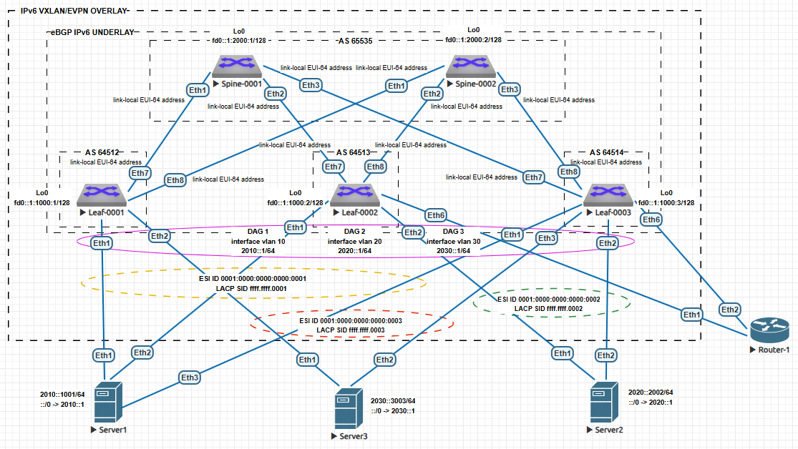

## Домашнее задание №8. VXLAN. Routing.

### Цели:
* Реализовать передачу суммарных префиксов через EVPN route-type 5.

### Описание/Пошаговая инструкция выполнения домашнего задания:
В этой самостоятельной работе мы ожидаем, что вы самостоятельно:

#### 1) Разместите двух "клиентов" в разных VRF в рамках одной фабрики;
#### 2) Настроите маршрутизацию между клиентами через внешнее устройство (граничный роутер\фаерволл\etc);
#### 3) Зафиксируете в документации - план работы, адресное пространство, схему сети, настройки сетевого оборудования.

# Выполнение:

## План работ:

1) Выделить адресное пространство для endpoint-ов;
2) Зафиксировать значения для Overlay-сети;
4) Опубликовать список реализованных функций Overlay-сети (Control- и Data-plane) для реализации маршрутизации между клиентами через внешнее устройство;
5) Проверить связность между серверами, которые находятся в разных Tenant/VRF;
6) Вывести дамп трафика;
7) Опубликовать листинг команд для проверки корректной работы сети;
8) Привести конфигурации устройств.

Используем Underlay-сеть построенную в предыдущем домашнем задании.

## Адресное пространство:

| Назначение | IP-шлюза | VLAN ID | VRF |
| ------------ |:---------------:|:---------------:|:---------------:|
| DAG 1 | 2010::1/64 | 10 | sIRB |
| DAG 2 | 2020::1/64 | 20 | sIRB-2 |
| DAG 3 | 2030::1/64 | 30 | sIRB-3 |

| Назначение | IP | DG |
| ------------ |:---------------:|:---------------:|
| Server1 | 2010::1001/64 | 2010::1/64 |
| Server2 | 2020::2002/64 | 2020::1/64 |
| Server3 | 2030::3003/64 | 2030::1/64 |

## Параметры Overlay-сети:

| Назначение | VLAN ID | VNI | RD | RT |
| ------------ |:---------------:|:---------------:|:---------------:|:---------------:|
| MAC-VRF 1 | 10 | 100010 | auto (Router ID:VLAN ID) | 65000:100010 |
| MAC-VRF 2 | 20 | 100020 | auto (Router ID:VLAN ID) | 65000:100020 |
| MAC-VRF 3 | 30 | 100030 | auto (Router ID:VLAN ID) | 65000:100030 |
| IP-VRF 1 | - | 10102 | 1.1.1.x:10102 | 65000:10102 |
| IP-VRF 2 | - | 10202 | 1.1.1.x:10202 | 65000:10202 |
| IP-VRF 3 | - | 10302 | 1.1.1.x:10302 | 65000:10302 |

Где x - номер Leaf-коммутатора.

## Параметры взаимодействия с внешним устройством:

| Назначение | VRF | IP (fabric side) | IP (router side) | VLAN ID | Router ID |
| ------------ |:---------------:|:---------------:|:---------------:|:---------------:|:---------------:|
| P-2-P eBGP from Leaf-0002 | sIRB | 2997::1/125 | 2997::3/125 | 997 | 1.1.1.2 |
| P-2-P eBGP from Leaf-0003 | sIRB | 2997::2/125 | 2997::3/125 | 997 | 1.1.1.3 |
| P-2-P eBGP from Leaf-0002 | sIRB-2 | 2998::1/125 | 2998::3/125 | 998 | 1.1.1.2 |
| P-2-P eBGP from Leaf-0003 | sIRB-2 | 2998::2/125 | 2998::3/125 | 998 | 1.1.1.3 |
| P-2-P eBGP from Leaf-0002 | sIRB-3 | 2999::1/125 | 2999::3/125 | 999 | 99.99.99.99 |
| P-2-P eBGP from Leaf-0003 | sIRB-3 | 2999::2/125 | 2999::3/125 | 999 | 99.99.99.99 |

## Адреса Loopback-интерфейсов для проведения проверок связности и осуществление суммаризации:

| Назначение | Interface | VRF | IP |
| ------------ |:---------------:|:---------------:|:---------------:|
| Leaf-0001 | Loopback110 | sIRB | 1100::1/17 |
| Leaf-0001 | Loopback120 | sIRB-2 | 1200::1/17 |
| Leaf-0002 | Loopback111 | sIRB | 1100:8000::1/17 |
| Leaf-0002 | Loopback121 | sIRB-2 | 1200:8000::1/17 |
| Router-1 | Loopback997 | GRT | 2000:997::997/128 |
| Router-1 | Loopback998 | GRT | 2000:998::998/128 |
| Router-1 | Loopback999 | GRT | 2000:999::999/128 |

## Параметры ESI для серверов:

| Назначение   | Интерфейс | ESI ID | RT | LACP SID
| ------------ |:---------------:|:---------------:|:---------------:|:---------------:|
| Server1 | Port-channel 1 | 0001:0000:0000:0000:0001 | 00:01:00:00:00:01 | ffff.ffff.0001 |
| Server2 | Port-channel 2 | 0001:0000:0000:0000:0002 | 00:01:00:00:00:02 | ffff.ffff.0002 |
| Server3 | Port-channel 3 | 0001:0000:0000:0000:0003 | 00:01:00:00:00:03 | ffff.ffff.0003 |

## Cхема сети:



## Список реализованных функций:

* Базовые настройки Underlay и Overlay сетей остаются прежними (Symmetric IRB);
* Все Leaf-коммутаторы имею идентичную конфигурацию за исключение конфигураций ESI;
* В качестве хостов подключенных к фабрике используем тот же образ, что и для коммутаторов;
* Первый сервер подлючен ко всем Leaf-коммутаторам, имеет один адрес и маршрут по-умолчанию;
* Второй сервер подлючен ко второму и к третьему Leaf-коммутаторам, имеет один адрес и маршрут по-умолчанию;
* Третий сервер подлючен к первому и к третьему Leaf-коммутаторам, имеет один адрес и маршрут по-умолчанию;
* В качестве внешнего устройства (маршрутизатора - ASN 64999) подключенного к фабрике используем тот же образ, что и для коммутаторов;
* Внешнее устройство подлючено двумя независимыми линками, которые передают тэгированный трафик VLAN, которые используются для установления соединения по eBGP между адресами на SVI-интерфесах;
* На внешнем устройстве осуществлена агрегация адресов 1100::1/17 и 1100:8000::1/17, которые затерминированы на коммутаторах Leaf-0001 и Leaf-0002 соответственно, в 1100::/16;
* На внешнем устройстве осуществлена агрегация адресов 1200::1/17 и 1200:8000::1/17, которые затерминированы на коммутаторах Leaf-0001 и Leaf-0002 соответственно, в 1200::/16;
* Адреса 2000:997::997/128, 2000:998::998/128, 2000:999::999/128 затерминированные на внешнем устройстве доступны через перераспределенный маршрут по-умолчанию.

## Проверка работы Overlay-сети:


## Дамп трафика: (в разработке)

## Листинг команд с примерами вывода:
#### Листинг:
```
show bgp evpn route-type ip-prefix ipv6
show ipv6 bgp vrf [VRF-name]
```

#### Выводы команд с коммутатора Leaf-0003:

```
Leaf-0003#show bgp evpn route-type ip-prefix ipv6
BGP routing table information for VRF default
Router identifier 1.1.1.3, local AS number 64514
Route status codes: * - valid, > - active, S - Stale, E - ECMP head, e - ECMP
                    c - Contributing to ECMP, % - Pending BGP convergence
Origin codes: i - IGP, e - EGP, ? - incomplete
AS Path Attributes: Or-ID - Originator ID, C-LST - Cluster List, LL Nexthop - Link Local Nexthop

          Network                Next Hop              Metric  LocPref Weight  Path
 * >Ec    RD: 1.1.1.2:10102 ip-prefix ::/0
                                 fd0::1:1000:2         -       100     0       65535 64513 64999 ?
 *  ec    RD: 1.1.1.2:10102 ip-prefix ::/0
                                 fd0::1:1000:2         -       100     0       65535 64513 64999 ?
 * >Ec    RD: 1.1.1.2:10202 ip-prefix ::/0
                                 fd0::1:1000:2         -       100     0       65535 64513 64999 ?
 *  ec    RD: 1.1.1.2:10202 ip-prefix ::/0
                                 fd0::1:1000:2         -       100     0       65535 64513 64999 ?
 * >Ec    RD: 1.1.1.2:10302 ip-prefix ::/0
                                 fd0::1:1000:2         -       100     0       65535 64513 64999 ?
 *  ec    RD: 1.1.1.2:10302 ip-prefix ::/0
                                 fd0::1:1000:2         -       100     0       65535 64513 64999 ?
 * >      RD: 1.1.1.3:10102 ip-prefix ::/0
                                 -                     -       100     0       64999 ?
 * >      RD: 1.1.1.3:10202 ip-prefix ::/0
                                 -                     -       100     0       64999 ?
 * >      RD: 1.1.1.3:10302 ip-prefix ::/0
                                 -                     -       100     0       64999 ?
 * >      RD: 1.1.1.3:10102 ip-prefix 1100::/16
                                 -                     -       100     0       64999 64513 i
 * >      RD: 1.1.1.3:10202 ip-prefix 1100::/16
                                 -                     -       100     0       64999 64513 i
 * >      RD: 1.1.1.3:10302 ip-prefix 1100::/16
                                 -                     -       100     0       64999 64513 i
 * >Ec    RD: 1.1.1.1:10102 ip-prefix 1100::/17
                                 fd0::1:1000:1         -       100     0       65535 64512 i
 *  ec    RD: 1.1.1.1:10102 ip-prefix 1100::/17
                                 fd0::1:1000:1         -       100     0       65535 64512 i
 * >Ec    RD: 1.1.1.2:10102 ip-prefix 1100:8000::/17
                                 fd0::1:1000:2         -       100     0       65535 64513 i
 *  ec    RD: 1.1.1.2:10102 ip-prefix 1100:8000::/17
                                 fd0::1:1000:2         -       100     0       65535 64513 i
 * >      RD: 1.1.1.3:10102 ip-prefix 1200::/16
                                 -                     -       100     0       64999 64513 i
 * >      RD: 1.1.1.3:10202 ip-prefix 1200::/16
                                 -                     -       100     0       64999 64513 i
 * >      RD: 1.1.1.3:10302 ip-prefix 1200::/16
                                 -                     -       100     0       64999 64513 i
 * >Ec    RD: 1.1.1.1:10202 ip-prefix 1200::/17
                                 fd0::1:1000:1         -       100     0       65535 64512 i
 *  ec    RD: 1.1.1.1:10202 ip-prefix 1200::/17
                                 fd0::1:1000:1         -       100     0       65535 64512 i
 * >Ec    RD: 1.1.1.2:10202 ip-prefix 1200:8000::/17
                                 fd0::1:1000:2         -       100     0       65535 64513 i
 *  ec    RD: 1.1.1.2:10202 ip-prefix 1200:8000::/17
                                 fd0::1:1000:2         -       100     0       65535 64513 i
 * >Ec    RD: 1.1.1.1:10102 ip-prefix 2010::/64
                                 fd0::1:1000:1         -       100     0       65535 64512 i
 *  ec    RD: 1.1.1.1:10102 ip-prefix 2010::/64
                                 fd0::1:1000:1         -       100     0       65535 64512 i
 * >Ec    RD: 1.1.1.2:10102 ip-prefix 2010::/64
                                 fd0::1:1000:2         -       100     0       65535 64513 i
 *  ec    RD: 1.1.1.2:10102 ip-prefix 2010::/64
                                 fd0::1:1000:2         -       100     0       65535 64513 i
 * >      RD: 1.1.1.3:10102 ip-prefix 2010::/64
                                 -                     -       -       0       i
 *        RD: 1.1.1.3:10102 ip-prefix 2010::/64
                                 -                     -       100     0       64999 64513 i
 * >      RD: 1.1.1.3:10202 ip-prefix 2010::/64
                                 -                     -       100     0       64999 64513 i
 * >      RD: 1.1.1.3:10302 ip-prefix 2010::/64
                                 -                     -       100     0       64999 64513 i
 * >Ec    RD: 1.1.1.1:10202 ip-prefix 2020::/64
                                 fd0::1:1000:1         -       100     0       65535 64512 i
 *  ec    RD: 1.1.1.1:10202 ip-prefix 2020::/64
                                 fd0::1:1000:1         -       100     0       65535 64512 i
 * >Ec    RD: 1.1.1.2:10202 ip-prefix 2020::/64
                                 fd0::1:1000:2         -       100     0       65535 64513 i
 *  ec    RD: 1.1.1.2:10202 ip-prefix 2020::/64
                                 fd0::1:1000:2         -       100     0       65535 64513 i
 * >      RD: 1.1.1.3:10102 ip-prefix 2020::/64
                                 -                     -       100     0       64999 64513 i
 * >      RD: 1.1.1.3:10202 ip-prefix 2020::/64
                                 -                     -       -       0       i
 *        RD: 1.1.1.3:10202 ip-prefix 2020::/64
                                 -                     -       100     0       64999 64513 i
 * >      RD: 1.1.1.3:10302 ip-prefix 2020::/64
                                 -                     -       100     0       64999 64513 i
 * >Ec    RD: 1.1.1.1:10302 ip-prefix 2030::/64
                                 fd0::1:1000:1         -       100     0       65535 64512 i
 *  ec    RD: 1.1.1.1:10302 ip-prefix 2030::/64
                                 fd0::1:1000:1         -       100     0       65535 64512 i
 * >Ec    RD: 1.1.1.2:10302 ip-prefix 2030::/64
                                 fd0::1:1000:2         -       100     0       65535 64513 i
 *  ec    RD: 1.1.1.2:10302 ip-prefix 2030::/64
                                 fd0::1:1000:2         -       100     0       65535 64513 i
 * >      RD: 1.1.1.3:10102 ip-prefix 2030::/64
                                 -                     -       100     0       64999 64513 i
 * >      RD: 1.1.1.3:10202 ip-prefix 2030::/64
                                 -                     -       100     0       64999 64513 i
 * >      RD: 1.1.1.3:10302 ip-prefix 2030::/64
                                 -                     -       -       0       i
 *        RD: 1.1.1.3:10302 ip-prefix 2030::/64
                                 -                     -       100     0       64999 64513 i
 * >      RD: 1.1.1.3:10102 ip-prefix 2030::3003/128
                                 -                     -       100     0       64999 64513 65535 64512 i
 * >      RD: 1.1.1.3:10202 ip-prefix 2030::3003/128
                                 -                     -       100     0       64999 64513 65535 64512 i
 * >      RD: 1.1.1.3:10302 ip-prefix 2030::3003/128
                                 -                     -       100     0       64999 64513 65535 64512 i
 * >Ec    RD: 1.1.1.2:10102 ip-prefix 2997::/125
                                 fd0::1:1000:2         -       100     0       65535 64513 i
 *  ec    RD: 1.1.1.2:10102 ip-prefix 2997::/125
                                 fd0::1:1000:2         -       100     0       65535 64513 i
 * >      RD: 1.1.1.3:10102 ip-prefix 2997::/125
                                 -                     -       -       0       i
 * >Ec    RD: 1.1.1.2:10202 ip-prefix 2998::/125
                                 fd0::1:1000:2         -       100     0       65535 64513 i
 *  ec    RD: 1.1.1.2:10202 ip-prefix 2998::/125
                                 fd0::1:1000:2         -       100     0       65535 64513 i
 * >      RD: 1.1.1.3:10202 ip-prefix 2998::/125
                                 -                     -       -       0       i
 * >Ec    RD: 1.1.1.2:10302 ip-prefix 2999::/125
                                 fd0::1:1000:2         -       100     0       65535 64513 i
 *  ec    RD: 1.1.1.2:10302 ip-prefix 2999::/125
                                 fd0::1:1000:2         -       100     0       65535 64513 i
 * >      RD: 1.1.1.3:10302 ip-prefix 2999::/125
                                 -                     -       -       0       i
```
```
Leaf-0003#show ipv6 bgp vrf sIRB
BGP routing table information for VRF sIRB
Router identifier 1.1.1.3, local AS number 64514
Route status codes: s - suppressed contributor, * - valid, > - active, E - ECMP head, e - ECMP
                    S - Stale, c - Contributing to ECMP, b - backup, L - labeled-unicast
                    % - Pending BGP convergence
Origin codes: i - IGP, e - EGP, ? - incomplete
RPKI Origin Validation codes: V - valid, I - invalid, U - unknown
AS Path Attributes: Or-ID - Originator ID, C-LST - Cluster List, LL Nexthop - Link Local Nexthop

          Network                Next Hop              Metric  AIGP       LocPref Weight  Path
 * >      ::/0                   2997::3               0       -          100     0       64999 ?
 *  Ec    ::/0                   fd0::1:1000:2         0       -          100     0       65535 64513 64999 ?
 *  ec    ::/0                   fd0::1:1000:2         0       -          100     0       65535 64513 64999 ?
 * >      1100::/16              2997::3               0       -          100     0       64999 64513 i
 * >Ec    1100::/17              fd0::1:1000:1         0       -          100     0       65535 64512 i
 *  ec    1100::/17              fd0::1:1000:1         0       -          100     0       65535 64512 i
 * >Ec    1100:8000::/17         fd0::1:1000:2         0       -          100     0       65535 64513 i
 *  ec    1100:8000::/17         fd0::1:1000:2         0       -          100     0       65535 64513 i
 * >      1200::/16              2997::3               0       -          100     0       64999 64513 i
 * >      2010::/64              -                     -       -          -       0       i
 *        2010::/64              2997::3               0       -          100     0       64999 64513 i
 *  Ec    2010::/64              fd0::1:1000:1         0       -          100     0       65535 64512 i
 *  ec    2010::/64              fd0::1:1000:2         0       -          100     0       65535 64513 i
 *  ec    2010::/64              fd0::1:1000:2         0       -          100     0       65535 64513 i
 *  ec    2010::/64              fd0::1:1000:1         0       -          100     0       65535 64512 i
          2010::1001/128         fd0::1:1000:2         0       -          100     0       65535 64513 i
          2010::1001/128         fd0::1:1000:1         0       -          100     0       65535 64512 i
          2010::1001/128         fd0::1:1000:1         0       -          100     0       65535 64512 i
          2010::1001/128         fd0::1:1000:2         0       -          100     0       65535 64513 i
 * >      2020::/64              2997::3               0       -          100     0       64999 64513 i
 * >      2030::/64              2997::3               0       -          100     0       64999 64513 i
 * >      2030::3003/128         2997::3               0       -          100     0       64999 64513 65535 64512 i
 * >      2997::/125             -                     -       -          -       0       i
 *  Ec    2997::/125             fd0::1:1000:2         0       -          100     0       65535 64513 i
 *  ec    2997::/125             fd0::1:1000:2         0       -          100     0       65535 64513 i

Leaf-0003#show ipv6 bgp vrf sIRB-2
BGP routing table information for VRF sIRB-2
Router identifier 1.1.1.3, local AS number 64514
Route status codes: s - suppressed contributor, * - valid, > - active, E - ECMP head, e - ECMP
                    S - Stale, c - Contributing to ECMP, b - backup, L - labeled-unicast
                    % - Pending BGP convergence
Origin codes: i - IGP, e - EGP, ? - incomplete
RPKI Origin Validation codes: V - valid, I - invalid, U - unknown
AS Path Attributes: Or-ID - Originator ID, C-LST - Cluster List, LL Nexthop - Link Local Nexthop

          Network                Next Hop              Metric  AIGP       LocPref Weight  Path
 * >      ::/0                   2998::3               0       -          100     0       64999 ?
 *  Ec    ::/0                   fd0::1:1000:2         0       -          100     0       65535 64513 64999 ?
 *  ec    ::/0                   fd0::1:1000:2         0       -          100     0       65535 64513 64999 ?
 * >      1100::/16              2998::3               0       -          100     0       64999 64513 i
 * >      1200::/16              2998::3               0       -          100     0       64999 64513 i
 * >Ec    1200::/17              fd0::1:1000:1         0       -          100     0       65535 64512 i
 *  ec    1200::/17              fd0::1:1000:1         0       -          100     0       65535 64512 i
 * >Ec    1200:8000::/17         fd0::1:1000:2         0       -          100     0       65535 64513 i
 *  ec    1200:8000::/17         fd0::1:1000:2         0       -          100     0       65535 64513 i
 * >      2010::/64              2998::3               0       -          100     0       64999 64513 i
 * >      2020::/64              -                     -       -          -       0       i
 *        2020::/64              2998::3               0       -          100     0       64999 64513 i
 *  Ec    2020::/64              fd0::1:1000:1         0       -          100     0       65535 64512 i
 *  ec    2020::/64              fd0::1:1000:2         0       -          100     0       65535 64513 i
 *  ec    2020::/64              fd0::1:1000:1         0       -          100     0       65535 64512 i
 *  ec    2020::/64              fd0::1:1000:2         0       -          100     0       65535 64513 i
          2020::2002/128         fd0::1:1000:2         0       -          100     0       65535 64513 i
          2020::2002/128         fd0::1:1000:2         0       -          100     0       65535 64513 i
 * >      2030::/64              2998::3               0       -          100     0       64999 64513 i
 * >      2030::3003/128         2998::3               0       -          100     0       64999 64513 65535 64512 i
 * >      2998::/125             -                     -       -          -       0       i
 *  Ec    2998::/125             fd0::1:1000:2         0       -          100     0       65535 64513 i
 *  ec    2998::/125             fd0::1:1000:2         0       -          100     0       65535 64513 i

Leaf-0003#show ipv6 bgp vrf sIRB-3
BGP routing table information for VRF sIRB-3
Router identifier 1.1.1.3, local AS number 64514
Route status codes: s - suppressed contributor, * - valid, > - active, E - ECMP head, e - ECMP
                    S - Stale, c - Contributing to ECMP, b - backup, L - labeled-unicast
                    % - Pending BGP convergence
Origin codes: i - IGP, e - EGP, ? - incomplete
RPKI Origin Validation codes: V - valid, I - invalid, U - unknown
AS Path Attributes: Or-ID - Originator ID, C-LST - Cluster List, LL Nexthop - Link Local Nexthop

          Network                Next Hop              Metric  AIGP       LocPref Weight  Path
 * >      ::/0                   2999::3               0       -          100     0       64999 ?
 *  Ec    ::/0                   fd0::1:1000:2         0       -          100     0       65535 64513 64999 ?
 *  ec    ::/0                   fd0::1:1000:2         0       -          100     0       65535 64513 64999 ?
 * >      1100::/16              2999::3               0       -          100     0       64999 64513 i
 * >      1200::/16              2999::3               0       -          100     0       64999 64513 i
 * >      2010::/64              2999::3               0       -          100     0       64999 64513 i
 * >      2020::/64              2999::3               0       -          100     0       64999 64513 i
 * >      2030::/64              -                     -       -          -       0       i
 *        2030::/64              2999::3               0       -          100     0       64999 64513 i
 *  Ec    2030::/64              fd0::1:1000:2         0       -          100     0       65535 64513 i
 *  ec    2030::/64              fd0::1:1000:1         0       -          100     0       65535 64512 i
 *  ec    2030::/64              fd0::1:1000:2         0       -          100     0       65535 64513 i
 *  ec    2030::/64              fd0::1:1000:1         0       -          100     0       65535 64512 i
 * >      2030::3003/128         2999::3               0       -          100     0       64999 64513 65535 64512 i
          2030::3003/128         fd0::1:1000:1         0       -          100     0       65535 64512 i
          2030::3003/128         fd0::1:1000:1         0       -          100     0       65535 64512 i
 * >      2999::/125             -                     -       -          -       0       i
 *  Ec    2999::/125             fd0::1:1000:2         0       -          100     0       65535 64513 i
 *  ec    2999::/125             fd0::1:1000:2         0       -          100     0       65535 64513 i
```

## Конфигурации устройств:
```
Leaf-0001#show running-config
! Command: show running-config
! device: Leaf-0001 (vEOS-lab, EOS-4.29.2F)
!
! boot system flash:/vEOS-lab.swi
!
no aaa root
!
transceiver qsfp default-mode 4x10G
!
service routing protocols model multi-agent
!
hostname Leaf-0001
!
spanning-tree mode mstp
!
vlan 10,20,30,110-111
!
vrf instance sIRB
!
vrf instance sIRB-2
!
vrf instance sIRB-3
!
interface Port-Channel1
   description Server1
   switchport trunk allowed vlan 10
   switchport mode trunk
   !
   evpn ethernet-segment
      identifier 0001:0000:0000:0000:0001
      route-target import 00:01:00:00:00:01
   lacp system-id ffff.ffff.0001
!
interface Port-Channel3
   description Server3
   switchport trunk allowed vlan 30
   switchport mode trunk
   !
   evpn ethernet-segment
      identifier 0001:0000:0000:0000:0003
      route-target import 00:01:00:00:00:03
   lacp system-id ffff.ffff.0003
!
interface Ethernet1
   description Server1_Eth1
   channel-group 1 mode active
!
interface Ethernet2
   description Server3_Eth1
   channel-group 3 mode active
!
interface Ethernet3
   shutdown
!
interface Ethernet4
   shutdown
!
interface Ethernet5
   shutdown
!
interface Ethernet6
   shutdown
!
interface Ethernet7
   description Spine-0001_Eth1
   no switchport
   bfd interval 100 min-rx 100 multiplier 3
   ipv6 enable
!
interface Ethernet8
   description Spine-0002_Eth1
   no switchport
   bfd interval 100 min-rx 100 multiplier 3
   ipv6 enable
!
interface Loopback0
   description iFace
   ipv6 enable
   ipv6 address fd0::1:1000:1/128
!
interface Loopback110
   vrf sIRB
   ipv6 enable
   ipv6 address 1100::1/17
   ipv6 nd ra disabled
!
interface Loopback120
   vrf sIRB-2
   ipv6 enable
   ipv6 address 1200::1/17
   ipv6 nd ra disabled
!
interface Management1
!
interface Vlan10
   description Client-1_service_segment
   vrf sIRB
   ipv6 enable
   ipv6 nd ra disabled
   ipv6 address virtual 2010::1/64
!
interface Vlan20
   description Client-2_service_segment
   vrf sIRB-2
   ipv6 enable
   ipv6 nd ra disabled
   ipv6 address virtual 2020::1/64
!
interface Vlan30
   description Client-3_service_segment
   vrf sIRB-3
   ipv6 enable
   ipv6 nd ra disabled
   ipv6 address virtual 2030::1/64
!
interface Vxlan1
   vxlan source-interface Loopback0
   vxlan udp-port 4789
   vxlan encapsulation ipv6
   vxlan vlan 10 vni 100010
   vxlan vlan 20 vni 100020
   vxlan vlan 30 vni 100030
   vxlan vrf sIRB vni 10102
   vxlan vrf sIRB-2 vni 10202
   vxlan vrf sIRB-3 vni 10302
!
ip virtual-router mac-address 10:20:30:40:50:60
!
no ip routing
no ip routing vrf sIRB
no ip routing vrf sIRB-2
no ip routing vrf sIRB-3
!
ipv6 unicast-routing
ipv6 unicast-routing vrf sIRB
ipv6 unicast-routing vrf sIRB-2
ipv6 unicast-routing vrf sIRB-3
!
router bgp 64512
   router-id 1.1.1.1
   maximum-paths 8
   neighbor SPINE peer group
   neighbor SPINE bfd
   neighbor SPINE bfd interval 100 min-rx 100 multiplier 3
   neighbor SPINE timers 3 9
   neighbor SPINE idle-restart-timer 60
   neighbor SPINE_EVPN peer group
   neighbor SPINE_EVPN remote-as 65535
   neighbor SPINE_EVPN update-source Loopback0
   neighbor SPINE_EVPN ebgp-multihop 3
   neighbor SPINE_EVPN send-community extended
   neighbor fd0::1:2000:1 peer group SPINE_EVPN
   neighbor fd0::1:2000:2 peer group SPINE_EVPN
   redistribute connected
   neighbor interface Et7-8 peer-group SPINE remote-as 65535
   !
   vlan 10
      rd auto
      route-target both 65000:100010
      redistribute learned
   !
   vlan 20
      rd auto
      route-target both 65000:100020
      redistribute learned
   !
   vlan 30
      rd auto
      route-target both 65000:100030
      redistribute learned
   !
   address-family evpn
      no neighbor SPINE activate
      neighbor SPINE_EVPN activate
   !
   address-family ipv6
      neighbor SPINE activate
      no neighbor SPINE_EVPN activate
   !
   vrf sIRB
      rd 1.1.1.1:10102
      route-target import evpn 65000:10102
      route-target export evpn 65000:10102
      redistribute connected
   !
   vrf sIRB-2
      rd 1.1.1.1:10202
      route-target import evpn 65000:10202
      route-target export evpn 65000:10202
      redistribute connected
   !
   vrf sIRB-3
      rd 1.1.1.1:10302
      route-target import evpn 65000:10302
      route-target export evpn 65000:10302
      redistribute connected
!
end
```
```
Leaf-0002#show running-config
! Command: show running-config
! device: Leaf-0002 (vEOS-lab, EOS-4.29.2F)
!
! boot system flash:/vEOS-lab.swi
!
no aaa root
!
transceiver qsfp default-mode 4x10G
!
service routing protocols model multi-agent
!
hostname Leaf-0002
!
spanning-tree mode mstp
!
vlan 10,20,30,997-999
!
vrf instance sIRB
!
vrf instance sIRB-2
!
vrf instance sIRB-3
!
interface Port-Channel1
   description Server1
   switchport trunk allowed vlan 10
   switchport mode trunk
   !
   evpn ethernet-segment
      identifier 0001:0000:0000:0000:0001
      route-target import 00:01:00:00:00:01
   lacp system-id ffff.ffff.0001
!
interface Port-Channel2
   description Server2
   switchport trunk allowed vlan 20
   switchport mode trunk
   !
   evpn ethernet-segment
      identifier 0001:0000:0000:0000:0002
      route-target import 00:01:00:00:00:02
   lacp system-id ffff.ffff.0002
!
interface Port-Channel999999
   lacp system-id ffff.ff99.9999
!
interface Ethernet1
   description Server1_Eth2
   channel-group 1 mode active
!
interface Ethernet2
   description Server2_Eth1
   channel-group 2 mode active
!
interface Ethernet3
   shutdown
!
interface Ethernet4
   shutdown
!
interface Ethernet5
   shutdown
!
interface Ethernet6
   description Router-1_Eth1
   switchport trunk allowed vlan 997-999
   switchport mode trunk
!
interface Ethernet7
   description Spine-0001_Eth2
   no switchport
   bfd interval 100 min-rx 100 multiplier 3
   ipv6 enable
!
interface Ethernet8
   description Spine-0002_Eth2
   no switchport
   bfd interval 100 min-rx 100 multiplier 3
   ipv6 enable
!
interface Loopback0
   description iFace
   ipv6 enable
   ipv6 address fd0::1:1000:2/128
!
interface Loopback111
   vrf sIRB
   ipv6 enable
   ipv6 address 1100:8000::1/17
   ipv6 nd ra disabled
!
interface Loopback121
   vrf sIRB-2
   ipv6 enable
   ipv6 address 1200:8000::1/17
   ipv6 nd ra disabled
!
interface Management1
!
interface Vlan10
   description Client-1_service_segment
   vrf sIRB
   ipv6 enable
   ipv6 nd ra disabled
   ipv6 address virtual 2010::1/64
!
interface Vlan20
   description Client-2_service_segment
   vrf sIRB-2
   ipv6 enable
   ipv6 nd ra disabled
   ipv6 address virtual 2020::1/64
!
interface Vlan30
   description Client-3_service_segment
   vrf sIRB-3
   ipv6 enable
   ipv6 nd ra disabled
   ipv6 address virtual 2030::1/64
!
interface Vlan997
   description Head-End_eBGP_for_vrf_sIRB_1
   vrf sIRB
   ipv6 enable
   ipv6 address 2997::1/125
   ipv6 nd ra disabled
!
interface Vlan998
   description Head-End_eBGP_for_vrf_sIRB-2_1
   vrf sIRB-2
   ipv6 enable
   ipv6 address 2998::1/125
   ipv6 nd ra disabled
!
interface Vlan999
   description Head-End_eBGP_for_vrf_sIRB-3_1
   vrf sIRB-3
   ipv6 enable
   ipv6 address 2999::1/125
   ipv6 nd ra disabled
!
interface Vxlan1
   vxlan source-interface Loopback0
   vxlan udp-port 4789
   vxlan encapsulation ipv6
   vxlan vlan 10 vni 100010
   vxlan vlan 20 vni 100020
   vxlan vlan 30 vni 100030
   vxlan vrf sIRB vni 10102
   vxlan vrf sIRB-2 vni 10202
   vxlan vrf sIRB-3 vni 10302
!
ip virtual-router mac-address 10:20:30:40:50:60
!
no ip routing
no ip routing vrf sIRB
no ip routing vrf sIRB-2
no ip routing vrf sIRB-3
!
ipv6 unicast-routing
ipv6 unicast-routing vrf sIRB
ipv6 unicast-routing vrf sIRB-2
ipv6 unicast-routing vrf sIRB-3
!
router bgp 64513
   router-id 1.1.1.2
   maximum-paths 8
   neighbor SPINE peer group
   neighbor SPINE bfd
   neighbor SPINE bfd interval 100 min-rx 100 multiplier 3
   neighbor SPINE timers 3 9
   neighbor SPINE idle-restart-timer 60
   neighbor SPINE_EVPN peer group
   neighbor SPINE_EVPN remote-as 65535
   neighbor SPINE_EVPN update-source Loopback0
   neighbor SPINE_EVPN ebgp-multihop 3
   neighbor SPINE_EVPN send-community extended
   neighbor fd0::1:2000:1 peer group SPINE_EVPN
   neighbor fd0::1:2000:2 peer group SPINE_EVPN
   redistribute connected
   neighbor interface Et7-8 peer-group SPINE remote-as 65535
   !
   vlan 10
      rd auto
      route-target both 65000:100010
      redistribute learned
   !
   vlan 20
      rd auto
      route-target both 65000:100020
      redistribute learned
   !
   vlan 30
      rd auto
      route-target both 65000:100030
      redistribute learned
   !
   address-family evpn
      no neighbor SPINE activate
      neighbor SPINE_EVPN activate
   !
   address-family ipv6
      neighbor SPINE activate
      no neighbor SPINE_EVPN activate
   !
   vrf sIRB
      rd 1.1.1.2:10102
      route-target import evpn 65000:10102
      route-target export evpn 65000:10102
      router-id 1.1.1.2
      neighbor 2997::3 remote-as 64999
      neighbor 2997::3 update-source Vlan997
      redistribute connected
      !
      address-family ipv6
         neighbor 2997::3 activate
   !
   vrf sIRB-2
      rd 1.1.1.2:10202
      route-target import evpn 65000:10202
      route-target export evpn 65000:10202
      router-id 1.1.1.2
      neighbor 2998::3 remote-as 64999
      neighbor 2998::3 update-source Vlan998
      redistribute connected
      !
      address-family ipv6
         neighbor 2998::3 activate
   !
   vrf sIRB-3
      rd 1.1.1.2:10302
      route-target import evpn 65000:10302
      route-target export evpn 65000:10302
      router-id 1.1.1.2
      neighbor 2999::3 remote-as 64999
      neighbor 2999::3 update-source Vlan999
      redistribute connected
      !
      address-family ipv6
         neighbor 2999::3 activate
!
end
```
```
Leaf-0003#show running-config
! Command: show running-config
! device: Leaf-0003 (vEOS-lab, EOS-4.29.2F)
!
! boot system flash:/vEOS-lab.swi
!
no aaa root
!
transceiver qsfp default-mode 4x10G
!
service routing protocols model multi-agent
!
hostname Leaf-0003
!
spanning-tree mode mstp
!
vlan 10,20,30,997-999
!
vrf instance sIRB
!
vrf instance sIRB-2
!
vrf instance sIRB-3
!
interface Port-Channel1
   description Server1
   switchport trunk allowed vlan 10
   switchport mode trunk
   !
   evpn ethernet-segment
      identifier 0001:0000:0000:0000:0001
      route-target import 00:01:00:00:00:01
   lacp system-id ffff.ffff.0001
!
interface Port-Channel2
   description Server2
   switchport trunk allowed vlan 20
   switchport mode trunk
   !
   evpn ethernet-segment
      identifier 0001:0000:0000:0000:0002
      route-target import 00:01:00:00:00:02
   lacp system-id ffff.ffff.0002
!
interface Port-Channel3
   description Server3
   switchport trunk allowed vlan 30
   switchport mode trunk
   !
   evpn ethernet-segment
      identifier 0001:0000:0000:0000:0003
      route-target import 00:01:00:00:00:03
   lacp system-id ffff.ffff.0003
!
interface Port-Channel999999
   lacp system-id ffff.ff99.9999
!
interface Ethernet1
   description Server1_Eth3
   channel-group 1 mode active
!
interface Ethernet2
   description Server2_Eth2
   channel-group 2 mode active
!
interface Ethernet3
   description Server3_Eth2
   channel-group 3 mode active
!
interface Ethernet4
   shutdown
!
interface Ethernet5
   shutdown
!
interface Ethernet6
   description Router-1_Eth6
   switchport trunk allowed vlan 997-999
   switchport mode trunk
!
interface Ethernet7
   description Spine-0001_Eth3
   no switchport
   bfd interval 100 min-rx 100 multiplier 3
   ipv6 enable
!
interface Ethernet8
   description Spine-0002_Eth3
   no switchport
   bfd interval 100 min-rx 100 multiplier 3
   ipv6 enable
!
interface Loopback0
   description iFace
   ipv6 enable
   ipv6 address fd0::1:1000:3/128
!
interface Management1
!
interface Vlan10
   description Client-1_service_segment
   vrf sIRB
   ipv6 enable
   ipv6 nd ra disabled
   ipv6 address virtual 2010::1/64
!
interface Vlan20
   description Client-2_service_segment
   vrf sIRB-2
   ipv6 enable
   ipv6 nd ra disabled
   ipv6 address virtual 2020::1/64
!
interface Vlan30
   description Client-3_service_segment
   vrf sIRB-3
   ipv6 enable
   ipv6 nd ra disabled
   ipv6 address virtual 2030::1/64
!
interface Vlan997
   description Head-End_eBGP_for_vrf_sIRB_2
   vrf sIRB
   ipv6 enable
   ipv6 address 2997::2/125
   ipv6 nd ra disabled
!
interface Vlan998
   description Head-End_eBGP_for_vrf_sIRB-2_2
   vrf sIRB-2
   ipv6 enable
   ipv6 address 2998::2/125
   ipv6 nd ra disabled
!
interface Vlan999
   description Head-End_eBGP_for_vrf_sIRB-3_2
   vrf sIRB-3
   ipv6 enable
   ipv6 address 2999::2/125
   ipv6 nd ra disabled
!
interface Vxlan1
   vxlan source-interface Loopback0
   vxlan udp-port 4789
   vxlan encapsulation ipv6
   vxlan vlan 10 vni 100010
   vxlan vlan 20 vni 100020
   vxlan vlan 30 vni 100030
   vxlan vrf sIRB vni 10102
   vxlan vrf sIRB-2 vni 10202
   vxlan vrf sIRB-3 vni 10302
!
ip virtual-router mac-address 10:20:30:40:50:60
!
no ip routing
no ip routing vrf sIRB
no ip routing vrf sIRB-2
no ip routing vrf sIRB-3
!
ipv6 unicast-routing
ipv6 unicast-routing vrf sIRB
ipv6 unicast-routing vrf sIRB-2
ipv6 unicast-routing vrf sIRB-3
!
router bgp 64514
   router-id 1.1.1.3
   maximum-paths 8
   neighbor SPINE peer group
   neighbor SPINE bfd
   neighbor SPINE bfd interval 100 min-rx 100 multiplier 3
   neighbor SPINE timers 3 9
   neighbor SPINE idle-restart-timer 60
   neighbor SPINE_EVPN peer group
   neighbor SPINE_EVPN remote-as 65535
   neighbor SPINE_EVPN update-source Loopback0
   neighbor SPINE_EVPN ebgp-multihop 3
   neighbor SPINE_EVPN send-community extended
   neighbor fd0::1:2000:1 peer group SPINE_EVPN
   neighbor fd0::1:2000:2 peer group SPINE_EVPN
   redistribute connected
   neighbor interface Et7-8 peer-group SPINE remote-as 65535
   !
   vlan 10
      rd auto
      route-target both 65000:100010
      redistribute learned
   !
   vlan 20
      rd auto
      route-target both 65000:100020
      redistribute learned
   !
   vlan 30
      rd auto
      route-target both 65000:100030
      redistribute learned
   !
   address-family evpn
      no neighbor SPINE activate
      neighbor SPINE_EVPN activate
   !
   address-family ipv6
      neighbor SPINE activate
      no neighbor SPINE_EVPN activate
   !
   vrf sIRB
      rd 1.1.1.3:10102
      route-target import evpn 65000:10102
      route-target export evpn 65000:10102
      router-id 1.1.1.3
      neighbor 2997::3 remote-as 64999
      neighbor 2997::3 update-source Vlan997
      redistribute connected
      !
      address-family ipv6
         neighbor 2997::3 activate
   !
   vrf sIRB-2
      rd 1.1.1.3:10202
      route-target import evpn 65000:10202
      route-target export evpn 65000:10202
      router-id 1.1.1.3
      neighbor 2998::3 remote-as 64999
      neighbor 2998::3 update-source Vlan998
      redistribute connected
      !
      address-family ipv6
         neighbor 2998::3 activate
   !
   vrf sIRB-3
      rd 1.1.1.3:10302
      route-target import evpn 65000:10302
      route-target export evpn 65000:10302
      router-id 1.1.1.3
      neighbor 2999::3 remote-as 64999
      neighbor 2999::3 update-source Vlan999
      redistribute connected
      !
      address-family ipv6
         neighbor 2999::3 activate
!
end
```
```
Router-1#show running-config
! Command: show running-config
! device: Router-1 (vEOS-lab, EOS-4.29.2F)
!
! boot system flash:/vEOS-lab.swi
!
no aaa root
!
transceiver qsfp default-mode 4x10G
!
service routing protocols model ribd
!
hostname Router-1
!
spanning-tree mode mstp
!
vlan 997
   name sRIB
!
vlan 998
   name sRIB-2
!
vlan 999
   name sRIB-3
!
interface Ethernet1
   description Leaf-0002_Eth6
   switchport mode trunk
!
interface Ethernet2
   description Leaf-0003_Eth6
   switchport mode trunk
!
interface Ethernet3
   shutdown
!
interface Ethernet4
   shutdown
!
interface Ethernet5
   shutdown
!
interface Ethernet6
   shutdown
!
interface Ethernet7
   shutdown
!
interface Ethernet8
   shutdown
!
interface Loopback997
   ipv6 enable
   ipv6 address 2000:997::997/128
   ipv6 nd ra disabled
!
interface Loopback998
   ipv6 enable
   ipv6 address 2000:998::998/128
   ipv6 nd ra disabled
!
interface Loopback999
   ipv6 enable
   ipv6 address 2000:999::999/128
   ipv6 nd ra disabled
!
interface Management1
!
interface Vlan997
   ipv6 enable
   ipv6 address 2997::3/125
   ipv6 nd ra disabled
!
interface Vlan998
   ipv6 enable
   ipv6 address 2998::3/125
   ipv6 nd ra disabled
!
interface Vlan999
   ipv6 enable
   ipv6 address 2999::3/125
   ipv6 nd ra disabled
!
no ip routing
!
ipv6 unicast-routing
!
ipv6 route ::/0 Null0
!
router bgp 64999
   router-id 99.99.99.99
   neighbor 2997::1 remote-as 64513
   neighbor 2997::1 update-source Vlan997
   neighbor 2997::2 remote-as 64514
   neighbor 2997::2 update-source Vlan997
   neighbor 2998::1 remote-as 64513
   neighbor 2998::1 update-source Vlan998
   neighbor 2998::2 remote-as 64514
   neighbor 2998::2 update-source Vlan998
   neighbor 2999::1 remote-as 64513
   neighbor 2999::1 update-source Vlan999
   neighbor 2999::2 remote-as 64514
   neighbor 2999::2 update-source Vlan999
   aggregate-address 1100::/16 summary-only
   aggregate-address 1200::/16 summary-only
   redistribute static
   !
   address-family ipv6
      neighbor 2997::1 activate
      neighbor 2997::2 activate
      neighbor 2998::1 activate
      neighbor 2998::2 activate
      neighbor 2999::1 activate
      neighbor 2999::2 activate
!
end
```
```
Server1#sh running-config
! Command: show running-config
! device: Server1 (vEOS-lab, EOS-4.29.2F)
!
! boot system flash:/vEOS-lab.swi
!
no aaa root
!
transceiver qsfp default-mode 4x10G
!
service routing protocols model ribd
!
hostname Server1
!
spanning-tree mode mstp
!
vlan 10
!
interface Port-Channel1
   switchport mode trunk
!
interface Ethernet1
   channel-group 1 mode active
!
interface Ethernet2
   channel-group 1 mode active
!
interface Ethernet3
   channel-group 1 mode active
!
interface Ethernet4
   shutdown
!
interface Ethernet5
   shutdown
!
interface Ethernet6
   shutdown
!
interface Ethernet7
   shutdown
!
interface Ethernet8
   shutdown
!
interface Management1
!
interface Vlan10
   ipv6 enable
   ipv6 address 2010::1001/64
   ipv6 nd ra disabled
!
no ip routing
!
ipv6 unicast-routing
!
ipv6 route ::/0 2010::1
!
end
```
```
Server2#show running-config
! Command: show running-config
! device: Server2 (vEOS-lab, EOS-4.29.2F)
!
! boot system flash:/vEOS-lab.swi
!
no aaa root
!
transceiver qsfp default-mode 4x10G
!
service routing protocols model ribd
!
hostname Server2
!
spanning-tree mode mstp
!
vlan 20
!
interface Port-Channel1
   switchport mode trunk
!
interface Ethernet1
   channel-group 1 mode active
!
interface Ethernet2
   channel-group 1 mode active
!
interface Ethernet3
   shutdown
!
interface Ethernet4
   shutdown
!
interface Ethernet5
   shutdown
!
interface Ethernet6
   shutdown
!
interface Ethernet7
   shutdown
!
interface Ethernet8
   shutdown
!
interface Management1
!
interface Vlan20
   ipv6 enable
   ipv6 address 2020::2002/64
   ipv6 nd ra disabled
!
no ip routing
!
ipv6 unicast-routing
!
ipv6 route ::/0 2020::1
!
end
```
```
Server3#show running-config
! Command: show running-config
! device: Server3 (vEOS-lab, EOS-4.29.2F)
!
! boot system flash:/vEOS-lab.swi
!
no aaa root
!
transceiver qsfp default-mode 4x10G
!
service routing protocols model ribd
!
hostname Server3
!
spanning-tree mode mstp
!
vlan 30
!
interface Port-Channel1
   switchport mode trunk
!
interface Ethernet1
   channel-group 1 mode active
!
interface Ethernet2
   channel-group 1 mode active
!
interface Ethernet3
   shutdown
!
interface Ethernet4
   shutdown
!
interface Ethernet5
   shutdown
!
interface Ethernet6
   shutdown
!
interface Ethernet7
   shutdown
!
interface Ethernet8
   shutdown
!
interface Management1
!
interface Vlan30
   ipv6 enable
   ipv6 address 2030::3003/64
   ipv6 nd ra disabled
!
no ip routing
!
ipv6 unicast-routing
!
ipv6 route ::/0 2030::1
!
end
```
```
Spine-0001#show running-config
! Command: show running-config
! device: Spine-0001 (vEOS-lab, EOS-4.29.2F)
!
! boot system flash:/vEOS-lab.swi
!
no aaa root
!
transceiver qsfp default-mode 4x10G
!
service routing protocols model multi-agent
!
hostname Spine-0001
!
spanning-tree mode none
!
interface Ethernet1
   description Leaf-0001_Eth1
   no switchport
   bfd interval 100 min-rx 100 multiplier 3
   ipv6 enable
!
interface Ethernet2
   description Leaf-0002_Eth1
   no switchport
   bfd interval 100 min-rx 100 multiplier 3
   ipv6 enable
!
interface Ethernet3
   description Leaf-0003_Eth1
   no switchport
   bfd interval 100 min-rx 100 multiplier 3
   ipv6 enable
!
interface Ethernet4
   shutdown
!
interface Ethernet5
   shutdown
!
interface Ethernet6
   shutdown
!
interface Ethernet7
   shutdown
!
interface Ethernet8
   shutdown
!
interface Loopback0
   ipv6 enable
   ipv6 address fd0::1:2000:1/128
!
interface Management1
!
no ip routing
!
ipv6 unicast-routing
!
peer-filter pf_accept_leaf_as-range
   10 match as-range 64512-65512 result accept
!
router bgp 65535
   router-id 1.2.1.1
   maximum-paths 8
   bgp listen range fe80::/64 peer-group LEAF peer-filter pf_accept_leaf_as-range
   neighbor LEAF peer group
   neighbor LEAF bfd
   neighbor LEAF bfd interval 100 min-rx 100 multiplier 3
   neighbor LEAF timers 3 9
   neighbor LEAF idle-restart-timer 60
   neighbor LEAF_EVPN peer group
   neighbor LEAF_EVPN next-hop-unchanged
   neighbor LEAF_EVPN update-source Loopback0
   neighbor LEAF_EVPN ebgp-multihop 3
   neighbor LEAF_EVPN send-community extended
   neighbor fd0::1:1000:1 peer group LEAF_EVPN
   neighbor fd0::1:1000:1 remote-as 64512
   neighbor fd0::1:1000:2 peer group LEAF_EVPN
   neighbor fd0::1:1000:2 remote-as 64513
   neighbor fd0::1:1000:3 peer group LEAF_EVPN
   neighbor fd0::1:1000:3 remote-as 64514
   redistribute connected
   !
   address-family evpn
      no neighbor LEAF activate
      neighbor LEAF_EVPN activate
   !
   address-family ipv6
      neighbor LEAF activate
      no neighbor LEAF_EVPN activate
!
end
```
```
Spine-0002#show running-config
! Command: show running-config
! device: Spine-0002 (vEOS-lab, EOS-4.29.2F)
!
! boot system flash:/vEOS-lab.swi
!
no aaa root
!
transceiver qsfp default-mode 4x10G
!
service routing protocols model multi-agent
!
hostname Spine-0002
!
spanning-tree mode none
!
interface Ethernet1
   description Leaf-0001_Eth2
   no switchport
   bfd interval 100 min-rx 100 multiplier 3
   ipv6 enable
!
interface Ethernet2
   description Leaf-0002_Eth2
   no switchport
   bfd interval 100 min-rx 100 multiplier 3
   ipv6 enable
!
interface Ethernet3
   description Leaf-0003_Eth2
   no switchport
   bfd interval 100 min-rx 100 multiplier 3
   ipv6 enable
!
interface Ethernet4
   shutdown
!
interface Ethernet5
   shutdown
!
interface Ethernet6
   shutdown
!
interface Ethernet7
   shutdown
!
interface Ethernet8
   shutdown
!
interface Loopback0
   ipv6 enable
   ipv6 address fd0::1:2000:2/128
!
interface Management1
!
no ip routing
!
ipv6 unicast-routing
!
peer-filter pf_accept_leaf_as-range
   10 match as-range 64512-65512 result accept
!
router bgp 65535
   router-id 1.2.1.2
   maximum-paths 8
   bgp listen range fe80::/64 peer-group LEAF peer-filter pf_accept_leaf_as-range
   neighbor LEAF peer group
   neighbor LEAF bfd
   neighbor LEAF bfd interval 100 min-rx 100 multiplier 3
   neighbor LEAF timers 3 9
   neighbor LEAF idle-restart-timer 60
   neighbor LEAF_EVPN peer group
   neighbor LEAF_EVPN next-hop-unchanged
   neighbor LEAF_EVPN update-source Loopback0
   neighbor LEAF_EVPN ebgp-multihop 3
   neighbor LEAF_EVPN send-community extended
   neighbor fd0::1:1000:1 peer group LEAF_EVPN
   neighbor fd0::1:1000:1 remote-as 64512
   neighbor fd0::1:1000:2 peer group LEAF_EVPN
   neighbor fd0::1:1000:2 remote-as 64513
   neighbor fd0::1:1000:3 peer group LEAF_EVPN
   neighbor fd0::1:1000:3 remote-as 64514
   redistribute connected
   !
   address-family evpn
      no neighbor LEAF activate
      neighbor LEAF_EVPN activate
   !
   address-family ipv6
      neighbor LEAF activate
      no neighbor LEAF_EVPN activate
!
end
```
